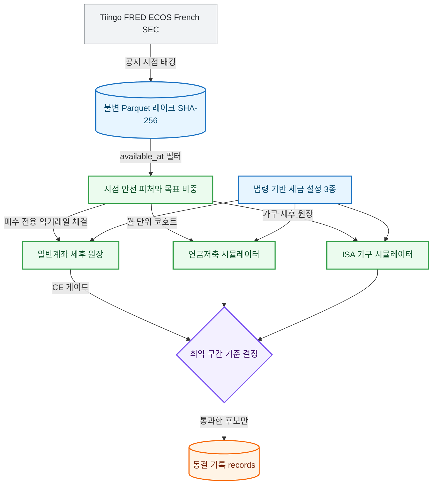

# ETF-Manager: Account-Aware ETF Allocation Research System

> **일반계좌 · 연금저축펀드 · ISA 중개형 세 계좌의 ETF 자산배분 정책을, 미래 정보 누출을 차단한 시점 정합성(PIT) 데이터와 법령 기반 세후 원장으로 검증·확정하는 퀀트 리서치 엔진**


---

## 1. System Highlights

| 핵심 엔지니어링 지표 | 실측 성과 / 보장 기준 | 아키텍처 불변식 및 강제 장치 |
| :--- | :---: | :--- |
| 📈 **일반계좌 성과 (월 100만 원 적립)** | **`24.7%`** 실질 연수익률 (QQQ 단독 23.3%) | 4개 검증 기간 전부 우세, 매수 전용 + 연말 공제 활용 이익실현(TGH) |
| 📈 **연금저축 성과 (연 600만 원, 20년)** | **`1.65배`** 최종 자산 (S&P500 단독 대비) | 100년 지수·현대·실제 ETF 3개 구간 최저 점수 기준 채택 (`0.995` 지배 가드) |
| 📈 **ISA 중개형 결정 (연 600만~2,000만 원)** | **`3/3`** 예산에서 계속 보유가 1위 | 운용 방식 6종 × 소득 시나리오 4종의 최악 구간 비교, 연금 이전 최고 `0.990` |
| ⏱️ **시계열 정합성 (미래 참조 누출)** | **`0건`** (Fail-Closed) | 모든 행에 `available_at` 부여, 미래 행 유입 시 `LookAheadError` 즉시 중단 |
| 🔒 **데이터 무결성 (변조 감지)** | **`1바이트`** 단위 | SHA-256 매니페스트 재검산, 불일치 시 `UntrustedDatasetError`로 읽기 거부 |
| ⚖️ **세법 정확성 (설정 3종)** | **`0`** 코드 하드코딩 | 법령 조문 원문 기준 `configs/tax/*.json`, 키 집합 불일치 시 실행 차단 |
| ⚡ **결정 재현성 및 속도** | **`4초`** ISA 가구 결정 전체 (72개 방식·예산·소득 조합) | run id = `SHA-256(설정 + git 커밋 + 데이터 매니페스트 + 시드)` |
| 🧪 **품질** | **`1,801`** 테스트 통과, `mypy --strict` **`173`** 파일 오류 0 | 현금 보존·비중 합·외부 현금 총액 항등식을 속성 기반 테스트로 검증 |

---

## 2. Tech Stack

| 분류 | 기술 | 채택 근거 및 트레이드오프 |
| :--- | :--- | :--- |
| **Language & Tooling** | `Python 3.11+`, `uv`, `ruff` | 결정론적 가상환경 동기화와 빠른 정적 분석 |
| **Data Engine & Storage** | `Polars`, `Parquet`, `SHA-256` | RDBMS 데몬 없이 컬럼 벡터 연산으로 수십 년 일별 데이터 처리. 행 단위 수정은 불가하고 파티션을 새로 씀 |
| **Numerics** | `NumPy` | 코호트·부트스트랩 시나리오를 배열 한 번에 계산(월 단위 시뮬레이터, ISA 가구 원장) |
| **Data Vendors** | `Tiingo`, `FRED`, `ECOS`, `Kenneth French`, `SEC EDGAR` | 미국 주가, 환율·거시, 한국 환율·CPI, 100년 팩터 지수, ETF 보유종목. 벤더별 속도 제한과 쿼터 준수 |
| **Domain Engine** | 매수 전용 배분기, 세후 원장, 견고 결정 | 익거래일 체결·정수 주수·수수료·세금을 반영한 현실 체결과 최악 구간 기준 채택 |
| **Verification & Quality** | `pytest`, `Hypothesis`, `mypy --strict` | 임의 시장 경로에서도 현금 보존과 비중 합이 깨지지 않음을 검증. 수익성은 테스트하지 않음 |

---

## 3. Research Lifecycle & Pipeline

| 단계 | 명령 | 핵심 처리 내용 |
| :---: | :--- | :--- |
| 📥 **수집** | `ingest` | 벤더 호출 $\to$ 공시 시점 태깅 $\to$ 품질 게이트 $\to$ 불변 Parquet 저장 |
| ⚙️ **시뮬레이션** | `run policy` | 목표 비중 $\to$ 매수 전용 배분 $\to$ 익거래일 체결 $\to$ 계좌별 세후 원장 |
| 🧮 **결정** | `run pension-decision`, `run isa-household` | 다중 구간 견고 점수 $\to$ 부트스트랩 $\to$ 세금 교차 검증 |
| 🧊 **동결·재검토** | `--freeze`, `run pension-review` | 통과한 결정만 `data/frozen/`에 불변 기록, 이후 가격으로 정기 재검토 |



---

## 4. Top 5 Real-world Engineering Invariants (핵심 챌린지)

### 1. 미래 정보 누출(Look-Ahead Bias) 차단
* 🚨 **문제**: 1월 경제지표를 2월에 알았다고 가정하거나 신호일 종가로 그날 체결하면 수익률이 부풀려짐.
* 📐 **원칙**: 의사결정 시점 $t$에는 `available_at <= t`인 정보만 쓰고, 체결은 반드시 $t+1$.
* 💡 **해결**: `SESSION_CLOSE`·`RELEASE_COLUMN`·`FIXED_LAG` 3규칙으로 공개 시각을 강제하고, 미래 행이 보이면 `LookAheadError`로 중단. 사후 수정 지표는 당시 최신 발표본만 사용.

### 2. 세법 정확성: 블로그 정보와 법률의 괴리
* 🚨 **문제**: ISA "비과세 500만·1,000만 원, 납입 4천만 원 확대"라는 글이 다수였으나 실제 시행 중인 법에는 없었음. 세제개편안은 국회 계류 법안.
* 📐 **원칙**: 세금 파라미터는 법령 조문 원문으로만 확인하고 코드에 넣지 않음.
* 💡 **해결**: 국가법령정보센터 조문(조세특례제한법 제91조의18 등)으로 검증한 `configs/tax/kr_isa_2026.json`을 로더가 키 집합까지 검사하며, 법 변경은 새 설정 파일 + 새 결정 실행으로 대응.

### 3. 지수 대체 구간이 만드는 착시
* 🚨 **문제**: 실제 ETF 이력이 짧아 100년 지수 프록시를 섞으면 프록시 구간의 우위만으로 조합을 교체할 위험.
* 📐 **원칙**: 어느 한 구간의 우위가 다른 구간의 열세를 사줄 수 없음.
* 💡 **해결**: 후보 점수를 **모든 구간·기간 칸의 최저값**으로 정하고 기준 대비 `0.995` 미만 칸이 있으면 탈락. 나스닥 80% + 배당 20%는 실제 ETF 구간 `0.992`로, 나스닥 100%는 100년 구간 `0.995` 미달로 탈락.

### 4. 반복 시험이 만드는 우연한 우위(다중검정)
* 🚨 **문제**: 같은 과거 데이터로 후보를 계속 늘리면 우연히 좋은 조합이 발견됨.
* 📐 **원칙**: 시험 횟수를 공개하고, 새 계좌에는 후보를 새로 만들지 않음.
* 💡 **해결**: ISA는 동결된 연금 보유 종목을 재사용하고 운용 방식 6종만 비교. 국내주식 ETF는 10년 기준 전부 `0.995` 미만으로 기각. 결과마다 누적 시험 횟수(연금 `34`, ISA `55`)를 기록.

### 5. 동일 외부 납입금과 회계 보존
* 🚨 **문제**: 하락장에 돈을 더 넣거나 계좌 사이에서 돈이 새면 배분 능력과 저축액이 뒤섞임.
* 📐 **원칙**: 모든 비교 전략은 같은 현금을 쓰고, 어떤 계좌 이동에서도 돈이 새지 않음.
* 💡 **해결**: `AllocationConfig` 납입금 고정과 ISA 가구 원장의 `기여 총액 = 기간 × (연금 납입 + ISA 예산)` 항등식을 모든 방식에 대해 테스트로 강제. ISA에 못 넣은 금액은 일반계좌로 이동.

---

## 5. Verified Performance Matrix (실측 정본 성과)

> **출처**: `docs/results/general.md`, `docs/results/pension.md`, `docs/results/isa.md`, 결정 설정 `configs/decision/*.json`  
> **조건**: 익거래일 체결, 환전 스프레드·수수료·세금 반영, 한국 CPI 실질 원화. 연금·ISA 비율은 기준 조합 = 1.000

| 계좌 | 기준 조합 | 채택 조합 | 핵심 지표 (기준 = 1.000) | 판정 |
| :--- | :--- | :--- | :---: | :--- |
| **일반계좌** | QQQ 100% | **QQQ 90% + SOXX 10%** | 실질 연수익률 **24.7%** (기준 23.3%), 최악 기간 **1.022** | 4개 기간 전부 우세. 85/15는 반도체 쏠림으로 기각 |
| **연금저축** | 나스닥100 80% + S&P500 20% | **나스닥100 90% + 배당 10%** | 100년 **1.039**, 현대 **1.057**, 실제 ETF **1.024** | 세 구간 모두 0.995 이상 |
| **ISA 중개형** (연 2,000만 원) | 계속 보유 (`hold`) | **계속 보유 (`hold`)** | 3년마다 전액 연금 이전 **0.990**, ISA 미사용 **0.944** | 대체 방식 전부 0.995 미달 |

* ISA 예산 600만 원·1,200만 원에서도 연금 이전 최고 점수는 `0.970`·`0.977`이었고, 서민형·일반형 소득 경로 4종 모두 결론은 같았습니다.
* 안전자산(채권·금)은 20년 이상 적립 구간에서 대부분 열세라 후보에서 제외했습니다.

---

## 6. Architecture Layer Contracts

```text
Layer 6: CLI 진입점            (`src/cli.py`, `src/cli_commands/`)
   ↓
Layer 5: 검증 및 결정           (`src/validation/`)
   ↓
Layer 4: 계좌별 시뮬레이션·세금 (`src/sim/`)
   ↓
Layer 3: 정책 및 ETF 매핑       (`src/policy/`, `src/etf/`)
   ↓
Layer 2: 시점 안전 피처         (`src/features/`)
   ↓
Layer 1: 데이터 수집·저장       (`src/data/`)
────────────────────────────────────────────────────
읽기 전용 옆 계층: 진단 (`src/analytics/`), 모의 집행 (`src/execution/`)
```

* **정적 검증**: `uv run mypy src`(strict), `uv run ruff check .`, 문서 정합성 `tests/unit/docs/test_architecture_docs.py`
* **상세 문서**: [`docs/architecture/system-design.md`](docs/architecture/system-design.md), [`docs/architecture/engineering-decisions.md`](docs/architecture/engineering-decisions.md)

---

## 7. Quick Start & Verification

```bash
# 1. 의존성 설치
uv sync --all-groups

# 데이터 백업(검증된 로컬 raw 정리) 및 새 클론에서 복원
uv run python tools/devops/backup.py push
uv run python tools/devops/backup.py pull

# 2. 일반계좌 운영 표준 시뮬레이션 (QQQ 90% / SOXX 10%, 월 100만 원)
uv run python -m src.cli run policy --id qqq --start 2016-07-01 --end 2026-06-30 --contribution-krw 1000000

# 3. 연금저축 결정 재현
uv run python -m src.cli run pension-decision --config configs/decision/pension.json --seed 42

# 4. ISA 중개형 운용 결정 재현 (--freeze 를 붙이면 결정 기록 동결)
uv run python -m src.cli run isa-household --config configs/decision/isa.json --seed 42

# 5. 일반계좌 검증 캠페인 및 품질 검사
uv run python -m src.cli run final-historical-campaign --config configs/decision/general.json --seed 42
uv run pytest && uv run ruff check . && uv run mypy src
```

* 새로 클론한 저장소는 테스트가 데이터 없이도 통과하며, 결정을 재현하려면 먼저 `uv run python tools/devops/backup.py pull`로 정규화 데이터를 복원해야 합니다.

* **한계**: 표본 크기, 극단 국면의 실제 ETF 부재, 월 단위 환율 중립 근사, 세 결정의 데이터 공유 등은 [`system-design.md`](docs/architecture/system-design.md)의 Limitations에 정리했습니다.
