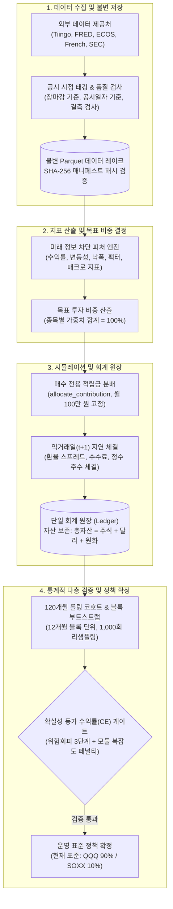

# ETF-Manager

> **미래 정보 누출(Look-ahead Bias)을 차단한 시점 정합성(PIT) 데이터**와 **동일한 외부 납입금(월 100만 원 고정)** 제약 하에서 장기 적립식(DCA) 투자 시 실질 원화(물가 반영) 자산을 극대화하는 자산배분 정책을 검증·확정하는 **퀀트 시뮬레이션 및 리서치 엔진**

---

## 1. 프로젝트 개요 (Project Overview)

ETF-Manager는 10~20년 장기 자산 형성을 목표로 하는 개인 적립식(DCA) 투자자를 위해 개발된 퀀트 시뮬레이션 및 자산배분 정책 검증 플랫폼입니다.

일반적인 주식 백테스트 프로그램이 당연하게 여겨 온 **미래 정보 미리보기(Look-ahead Bias)**, **당일 종가 무마찰 즉시 체결 가정($t+0$)**, **외부 투자금을 임의로 조절해 수익률을 부풀리는 현금흐름 왜곡**, **잦은 매도 리밸런싱에 따른 양도소득세(22%) 및 수수료 낭비**를 시스템 수준에서 원천 차단합니다. 5대 공신력 있는 데이터 제공처(Tiingo, FRED, ECOS, Kenneth French, SEC EDGAR)를 연동하여 실제 공시 시점(`available_at`)을 기준으로 시계열을 정렬하며, 보유 주식을 팔지 않고 매월 들어오는 적립금만 부족한 종목에 채워 넣는 **매수 전용(Buy-Only)** 방식과 위험 회피 성향을 반영한 **확실성 등가 수익률(CE)** 평가를 통해 실전에서 재현 가능한 최적의 자산배분 표준을 도출합니다.

---

## 2. 해결하려는 문제와 배경 (Why This Project)

개인과 금융권의 적립식 백테스트는 다음과 같은 4대 비현실적 왜곡을 자주 내포합니다:

1. **거시 지표 사후 수정(Vintage Revision)과 미래 정보 누출:** GDP, CPI 등 주요 경제지표는 발표 후에도 몇 달, 몇 년에 걸쳐 수정치가 계속 나옵니다. 과거 시점의 투자 결정을 시뮬레이션하면서 훗날 발표된 수정치를 미리 알고 투자했다고 가정하면 비현실적인 초과수익이 나옵니다.
2. **비현실적인 무마찰 당일 체결 ($t+0$ Execution & Zero Friction):** 한국 거주자가 미국 상장 ETF를 살 때, 한국 시각 새벽에 끝나는 뉴욕 거래소 종가를 확인하고 그 종가로 동시에 주문을 체결하는 것은 물리적으로 불가능합니다. 또한 환전 스프레드와 거래 수수료를 빼놓으면 수십 년간의 복리 수익률이 크게 부풀려집니다.
3. **외부 납입금 조절로 인한 성과 왜곡 (Cashflow Distortion):** 자산배분 전략이 주가가 폭락했을 때 외부에서 돈을 더 많이 넣도록 허용하면, 순수한 자산배분 능력(알파) 때문이 아니라 단순 저축액 증가 때문에 최종 자산이 늘어나는 착시가 발생합니다.
4. **잦은 매도 리밸런싱에 따른 세금과 수수료 마찰:** 목표 비중을 맞추기 위해 정기적으로 주식을 팔아치우면 즉각적인 양도소득세(22%) 실현과 거래 수수료가 누적되어 장기 복리 효과가 훼손됩니다.

ETF-Manager는 **18대 핵심 시스템 규칙(Invariants)**과 **오류 시 즉시 중단(Fail-Closed) 원칙**을 코드로 강제하여 이러한 비현실적 가정을 배제하고, 현실에서 그대로 따라 할 수 있는 검증된 성과만을 측정합니다.

---

## 3. 핵심 기능 (Key Features)

- **시점 정합성(Point-in-Time, PIT) 데이터 레이크:** 데이터 관측 기준일(`observation_date`)과 실제 시장 공개 일시(`available_at`)를 분리하고, SHA-256 해시값으로 변조를 검사하는 불변 Parquet 저장소를 구축하여 미래 정보가 백테스트에 유입되는 것을 원천 차단합니다.
- **매수 전용(Buy-Only) 적립식 리밸런싱:** 목표 비중을 맞추기 위해 기존 주식을 파는 대신, 매달 들어오는 신규 적립금(100만 원)만 목표 대비 부족한 종목에 차등 분배하는 `allocate_contribution` 알고리즘을 적용하여 양도소득세와 거래 비용을 극소화합니다.
- **동일 외부 납입금 제약 (Flat 월 100만 원, Invariant $I_5$):** 모든 비교 전략이 매달 동일한 100만 원만을 투자하도록 강제하여, 투자금 투입 시점 조작으로 인한 왜곡을 없애고 순수 자산배분 능력만 공정하게 비교합니다.
- **위험 회피를 고려한 확실성 등가 수익률(CE) 평가:** 단순히 평균 수익률만 보지 않고, 경제학의 CRRA 효용 함수($\gamma \in \{2, 5, 10\}$)를 적용해 하락장 폭락 위험을 크게 감점하며, 전략에 포함된 규칙/모듈이 늘어날수록 2%의 추가 초과수익 허들(복잡도 페널티)을 요구해 과적합(Overfitting)을 막습니다.
- **120개월 롤링 코호트 & 12개월 단위 블록 부트스트랩:** 특정 10년에만 유리했던 착시를 없애기 위해 120개월 롤링 윈도우(4개 코호트)를 돌리고, 금융 데이터의 연속성(자기상관성)을 보존하도록 1년 단위로 묶어 1,000회 무작위 재표본(Block Bootstrap) 검증을 수행하여 하위 5% 최악 시나리오($p_{05} > 1.0$)에서도 우위가 유지되는지 확인합니다.
- **익거래일($t+1$) 지연 체결 및 실질 구매력(Real KRW) 평가:** 신호 발생 다음 날($t+1$) 장 마감 종가와 환율 스프레드, 거래 수수료를 적용해 현실적으로 체결하고, 한국은행 CPI 물가지수로 할인한 실질 원화 기준 내부수익률(Real XIRR)을 도출합니다.

---

## 4. 시스템 아키텍처 (Architecture)

시스템은 데이터 수집부터 최종 정책 확정까지 단방향($L_1 \to L_5$) 데이터 흐름을 유지하며, 단일 회계 원장(Ledger)을 통해 매월 자산 보존 법칙을 검증합니다.



---

## 5. 실행 흐름 (End-to-End Flow)

```text
1. 원본 데이터 수집
   외부 API(Tiingo, FRED, ECOS, SEC)를 호출하여 주가, 환율, 거시지표, ETF 공시 수집
   → src/data/fetch.py, src/data/providers/*

2. 공시 시점 태깅 및 품질 검증
   공식 발표 시점(available_at)을 부여하고, 결측치나 순서 역전 발견 시 즉시 에러 중단
   → src/data/pit.py, src/data/quality.py

3. 불변 저장소 기록
   정규화된 시계열을 Parquet 파일로 저장하고 고유 SHA-256 매니페스트 발급
   → src/data/storage.py, src/data/catalog.py

4. 피처 및 지표 계산
   의사결정 시점 t 이전에 공개된 데이터만을 이용해 이동평균, 변동성, 팩터 민감도 계산
   → src/features/returns.py, src/features/risk.py, src/features/factors.py

5. 목표 투자 비중 결정
   전략 규칙에 따라 포트폴리오 목표 비중 산출 (가중치 합 = 1.0)
   → src/policy/targets.py, src/policy/overlay.py

6. 매수 전용 적립금 배분
   매달 유입되는 100만 원을 매도 없이 목표 비중 대비 부족한 종목에만 배분
   → src/sim/contribution.py

7. 익거래일(t+1) 체결 및 원장 기록
   다음 날 종가와 환율 스프레드를 적용해 살 수 있는 정수 주수 체결 후 회계 원장 갱신
   → src/sim/allocation.py, src/sim/lots.py

8. 통계적 다층 검증
   120개월 롤링 코호트, 블록 부트스트랩, 확실성 등가(CE) 게이트로 우위 검증
   → src/validation/gate.py, src/validation/accumulation_cohort.py, src/validation/bootstrap.py
```

---

## 6. 저장소 디렉토리 구조 (Repository Structure)

```text
ETF-Manager/
├── src/
│   ├── data/            # L1: 데이터 수집, 공시 시점(PIT) 부여, 품질 검증, Parquet 저장소
│   ├── features/        # L2: 미래 정보 차단 수익률, 변동성, 낙폭, 팩터, 매크로 지표 산출
│   ├── policy/          # L3: 자산배분 전략(PolicyId), 목표 투자 비중 계산, 하락장 오버레이
│   ├── sim/             # L4: 매수 전용 적립식 시뮬레이션, 익거래일 체결, 회계 원장
│   ├── validation/      # L5: CE 게이트, 120M 코호트, 블록 부트스트랩, 과적합 방지 규율
│   ├── etf/             # L6: 상장 ETF 종목 매핑, 보수/AUM 평가, 잦은 교체 방지 완충 장치
│   ├── analytics/       # 5개 관점의 투자 가설 분석(밸류에이션, 수급 쏠림, 구조적 타당성 등)
│   ├── execution/       # 주문서 생성 및 페이퍼 브로커(PaperBroker) 모의 체결
│   └── cli_commands/    # CLI 명령어 핸들러 (ingest, sim_run, campaign, thesis)
├── configs/
│   ├── experiments/     # 워크포워드, 코호트 등 실험 설정 JSON 파일
│   ├── theses/          # 사전 등록된 투자 가설 및 반증 조건 명세
│   └── prospective/     # OOS 전향적 관측 레지스트리
├── tests/               # 633개 단위·통합·속성(PBT) 테스트 스위트
└── docs/                # 아키텍처 및 연구 리포트 상세 문서
    └── architecture/    # 시스템 전체 개요, 데이터 흐름, 컴포넌트, ADR 설계 결정서
```

---

## 7. 핵심 설계 결정 (Technical Decisions)

### 결정 1: 보유 주식을 절대 팔지 않는 매수 전용(Buy-Only) 리밸런싱
* **선택 이유:** 장기 적립식 투자에서 주식을 정기적으로 팔면 매번 양도소득세(22%)와 거래 수수료가 발생해 복리 수익을 심각하게 갉아먹습니다.
* **트레이드오프:** 자산 규모가 커진 적립 후기 국면에서는 급격한 시장 변동 시 목표 비중으로 되돌아가는 속도가 다소 느릴 수 있으나, 양도세 과세 이연과 수수료 절감 효과가 이를 상회합니다.

### 결정 2: 위험회피도를 반영한 확실성 등가 수익률(CE) 게이트와 복잡도 페널티
* **선택 이유:** 단순 평균 수익률이나 샤프지수만 보면 평소에는 벌다가 위기 시 반토막이 나는 위험한 전략을 걸러내지 못하며, 규칙을 여러 개 붙인 복잡한 과적합 전략에 속기 쉽습니다.
* **트레이드오프:** 평균 수익률은 높지만 하락폭이 큰 공격적인 전략이 보수적으로 탈락할 수 있으나, 시스템의 장기 생존성과 견고함을 보장합니다.

### 결정 3: 데이터베이스 서버 대신 불변 Parquet 파일과 SHA-256 매니페스트 채택
* **선택 이유:** 외부 DB 서버(PostgreSQL 등) 설치 없이도 로컬에서 Polars를 통해 수십 년 치 일별 데이터를 초고속으로 읽을 수 있고, 해시값 검증을 통해 완벽한 재현성을 보장하기 위함입니다.
* **트레이드오프:** 실시간 데이터 수정(Update)이 어렵고 데이터가 바뀌면 전체 파일을 다시 써야 하지만, 읽기 위주의 퀀트 시뮬레이션 환경에 최적화되어 있습니다.

### 결정 4: 신호 발생 다음 날 체결되는 익거래일($t+1$) 지연 체결 모델
* **선택 이유:** 한국 투자자가 미국 장 마감 종가를 확인하고 그 마감 종가로 동시에 사는 것은 불가능하므로, 실제 투자자가 따라 할 수 있는 현실적인 체결을 보장하기 위함입니다.
* **트레이드오프:** 신호 발생 후 체결까지 하루의 시차가 발생해 단기 급변동 시 슬리피지를 겪을 수 있으나, 비현실적인 가공의 수익률을 배제합니다.

### 결정 5: 모든 비교 전략에 동일한 외부 납입금(Flat 월 100만 원, Invariant $I_5$) 강제
* **선택 이유:** 특정 전략이 하락장에서 외부 자금을 더 투입해 자산을 불리면, 순수한 자산배분 능력(알파)과 단순 저축액 증액 효과가 뒤섞여 공정한 평가가 불가능해집니다.
* **트레이드오프:** 성과급 유입 등 유연한 납입 시나리오를 직접 다룰 수는 없으나, 모든 전략을 100% 동일한 저축 조건 위에서 공정하게 비교할 수 있습니다.

---

## 8. 신뢰성 및 검증 체계 (Validation / Reliability)

* **테스트 스위트:** 총 **633개 단위·통합 테스트** 100% 통과 (`pytest`).
* **엄격한 정적 분석:** 전체 127개 소스 파일 `mypy --strict` 무오류 통과, `ruff` 린터 전수 준수.
* **속성 기반 테스트 (Hypothesis PBT):** 임의의 가상 시장 경로를 수만 번 생성해 테스트해도 매 거래 후 현금 보존 법칙(Cash Conservation)과 목표 비중 합계($1.0 \pm 10^{-6}$)가 절대 깨지지 않음을 수학적으로 보증.
* **오류 시 즉시 중단 (Fail-Closed):** 미래 데이터 참조가 감지되거나 결측치가 발견되면 임의로 채우지 않고 즉시 예외(`LookAheadError`, `DataQualityError`)를 발생시켜 오염된 백테스트 결과 생성을 원천 차단.
* **비용 스트레스 테스트:** 이상적 환경(0 bps)부터 가혹한 환경(환전 30 bps, 수수료 15 bps)까지 4단계 비용 시나리오를 모두 검증.

---

## 9. 실증 검증 결과 (Results)

### 최종 과거 캠페인 검증 결과 (`FINAL_HISTORICAL_CAMPAIGN_V1`)

* **평가 윈도우:** 2012-08-31 → 2026-08-28 (120개월 롤링 코호트, 1년 간격, 총 4개 코호트)
* **납입 조건:** 매월 고정 100만 원 납입 (동일 외부 현금흐름 강제, Invariant $I_5$)
* **비용 조건:** 한국 CPI 물가지수 반영 실질 원화(Real KRW), 환전 스프레드 및 거래 수수료 차감, $t+1$ 지연 체결
* **분할 및 검증:** 120개월 롤링 인샘플 & 아웃오브폴드, 12개월 블록 원형 부트스트랩 (1,000회 리샘플링)

| 전략 (Arm) | 목표 비중 | 코호트 수 | 실질 XIRR | 중위수 비율 | 최악 코호트 비율 | 부트스트랩 $p_{05}$ | CE 비율 ($\gamma=10$) | 최종 판정 |
| :--- | :--- | :---: | :---: | :---: | :---: | :---: | :---: | :---: |
| **B0 (기준선)** | QQQ 100% | 4 | 23.34% | 1.0000 | 1.0000 | 1.0000 | 1.0000 | 불변 기준선 |
| **C1** | QQQ 95% / SOXX 5% | 4 | 23.69% | 1.0110 | 1.0058 | 1.0047 | 1.0112 | 허들 미달 (초과수익 미미) |
| **C2 (표준 채택)** | **QQQ 90% / SOXX 10%** | **4** | **24.68%** | **1.0336** | **1.0224** | **1.0123** | **1.0335** | **운영 표준 동결 (Operational Lock)** |
| **C3** | QQQ 85% / SOXX 15% | 4 | 25.96% | 1.0556 | 1.0368 | 1.0120 | 1.0546 | 섹터 집중 위험 배제 (보수적 기각) |

#### 비용 스트레스 검증 결과 (C2 vs 기준선 최종 자산 비율)
* **Ideal (수수료 0 bps):** 1.0758 | **Low (5/1 bps):** 1.0764 | **Base (15/5 bps):** 1.0749 | **Stress (30/15 bps):** 1.0785

#### 핵심 요약
* **전수 초과 성과:** C2(QQQ 90% / SOXX 10%)는 4개 코호트 전수에서 기준선(QQQ)을 상회(최악 코호트 비율 1.0224, 승률 100%)했습니다.
* **실질 수익률 향상:** 물가를 반영한 실질 원화 연환산 내부수익률(Real XIRR) 24.68%를 기록하여 QQQ 단독(23.34%) 대비 연 **+1.34%p**의 초과수익을 달성했습니다.
* **하방 강건성 입증:** 부트스트랩 하위 5% 최악 시나리오($p_{05} = 1.0123 > 1.0$) 및 극단적 위험회피 조건($\mathrm{CE}_{\gamma=10} = 1.0335$)에서도 기준선을 확실히 앞섰습니다.
* **보수적 선택:** C3가 총수익률은 더 높았으나, 부트스트랩 하방 지표($p_{05} = 1.0120$)가 C2보다 낮고 반도체 단일 섹터 집중 위험이 커져 C2를 최종 운영 표준으로 채택했습니다.

---

## 10. 빠른 시작 (Getting Started)

### 1. 환경 설정 및 의존성 동기화
```bash
# uv를 통한 가상환경 격리 및 의존성 설치
uv sync --all-groups
```

### 2. 운영 표준 전략 시뮬레이션 실행 (QQQ 90% / SOXX 10% Flat DCA)
```bash
uv run python -m src.cli run policy \
  --id qqq \
  --start 2016-07-01 --end 2026-06-30 \
  --contribution-krw 1000000
```

### 3. 검증 캠페인 및 전체 테스트 실행
```bash
# 최종 과거 캠페인 검증 실행
uv run python -m src.cli run final-historical-campaign \
  --config configs/experiments/final_historical_campaign_v1.json \
  --seed 42

# 전체 633개 테스트 및 정적 타입 검사
uv run pytest
uv run ruff check .
uv run mypy src
```

---

## 11. 아키텍처 상세 문서 (Documentation)

* [아키텍처 개요 (Overview)](docs/architecture/overview.md) — 6계층 구조, 시스템 경계 및 18대 시스템 불변식 상세
* [데이터 흐름 명세 (Data Flow)](docs/architecture/data-flow.md) — 10단계 파이프라인, 공시 시점 부여 규칙 및 결측치 정책
* [컴포넌트 상세 명세 (Components)](docs/architecture/components.md) — 모듈별 단일 책임, 입출력 규격 및 주요 구현 코드
* [설계 의사결정 기록 (ADR)](docs/architecture/design-decisions.md) — 6대 핵심 엔지니어링 결정 배경, 대안 및 트레이드오프
* [과거 검증 리포트 원문](docs/results/final-historical/FINAL_HISTORICAL_CAMPAIGN_V1_8201d9e.md) — 과거 데이터 최종 검증 리포트

---

## 12. 한계점 및 아키텍처 경계 (Limitations)

1. **표본 크기와 코호트 중첩 (Thin-Sample & Overlapping Cohorts):** 한국은행 CPI 데이터의 실질 가용 기간(2012-08-31~) 한계로 인해 120개월(10년) 롤링 코호트 표본 수가 4개로 제한되며, 코호트 구간 간에 데이터 중첩이 존재합니다.
2. **과거 극단 국면(닷컴 버블 / 2008 금융위기) 실제 ETF 데이터 부재:** 2000년대 닷컴 버블 및 2008년 금융위기 구간은 SOXX 등 실제 ETF 상장 이전이므로 본 시뮬레이션의 실체결 데이터에 포함되지 않았습니다.
3. **최종 청산 세후 정산 모델 미포함:** 적립 기간 동안의 양도세 과세 이연은 모델링되었으나, 자산을 모두 인출하고 계좌를 해지하는 최종 청산 시점의 세후 정산 모델은 현재 엔진 범위에서 제외되어 있습니다.
4. **실계좌 주문 API 미연동:** 본 시스템은 모의 브로커(`PaperBroker`) 기반의 시뮬레이션 및 검증 엔진이며, 증권사 실계좌 자동주문 API 연동은 아키텍처 범위 외부에 있습니다.
