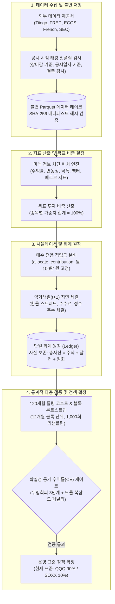

# ETF-Manager

> **미래 정보 누출(Look-ahead Bias)을 차단한 시점 정합성(PIT) 데이터**와 **동일한 외부 납입금(월 100만 원 고정)** 제약 하에서 장기 적립식(DCA) 투자 시 실질 원화(물가 반영) 자산을 극대화하는 자산배분 정책을 검증·확정하는 **퀀트 시뮬레이션 및 리서치 엔진**

---

## 결과 요약

| 계좌 | 최종 선택 | 핵심 수치 |
| :--- | :--- | :--- |
| [일반계좌](#일반계좌-월-100만-원-매수-전용) | **QQQ 90% + SOXX 10%** | 실질 연수익률 24.7% (QQQ 단독 23.3%), 4개 검증 기간 전부 우세 |
| [연금저축](#연금저축-매년-600만-원-20년-이상) | **나스닥100 90% + 미국배당다우존스 10%** | S&P500 단독 대비 최종 자산 약 1.65배 (1999~2026, 20년 적립) |

---

## 1. 프로젝트 개요 (Project Overview)

ETF-Manager는 10~20년 장기 자산 형성을 목표로 하는 개인 적립식(DCA) 투자자를 위해 개발된 퀀트 시뮬레이션 및 자산배분 정책 검증 플랫폼입니다.

일반적인 주식 백테스트 프로그램이 당연하게 여겨 온 **미래 정보 미리보기(Look-ahead Bias)**, **당일 종가 무마찰 즉시 체결 가정($t+0$)**, **외부 투자금을 임의로 조절해 수익률을 부풀리는 현금흐름 왜곡**, **잦은 매도 리밸런싱에 따른 양도소득세(22%) 및 수수료 낭비**를 시스템 수준에서 원천 차단합니다. 5대 공신력 있는 데이터 제공처(Tiingo, FRED, ECOS, Kenneth French, SEC EDGAR)를 연동하여 실제 공시 시점(`available_at`)을 기준으로 시계열을 정렬하며, 보유 주식을 팔지 않고 매월 들어오는 적립금만 부족한 종목에 채워 넣는 **매수 전용(Buy-Only)** 방식과 위험 회피 성향을 반영한 **확실성 등가 수익률(CE)** 평가를 통해 실전에서 재현 가능한 최적의 자산배분 표준을 도출합니다.

---

| 핵심 난제 (Challenge) | 일반적 접근법의 한계 | ETF-Manager 엔지니어링 솔루션 |
| :--- | :--- | :--- |
| **거시지표 사후 수정(Revision)** | 발표 후 수개월/수년에 걸쳐 수정되는 CPI/GDP 수치를 과거 시점에 미리 알았다고 가정해 왜곡 | **공시 시점(`available_at`) 태깅**: 관측일과 실제 공개 시점을 분리하고 SHA-256 해시 검증을 거친 불변 Parquet 레이크 구축 |
| **무마찰 당일 체결 ($t+0$)** | 밤사이 끝난 미국 ETF 종가로 즉시 체결하거나 환전 스프레드/거래 수수료를 누락 | **익거래일($t+1$) 지연 체결**: NYSE-KRX 캘린더 동기화, 환전 스프레드 및 수수료 실차감, 정수 주수 체결 강제 |
| **외부 납입금 성과 왜곡** | 주가 급락 시 외부 투자금을 임의로 더 투입하여 저축액 증가를 전략 알파로 둔갑 | **동일 외부 납입금 제약 (월 100만 원 고정, $I_5$)**: 모든 전략이 동일 현금흐름으로 경쟁하도록 회계 원장 강제 |
| **잦은 매도 리밸런싱 마찰** | 목표 비중 유지를 위해 잦은 매도를 감행하여 양도소득세(22%) 및 수수료 누적 | **매수 전용(Buy-Only) 리밸런싱**: 주식을 팔지 않고 매월 유입되는 100만 원만 부족 종목에 우선 배분 (`allocate_contribution`) |

---

## 3. 핵심 기능 (Key Features)

- **시점 정합성(Point-in-Time, PIT) 데이터 레이크:** 데이터 관측 기준일(`observation_date`)과 실제 시장 공개 일시(`available_at`)를 분리하고, SHA-256 해시값으로 변조를 검사하는 불변 Parquet 저장소를 구축하여 미래 정보가 백테스트에 유입되는 것을 원천 차단합니다.
- **매수 전용(Buy-Only) 적립식 리밸런싱:** 목표 비중을 맞추기 위해 기존 주식을 파는 대신, 매달 들어오는 신규 적립금(100만 원)만 목표 대비 부족한 종목에 차등 분배하는 `allocate_contribution` 알고리즘을 적용하여 양도소득세와 거래 비용을 극소화합니다.
- **동일 외부 납입금 제약 (Flat 월 100만 원, Invariant $I_5$):** 모든 비교 전략이 매달 동일한 100만 원만을 투자하도록 강제하여, 투자금 투입 시점 조작으로 인한 왜곡을 없애고 순수 자산배분 능력만 공정하게 비교합니다.
- **위험 회피를 고려한 확실성 등가 수익률(CE) 평가:** 단순히 평균 수익률만 보지 않고, 경제학의 CRRA 효용 함수($\gamma \in \{2, 5, 10\}$)를 적용해 하락장 폭락 위험을 크게 감점하며, 전략에 포함된 규칙/모듈이 늘어날수록 2%의 추가 초과수익 허들(복잡도 페널티)을 요구해 과적합(Overfitting)을 막습니다.
- **120개월 롤링 코호트 & 12개월 단위 블록 부트스트랩:** 특정 10년에만 유리했던 착시를 없애기 위해 120개월 롤링 윈도우(4개 코호트)를 돌리고, 금융 데이터의 연속성(자기상관성)을 보존하도록 1년 단위로 묶어 1,000회 무작위 재표본(Block Bootstrap) 검증을 수행하여 하위 5% 최악 시나리오($p_{05} > 1.0$)에서도 우위가 유지되는지 확인합니다.
- **익거래일($t+1$) 지연 체결 및 실질 구매력(Real KRW) 평가:** 신호 발생 다음 날($t+1$) 장 마감 종가와 환율 스프레드, 거래 수수료를 적용해 현실적으로 체결하고, 한국은행 CPI 물가지수로 할인한 실질 원화 기준 내부수익률(Real XIRR)을 도출합니다.

---

## 4. 시스템 아키텍처 (Architecture)

시스템은 데이터 수집부터 최종 정책 확정까지 단방향($L_1 \to L_5$) 데이터 흐름을 유지하며, 단일 회계 원장(Ledger)을 통해 매월 자산 보존 법칙을 검증합니다.



---

| 단계 | 주요 처리 내용 | 무결성 제약 및 안전장치 |
| :---: | :--- | :--- |
| **1. 데이터 수집** | Tiingo, FRED, ECOS, SEC API를 통한 주가, 환율, 거시지표 수집 | Rate Limit 준수, 원본 파일 불변 저장 (`data/raw/`) |
| **2. PIT 태깅 & 검증** | 공식 발표 시점(`available_at`) 부여, 결측치 및 날짜 역전 검사 | 10대 품질 규칙 검증, 이상 시 `DataQualityError` 즉시 중단 |
| **3. 불변 저장소 기록** | 정규화된 시계열 Parquet 저장 및 SHA-256 매니페스트 발급 | 1바이트 변조도 불허하는 무결성 해시 검증 (`StorageEngine`) |
| **4. 피처 & 지표 계산** | 의사결정 시점 $t$ 이전 공개 데이터만으로 이동평균, 변동성, 팩터 민감도 산출 | 미래 데이터 유입 시 `assert_no_lookahead`로 차단 |
| **5. 목표 비중 산출** | 자산배분 전략에 따른 종목별 목표 가중치 결정 (합계 = 1.0) | 전략 복잡도 상한 및 오버레이 규칙 강제 |
| **6. 매수 전용 배분** | 매달 유입되는 100만 원을 매도 없이 목표 대비 부족한 종목에만 배분 | 매도 0건 보장, 양도소득세 및 수수료 낭비 원천 차단 |
| **7. 익거래일($t+1$) 체결** | 다음 날 종가, 환율 스프레드, 수수료를 차감하여 정수 주수 체결 | 단일 회계 원장(Ledger) 자산 보존 법칙 실시간 검증 |
| **8. 통계적 다층 검증** | 120개월 롤링 코호트, 12개월 블록 부트스트랩(1,000회), CE 게이트 검증 | 위험회피도 3단계($\gamma \in \{2,5,10\}$) + 2% 복잡도 페널티 통과 시만 승격 |

---

## 6. 저장소 디렉토리 구조 (Repository Structure)

```text
ETF-Manager/
├── src/
│   ├── data/            # L1: 데이터 수집, 공시 시점(PIT) 부여, 품질 검증, Parquet 저장소
│   ├── features/        # L2: 미래 정보 차단 수익률, 변동성, 낙폭, 팩터, 매크로 지표 산출
│   ├── policy/          # L3: 자산배분 전략(PolicyId), 목표 투자 비중 계산, 하락장 오버레이
│   ├── sim/             # L4: 매수 전용 적립식 시뮬레이션, 익거래일 체결, 회계 원장
│   ├── validation/      # L5: CE 게이트, 120M 코호트, 블록 부트스트랩, 과적합 방지 규율
│   ├── etf/             # L6: 상장 ETF 종목 매핑, 보수/AUM 평가, 잦은 교체 방지 완충 장치
│   ├── analytics/       # 5개 관점의 투자 가설 분석(밸류에이션, 수급 쏠림, 구조적 타당성 등)
│   ├── execution/       # 주문서 생성 및 페이퍼 브로커(PaperBroker) 모의 체결
│   └── cli_commands/    # CLI 명령어 핸들러 (ingest, sim_run, campaign, thesis, diagnose, maintenance, results)
├── configs/
│   ├── experiments/     # 워크포워드, 코호트 등 실험 설정 JSON 파일
│   ├── theses/          # 사전 등록된 투자 가설 및 반증 조건 명세
│   └── prospective/     # OOS 전향적 관측 레지스트리
├── tests/               # 단위·통합·속성(PBT) 테스트 스위트 (pytest 수집 기준 1,409 케이스)
└── docs/                # 아키텍처 및 연구 리포트 상세 문서
    └── architecture/    # 시스템 전체 개요, 데이터 흐름, 컴포넌트, ADR 설계 결정서
```

---

## 7. 핵심 설계 결정 (ADR 요약)

| ADR | 주제 | 채택된 솔루션 | 기각된 대안 | 엔지니어링 근거 및 트레이드오프 |
| :--- | :--- | :--- | :--- | :--- |
| **ADR-01** | **리밸런싱 정책** | **매수 전용(Buy-Only) 적립식 분배** | 정기 매도 리밸런싱, 임의 비율 매도 | 양도소득세(22%) 과세 이연 및 거래비용 절감. 적립 후기 비중 복귀 속도 지연 감수 |
| **ADR-02** | **전략 평가 함수** | **확실성 등가 수익률(CE) 게이트 + 복잡도 페널티** | 단순 샤프 지수 극대화, 평균 수익률 | 위험회피도($\gamma=2,5,10$) 반영 및 규칙 개수당 2% 초과수익 허들로 과적합 원천 방어 |
| **ADR-03** | **외부 현금흐름 제약** | **동일 외부 납입금 강제 (Flat 월 100만 원, $I_5$)** | 하락장 외부 자금 추가 투입 | 현금흐름 조작에 의한 백테스트 왜곡 차단 및 순수 자산배분 능력(알파) 검증 |
| **ADR-04** | **체결 및 구매력 평가** | **익거래일($t+1$) 체결 & 한국 CPI 실질 원화 평가** | 당일 종가($t+0$) 즉시 체결, 명목 달러 평가 | 한국 거주자의 미국 ETF 실체결 시차 및 환전 스프레드, 국내 물가상승률 반영 |
| **ADR-05** | **데이터 무결성** | **공시 시점(`available_at`) 태깅 & SHA-256 매니페스트** | 관측일 기준 정렬, 단순 CSV 저장 | 거시지표 사후 수정(Vintage Revision)에 의한 Look-Ahead 편향 0% 보장 |
| **ADR-06** | **세후 운용 표준** | **QQQ90/SOXX10 매수 전용 + 연말 공제 활용 이익실현(TGH)** | 위험 회피 매도, 자산 순환(TAA) | 세후 청산 자산 +0.4~1.4%, 납부세 거의 0. 매도는 세금 최적화 목적으로만 허용 (상세: 설계 의사결정 ADR-007) |

---

### 결정 1: 보유 주식을 절대 팔지 않는 매수 전용(Buy-Only) 리밸런싱
* **선택 이유:** 장기 적립식 투자에서 주식을 정기적으로 팔면 매번 양도소득세(22%)와 거래 수수료가 발생해 복리 수익을 심각하게 갉아먹습니다.
* **트레이드오프:** 자산 규모가 커진 적립 후기 국면에서는 급격한 시장 변동 시 목표 비중으로 되돌아가는 속도가 다소 느릴 수 있으나, 양도세 과세 이연과 수수료 절감 효과가 이를 상회합니다.

### 결정 2: 위험회피도를 반영한 확실성 등가 수익률(CE) 게이트와 복잡도 페널티
* **선택 이유:** 단순 평균 수익률이나 샤프지수만 보면 평소에는 벌다가 위기 시 반토막이 나는 위험한 전략을 걸러내지 못하며, 규칙을 여러 개 붙인 복잡한 과적합 전략에 속기 쉽습니다.
* **트레이드오프:** 평균 수익률은 높지만 하락폭이 큰 공격적인 전략이 보수적으로 탈락할 수 있으나, 시스템의 장기 생존성과 견고함을 보장합니다.

### 결정 3: 데이터베이스 서버 대신 불변 Parquet 파일과 SHA-256 매니페스트 채택
* **선택 이유:** 외부 DB 서버(PostgreSQL 등) 설치 없이도 로컬에서 Polars를 통해 수십 년 치 일별 데이터를 초고속으로 읽을 수 있고, 해시값 검증을 통해 완벽한 재현성을 보장하기 위함입니다.
* **트레이드오프:** 실시간 데이터 수정(Update)이 어렵고 데이터가 바뀌면 전체 파일을 다시 써야 하지만, 읽기 위주의 퀀트 시뮬레이션 환경에 최적화되어 있습니다.

### 결정 4: 신호 발생 다음 날 체결되는 익거래일($t+1$) 지연 체결 모델
* **선택 이유:** 한국 투자자가 미국 장 마감 종가를 확인하고 그 마감 종가로 동시에 사는 것은 불가능하므로, 실제 투자자가 따라 할 수 있는 현실적인 체결을 보장하기 위함입니다.
* **트레이드오프:** 신호 발생 후 체결까지 하루의 시차가 발생해 단기 급변동 시 슬리피지를 겪을 수 있으나, 비현실적인 가공의 수익률을 배제합니다.

### 결정 5: 모든 비교 전략에 동일한 외부 납입금(Flat 월 100만 원, Invariant $I_5$) 강제
* **선택 이유:** 특정 전략이 하락장에서 외부 자금을 더 투입해 자산을 불리면, 순수한 자산배분 능력(알파)과 단순 저축액 증액 효과가 뒤섞여 공정한 평가가 불가능해집니다.
* **트레이드오프:** 성과급 유입 등 유연한 납입 시나리오를 직접 다룰 수는 없으나, 모든 전략을 100% 동일한 저축 조건 위에서 공정하게 비교할 수 있습니다.

---

## 8. 신뢰성 및 검증 체계 (Validation / Reliability)

* **테스트 스위트:** 총 **1,409개 테스트 케이스** 100% 통과 (`pytest`).
* **엄격한 정적 분석:** 전체 161개 소스 파일 `mypy --strict` 무오류 통과, `ruff` 린터 전수 준수.
* **속성 기반 테스트 (Hypothesis PBT):** 임의의 가상 시장 경로를 수만 번 생성해 테스트해도 매 거래 후 현금 보존 법칙(Cash Conservation)과 목표 비중 합계($1.0 \pm 10^{-6}$)가 절대 깨지지 않음을 수학적으로 보증.
* **오류 시 즉시 중단 (Fail-Closed):** 미래 데이터 참조가 감지되거나 결측치가 발견되면 임의로 채우지 않고 즉시 예외(`LookAheadError`, `DataQualityError`)를 발생시켜 오염된 백테스트 결과 생성을 원천 차단.
* **비용 스트레스 테스트:** 이상적 환경(0 bps)부터 가혹한 환경(환전 30 bps, 수수료 15 bps)까지 4단계 비용 시나리오를 모두 검증.

---

## 9. 실증 검증 결과 (Results)

### 일반계좌 (월 100만 원, 매수 전용)

2012-08 ~ 2026-08, 10년 적립 4개 기간, 물가·환전·수수료 반영 실질 원화 기준.

| 조합 | 실질 연수익률 | 최악 기간 (QQQ 단독 = 1.00) | 판정 |
| :--- | :---: | :---: | :--- |
| QQQ 100% | 23.3% | 1.000 | 기준선 |
| QQQ 95% + SOXX 5% | 23.7% | 1.006 | 초과수익 미미 |
| **QQQ 90% + SOXX 10%** | **24.7%** | **1.022** | **채택** |
| QQQ 85% + SOXX 15% | 26.0% | 1.037 | 반도체 쏠림 위험으로 기각 |

* 채택 조합은 4개 기간 전부에서 QQQ 단독을 앞섰고, 수수료 0~최악 4단계 비용 가정에서도 최종 자산 1.07~1.08배로 같았습니다.

### 연금저축 (매년 600만 원, 20년 이상)

후보 15개를 세 가지 과거 구간에서 비교했습니다. 표의 값은 기준 조합 대비 최종 자산 비율의 **구간별 최저값**입니다. 세 구간 모두 0.995 이상이어야 기준 조합을 대체할 수 있습니다.

| 조합 | 100년 지수 (1927~) | 현대 (1999~) | 실제 ETF만 (2011~) | 판정 |
| :--- | :---: | :---: | :---: | :--- |
| 나스닥100 80% + S&P500 20% | 1.000 | 1.000 | 1.000 | 기준 조합 |
| **나스닥100 90% + 배당 10%** | **1.039** | **1.057** | **1.024** | **채택** |
| 나스닥100 80% + 배당 20% | 1.069 | 1.003 | 0.992 | 실제 ETF 구간에서 열세, 탈락 |
| 나스닥100 100% | 0.995 | 1.113 | 1.056 | 100년 구간 열세, 탈락 |

* 안전자산(채권·금)은 20년 이상 적립 구간에서 대부분 열세라 후보에서 제외했습니다.
* 나스닥 90%가 결정의 핵심이며, 나머지 10%가 배당인지 S&P500인지는 실질적으로 동률입니다.
* 실제 ETF 구간은 10년 기간 5개뿐이라 참고용입니다.

---

## 10. 빠른 시작 (Getting Started)

### 1. 환경 설정 및 의존성 동기화
```bash
# uv를 통한 가상환경 격리 및 의존성 설치
uv sync --all-groups
```

### 2. 운영 표준 전략 시뮬레이션 실행 (QQQ 90% / SOXX 10% Flat DCA)
```bash
uv run python -m src.cli run policy \
  --id qqq \
  --start 2016-07-01 --end 2026-06-30 \
  --contribution-krw 1000000
```

### 3. 연금저축 결정 재현
```bash
uv run python -m src.cli run pension-decision --config experiments/pension_decision_v3.json --seed 42
```

### 4. 검증 캠페인 및 전체 테스트 실행
```bash
# 최종 과거 캠페인 검증 실행
uv run python -m src.cli run final-historical-campaign \
  --config experiments/final_historical_campaign_v1.json \
  --seed 42

# 전체 테스트(1,409 케이스) 및 정적 타입 검사
uv run pytest
uv run ruff check .
uv run mypy src
```

---

## 11. 아키텍처 상세 문서 (Documentation)

* [아키텍처 개요 (Overview)](docs/architecture/overview.md) — 6계층 구조, 시스템 경계 및 18대 시스템 불변식 상세
* [데이터 흐름 명세 (Data Flow)](docs/architecture/data-flow.md) — 10단계 파이프라인, 공시 시점 부여 규칙 및 결측치 정책
* [컴포넌트 상세 명세 (Components)](docs/architecture/components.md) — 모듈별 단일 책임, 입출력 규격 및 주요 구현 코드
* [설계 의사결정 기록 (ADR)](docs/architecture/design-decisions.md) — 7대 핵심 엔지니어링 결정 배경, 대안 및 트레이드오프
* [과거 검증 리포트 원문](docs/results/final-historical/final_historical_campaign_v1_2012-2026.md) — 과거 데이터 최종 검증 리포트

---

## 12. 한계점 및 아키텍처 경계 (Limitations)

1. **표본 크기와 코호트 중첩 (Thin-Sample & Overlapping Cohorts):** 한국은행 CPI 데이터의 실질 가용 기간(2012-08-31~) 한계로 인해 120개월(10년) 롤링 코호트 표본 수가 4개로 제한되며, 코호트 구간 간에 데이터 중첩이 존재합니다.
2. **과거 극단 국면(닷컴 버블 / 2008 금융위기) 실제 ETF 데이터 부재:** 2000년대 닷컴 버블 및 2008년 금융위기 구간은 SOXX 등 실제 ETF 상장 이전이므로 본 시뮬레이션의 실체결 데이터에 포함되지 않았습니다.
3. **최종 청산 세후 정산 모델 미포함:** 적립 기간 동안의 양도세 과세 이연은 모델링되었으나, 자산을 모두 인출하고 계좌를 해지하는 최종 청산 시점의 세후 정산 모델은 현재 엔진 범위에서 제외되어 있습니다.
4. **실계좌 주문 API 미연동:** 본 시스템은 모의 브로커(`PaperBroker`) 기반의 시뮬레이션 및 검증 엔진이며, 증권사 실계좌 자동주문 API 연동은 아키텍처 범위 외부에 있습니다.
