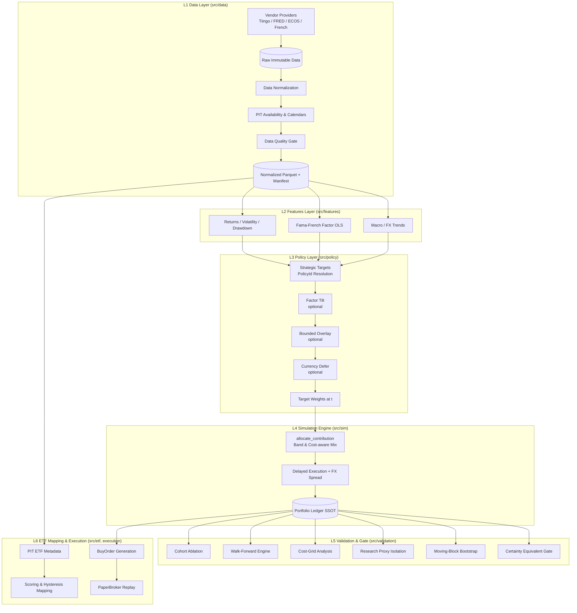

# ETF-Manager (ETF 적립식 매수 최적화 및 퀀트 검증 플랫폼)

> **Point-in-Time(PIT) 데이터 무결성**, **현실적 거래비용·환율 모델링**, **동일 현금흐름(Identical Cashflows)** 제약 하에서 실질 원화(Real KRW) 최종 자산을 극대화하는 최적의 ETF 적립식 매수 정책을 탐색하고 검증하는 플랫폼입니다.

---

## 📌 1. 프로젝트 개요 (Overview)

**ETF-Manager**는 단순한 과거 백테스트를 넘어, 실전 적립식 투자에서 발생할 수 있는 여러 편향(Look-ahead bias, 생존 편향, 암묵적 현금흐름 왜곡)을 엄격하게 통제하는 **기관급 퀀트 리서치 및 실행 엔진**입니다.

### 🎯 핵심 질문
> *"Point-in-Time 제약과 현실적인 거래/환전 비용 하에서, 동일한 외부 원화 적립금을 투입했을 때 인플레이션을 방어하고 실질 원화 자산을 극대화하는 적립 정책은 무엇인가?"*

### 🔒 핵심 원칙 및 불변식 (Invariants)
1. **엄격한 Point-in-Time(PIT) 무결성**: 공표 시점(`available_at`)과 지연 체결(`execution_at > signal_at`)을 분리하여 미래 참조(Look-ahead) 편향을 완전히 차단합니다.
2. **동일 현금흐름 기반 비교(Identical Cashflows)**: 모든 전략과 베이스라인은 매월 동일한 원화 금액을 적립하며, 임의의 현금 유출입 없이 원장(Ledger)을 통해 현금이 완전 보존됩니다.
3. **매수 전용 리밸런싱(Buy-Only Accumulation)**: 불필요한 매도에 따른 세금 및 거래비용을 방지하고, 신규 유입 적립금의 비중 조절(`allocate_contribution`)만으로 목표 자산배분을 추종합니다.
4. **확실성 등가(Certainty Equivalent, CE) 채택 게이트**: 전략 복잡도($m$)에 따른 허들($\delta_0 \cdot m$)을 부과하여, 위험회피계수 $\gamma \in \{2, 5, 10\}$ 전 구간에서 베이스라인을 유의미하게 초과할 때만 전략을 채택(Adoption)합니다.

---

## 🏗️ 2. 핵심 아키텍처 (Layer Topology)

ETF-Manager는 단방향 의존성 규칙(`L(n) -> L(m < n)`)을 엄격히 준수하는 모듈형 6계층 구조로 설계되어 있습니다.



### 계층별 역할 및 책임
- **L1 Data**: 외부 데이터 벤더(Tiingo, FRED, ECOS, Kenneth French) 수집, 불변 원본 보관, 스키마 검증 및 PIT 가용 시점 계산, 무결성 Manifest 생성.
- **L2 Features**: PIT 제약 하에서 안전한 롤링 수익률, 변동성, MDD, 파마-프렌치(Fama-French) 팩터 로딩 회귀 분석.
- **L3 Policy**: 경제적 가설에 따른 목표 비중 산출(`PolicyId`), 선택적 계층(팩터 틸트, 오버레이, 환율 분할 매수) 합성.
- **L4 Simulation Engine**: 단일 원장(Ledger SSOT) 기반 현금 보존 검증, 거래 비용/환전 스프레드/체결 지연을 반영한 매수 전용 적립 시뮬레이션.
- **L5 Validation**: 롤링 코호트(Ablation), Walk-Forward(전진 분석), 비용 시나리오 그리드, 블록 부트스트랩을 통한 통계적 검증 및 CE 게이트 판정.
- **L6 ETF Mapping & Execution**: 경제적 슬리브 자산을 실제 거래 가능한 ETF 종목으로 매핑(빈번한 교체 방지 Hysteresis 적용) 및 모의 주문(Paper Order) 생성.

---

## 📊 3. 전략(Policy) 카탈로그

시스템은 개별 종목 티커가 아닌 **경제적 가설(`PolicyId`)**을 중심으로 전략을 정의합니다.

| PolicyId | 대상 자산군 (Sleeves) | 분류 | 상태 |
| :--- | :--- | :--- | :--- |
| `vt` | Global All-Cap (VT 100%) | Baseline | 글로벌 분산 적립 기준선 |
| `vti` | US Total Market (VTI 100%) | CE Baseline | 미국 전체 시장 (검증 기준선) |
| **`qqq`** | **Nasdaq-100 (QQQ 100%)** | **Operational Lock** | **최종 채택 및 운용 정책** (2026-08) |
| `world_split` | US 50% / 선진국 30% / 신흥국 20% | Research | 지역 다변화 (기각) |
| `vt_bnd`      | 글로벌 주식 70% / 채권 30% | Research | 주식-채권 혼합 (기각) |
| `vt_treas` | 주식 60% / 중기채 20% / 장기채 20% | Research | 방어적 배분 (기각) |
| `inv_vol` | 지역별 역변동성(Inverse-Vol) 동적 배분 | Research | 동적 배분 연구 |
| `vti_vtv` | 미국 시장 80% / 가치주 20% | Research | 가치 팩터 틸트 (기각) |
| `ivv` | US Large-Cap (IVV 100% - S&P 500) | Research | 대형주 전용 (기각) |
| `ff_proxy` | French Daily Market Factor (Proxy) | Research | 장기 연구용 팩터 프록시 |

---

## 🔬 4. 검증 프레임워크 (Validation Framework)

### 확실성 등가(Certainty Equivalent, CE) 판정식
적립식 투자는 기간별 인플레이션과 위험 선호도에 큰 영향을 받으므로, 한국 CPI로 디플레이트된 실질 원화 최종 자산($W^{\text{real}}$)을 기반으로 CE를 측정합니다.

$$\mathrm{CE}_\gamma = \left(\frac{1}{N}\sum_{i=1}^{N}\left(W_i^{\text{real}}\right)^{1-\gamma}\right)^{\frac{1}{1-\gamma}}, \quad \gamma \in \{2, 5, 10\}$$

후보 전략 $k$가 베이스라인 $B$ 대비 채택되기 위한 조건:
$$\forall \gamma \in \{2, 5, 10\}: \quad \frac{\mathrm{CE}_\gamma(k)}{\mathrm{CE}_\gamma(B)} > 1 + \delta_0 \cdot m_k$$
- $\delta_0$: 모듈당 요구 복잡도 마진 (기본값 $0.02$, 즉 모듈당 최소 2% 이상 개선 필요)
- $m_k$: 추가된 전략 모듈 개수 (전략 복잡성에 대한 페널티)

### 주요 검증 파이프라인
1. **Cohort Ablation (`run ablation`)**: 동일 기간 롤링 윈도우 코호트 분석을 통해 단일 시점 편향을 제거하고 CE를 집계합니다.
2. **Walk-Forward Campaign (`run walk-forward`)**: In-Sample(Train) 구간에서 전략을 선택하고 Out-of-Sample(Test) 구간에서 실제 채택 여부를 검증합니다.
3. **Cost Grid Analysis (`run walk-forward-costs`)**: 거래비용/환율 스프레드 시나리오(Ideal, Low, Base, Stress) 전반에서 전략의 견고성을 스트레스 테스트합니다.
4. **Moving-Block Bootstrap (`moving_block_bootstrap`)**: 시계열 자기상관을 보존하는 블록 부트스트랩으로 신뢰구간을 산출합니다.

---

## 📁 5. 프로젝트 디렉토리 구조

```text
ETF-Manager/
├── configs/
│   ├── etf_metadata/           # ETF 수수료/AUM 등 부트스트랩 메타데이터
│   └── experiments/            # 가설 검증용 ExperimentSpec JSON 정의
├── data/
│   ├── raw/                    # 벤더 원본 데이터 (불변)
│   ├── normalized/             # 표준화된 PIT Parquet 파티션
│   ├── manifests/              # 데이터 무결성 SHA-256 매니페스트
│   └── experiments/            # 검증 캠페인 결과 리포트
├── docs/
│   └── architecture/           # 시스템 상세 아키텍처 설계 문서
├── src/
│   ├── analytics/              # 팩터 프로파일링, 성과 지표, 레짐 분석
│   ├── data/                   # 데이터 수집, 캘린더, PIT 조회, 품질 게이트
│   ├── etf/                    # ETF 매핑 및 히스테리시스 스코어링
│   ├── execution/              # 주문 생성 및 Paper Broker
│   ├── features/               # 수익률, 변동성, MDD, 팩터 계산
│   ├── policy/                 # 정책 정의(PolicyId), 틸트, 오버레이, 환율 로직
│   ├── sim/                    # 적립 시뮬레이션, 원장(Ledger), 비용 엔진
│   ├── validation/             # Ablation, Walk-Forward, CE 게이트, 부트스트랩
│   └── cli.py                  # 통합 CLI 엔트리포인트
├── tests/                      # 단위/통합/불변식 테스트 (Pytest, Hypothesis)
├── pyproject.toml              # 프로젝트 의존성 및 툴 설정
└── AGENTS.md                   # AI 코딩 에이전트 지침 및 불변 규칙
```

---

## 🚀 6. 시작하기 (Quickstart)

### 사전 요구사항
- Python `>= 3.11`
- [`uv`](https://docs.astral.sh/uv/) 패키지 관리자

### 설치
```bash
git clone https://github.com/KTHYEONG/ETF-Manager.git
cd ETF-Manager
uv sync --all-groups
```

### API 키 설정 (선택 사항)
실시간/히스토리 데이터를 새로 수집하려면 환경 변수를 설정합니다:
```bash
export TIINGO_API_KEY="your_tiingo_key"
export FRED_API_KEY="your_fred_key"
export ECOS_API_KEY="your_ecos_key"
```

---

## 💻 7. CLI 사용법 (Operator CLI)

모든 CLI 명령어는 프로젝트 규칙에 따라 `uv run` 접두사로 실행합니다.

### 1) 데이터 수집 (Ingest)
```bash
# 전체 패널 데이터 수집 (Prices, FX, Macro, CPI, Factors, Returns)
uv run python -m src.cli ingest history \
  --start 2012-06-01 --end 2024-10-31

# 스모크 테스트용 소규모 데이터 수집
uv run python -m src.cli ingest smoke
```

### 2) 시뮬레이션 및 정책 실행 (Simulation)
```bash
# 현재 운용 락 정책 (QQQ Nasdaq-100) 시뮬레이션
uv run python -m src.cli run policy \
  --id qqq \
  --start 2012-06-01 --end 2024-10-31 \
  --contribution-krw 1000000

# 단일 종목 베이스라인 DCA 실행 (예: VTI)
uv run python -m src.cli run baseline \
  --id dca_us --ticker VTI \
  --start 2012-06-01 --end 2024-10-31 \
  --contribution-krw 1000000
```

### 3) 가설 검증 및 어블레이션 (Validation Campaigns)
```bash
# 코호트 어블레이션 (Ablation) 실행
uv run python -m src.cli run ablation \
  --config configs/experiments/m1_m2.json

# Walk-Forward 분석 실행
uv run python -m src.cli run walk-forward \
  --config configs/experiments/wf_vti_ivv.json

# 비용 시나리오 그리드 스트레스 테스트
uv run python -m src.cli run walk-forward-costs \
  --config configs/experiments/wf_vt_vti.json
```

### 4) 진단 및 분석 (Diagnostics)
```bash
# 미국 주요 ETF(VTI, IVV, QQQ) 팩터 로딩 및 DCA 비교 진단
uv run python -m src.cli run diagnose-us-vehicles \
  --start 2012-06-01 --end 2024-10-31 \
  --contribution-krw 1000000
```

---

## 🧪 8. 품질 관리 및 테스트

```bash
# 테스트 실행 (단위 및 불변식 검증)
uv run pytest

# 린트 및 정적 분석
uv run ruff check .
uv run mypy src
```

---

## 📜 9. 라이선스

본 프로젝트는 내부 연구 및 포트폴리오 관리 목적으로 개발되었습니다.