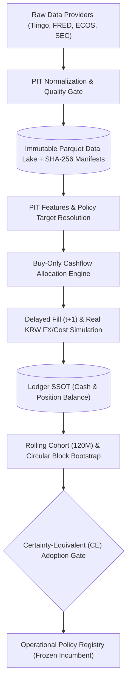

# ETF-Manager

> **Point-in-Time(PIT) 데이터 무결성**과 **동일 외부 현금흐름(Identical Cashflows)** 제약 하에서 장기 적립식(DCA) 투자 시 실질 원화(Real KRW) 자산을 극대화하는 자산배분 정책을 검증·확정하는 **퀀트 시뮬레이션 및 리서치 엔진**

`Point-in-Time Data` `DCA Simulation Engine` `Certainty-Equivalent Gate` `Circular Block Bootstrap` `Polars`

---

## Key Highlights

| 구분 | 핵심 내용 | 검증 근거 / 지표 |
| :--- | :--- | :--- |
| **Data Integrity** | 공시 시점(`available_at`)과 관측 시점 분리, Look-ahead Bias 원천 차단 | PIT 엔진, 불변 Parquet + SHA-256 매니페스트, 4개 데이터 공급자 연동 |
| **Execution Model** | $t+1$ 익거래일 체결 지연 및 무매도(Buy-Only) 현금흐름 배분 | 불변식 `I2`/`I5` 강제, 실질 원화(CPI 디플레이터) 환산, 환전·수수료 마찰 반영 |
| **Statistical Gate** | 위험회피계수($\gamma \in \{2, 5, 10\}$) 기반 Certainty-Equivalent (CE) 및 복잡도 페널티 검증 | CRRA 효용 함수 기반 채택/기각 게이트, Compound Growth 검증 |
| **Robustness** | 120개월 롤링 코호트(4개), 원형 블록 부트스트랩, 4대 비용 시나리오 스트레스 그리드 | Block size 12 부트스트랩 ($p_{05} = 1.0123 > 1.0$), 비용 스트레스 통과 |
| **Empirical Result** | 다층 검증을 통과해 확정된 잠정 표준 정책: **QQQ 90% / SOXX 10% Flat DCA** | 실질 XIRR **24.68%** (기준선 대비 연 **+1.34%p**), 4개 코호트 전수 승리 |
| **Engineering QA** | 단위·통합·속성 테스트 100% 통과, 127개 파일 Strict 정적 타입 보증 | **633 passed tests** (`pytest`), Mypy Strict, Hypothesis 불변식 검증 |

---

## Architecture



---

## Problem

기존 개인 및 상용 백테스트 시스템은 3가지 구조적 왜곡을 내포합니다:

1. **공시 시차 무시 및 무마찰 체결(Look-ahead Bias & Zero-friction):** 지표 수정치와 공시 시차를 고려하지 않고 신호 발생 당일 종가로 즉시 전액 체결을 가정하여 비현실적인 초과수익을 산출합니다.
2. **현금흐름 왜곡(Cashflow Distortion):** 동적 자산배분 전략이 인샘플 구간에서 외부 납입 원금을 임의로 늘려, 순수 자산배분 알파가 아닌 단순 납입금 증액 효과로 성과가 왜곡됩니다.
3. **단일 기간 과적합 및 꼬리 위험 간과(Overfitting & Tail Risk):** 단일 기간 총수익률이나 샤프지수 최적화에 의존하여 환율 스프레드, 인플레이션(실질 가치), 레짐 급변 시의 하방 위험(Drawdown)을 통제하지 못합니다.

ETF-Manager는 18대 시스템 불변식(Invariants)과 엄격한 통계적 게이트웨이를 통해 이러한 비현실적 가정을 원천 차단(Fail-closed)하고 재현 가능한 실질 성과만을 측정합니다.

---

## What I Built / My Contribution

*본 프로젝트는 1인 리서치 및 엔지니어링으로 데이터 수집 파이프라인부터 시뮬레이션 엔진, 검증 게이트까지 전체 파이프라인을 독자 설계·구현했습니다.*

- **Point-in-Time (PIT) 데이터 파이프라인 및 불변 스토리지 엔진 구축**
  - **문제:** 거시 지표 수정치(Vintage Revision) 및 공시 시차로 인한 백테스트 미래 정보 누수 발생.
  - **구현:** 관측일(`observation_date`)과 실제 가용일(`available_at`)을 분리하고, SHA-256 해시 매니페스트로 정합성을 검증하는 Parquet 불변 데이터 레이크 설계.
  - **효과:** 데이터 개정 및 미래 참조로 인한 Look-ahead Bias를 시스템 수준에서 원천 차단.
- **동일 현금흐름 제약 기반 Buy-Only 적립식 시뮬레이션 엔진 개발**
  - **문제:** 잦은 매도 리밸런싱에 따른 거래비용·세금 마찰 발생 및 전략 간 외부 납입금 차이로 인한 성과 왜곡.
  - **구현:** 모든 비교군에 동일 외부 원화 납입금(Flat 월 100만 원)을 강제하고, 매도 없이 신규 유입금만 목표 비중에 우선 배분하는 `allocate_contribution` 알고리즘 개발.
  - **효과:** 불필요한 과세 실현 및 마찰 비용을 최소화하고 전략 간 순수 자산배분 역량만 공정하게 비교.
- **다중 위험회피도 기반 Certainty-Equivalent (CE) 및 복잡도 페널티 채택 게이트 설계**
  - **문제:** 단순 평균 수익률은 극단적 하방 위험(Tail Risk)을 반영하지 못하며, 파라미터가 많은 복잡한 전략이 과적합되기 쉬움.
  - **구현:** CRRA 효용 함수 기반 확실성 등가 수익률($\mathrm{CE}_\gamma, \gamma \in \{2, 5, 10\}$)과 선언된 모듈 복잡도 페널티($\delta_0 \cdot m_k$)를 결합한 가설 채택/기각 게이트웨이 구현.
  - **효과:** 다중 위험회피 수준을 모두 통과하고 복잡도 대비 초과수익이 유의미하게 입증된 전략만 운영 정책으로 승격.
- **120개월 롤링 코호트 및 Paired Circular Block Bootstrap 검증 체계 구현**
  - **문제:** 금융 시계열의 강한 자기상관성(Autocorrelation)으로 인해 전통적 t-검정이 통계적 유의성을 과대평가.
  - **구현:** 120개월 롤링 윈도우(4개 코호트)와 12개월 블록 단위 원형 블록 부트스트랩, 4대 비용 시나리오(Ideal, Low, Base, Stress) 스트레스 테스트 파이프라인 구축.
  - **효과:** 특정 시작 시점 의존성을 배제하고 비용 악화 환경에서도 강건한 통계적 우위($p_{05} > 1.0$) 확보.
- **불변 원장(Ledger SSOT) 기반 단방향 회계 시스템 구축**
  - **문제:** 시뮬레이션 중 상태 불일치, 현금 누수 및 모듈 간 역방향 의존성으로 인한 데이터 오염.
  - **구현:** 모든 거래와 포지션 상태를 불변 원장 이벤트로 단방향(L1 Data $\rightarrow$ L4 Simulation) 기록하고, 매 스텝 현금 보존 법칙을 검증하는 Ledger 구현.
  - **효과:** 시뮬레이션 실행의 100% 결정론적 재현성 및 회계적 무결성 보장.

---

## Results & Evaluation

### 최종 과거 캠페인 검증 결과 (`FINAL_HISTORICAL_CAMPAIGN_V1`)

- **평가 윈도우:** 2012-08-31 → 2026-08-28 (120개월 롤링 코호트, Step 12개월, 총 4개 코호트)
- **납입 조건:** Flat 월 100만 원 고정 납입 (동일 외부 현금흐름 강제, Invariant `I5`)
- **비용 조건:** 한국 CPI 디플레이터 적용 실질 원화(Real KRW) 기준, 환전 스프레드 및 거래 수수료 차감, 익거래일($t+1$) 지연 체결
- **데이터 분할:** 120M Rolling In-Sample & Out-of-Fold (Block Bootstrap, 1,000 resamples)

| 전략 (Arm) | 목표 비중 | 코호트 수 | 실질 XIRR | Median Ratio | Worst Ratio | Bootstrap $p_{05}$ | CE Ratio ($\gamma=10$) | 최종 판정 |
| :--- | :--- | :---: | :---: | :---: | :---: | :---: | :---: | :---: |
| **B0 (Benchmark)** | QQQ 100% | 4 | 23.34% | 1.0000 | 1.0000 | 1.0000 | 1.0000 | 기준선 (Immutable) |
| **C1** | QQQ 95% / SOXX 5% | 4 | 23.69% | 1.0110 | 1.0058 | 1.0047 | 1.0112 | 허들 미달 (마진 협소) |
| **C2 (Incumbent)** | **QQQ 90% / SOXX 10%** | **4** | **24.68%** | **1.0336** | **1.0224** | **1.0123** | **1.0335** | **운영 채택 (Operational Lock)** |
| **C3** | QQQ 85% / SOXX 15% | 4 | 25.96% | 1.0556 | 1.0368 | 1.0120 | 1.0546 | 집중 위험 배제 (보수적) |

#### 비용 스트레스 시나리오 검증 (C2 vs Baseline Ratio)
- **Ideal:** 1.0758 | **Low:** 1.0764 | **Base:** 1.0749 | **Stress:** 1.0785

#### 성과 분석 요약
- **전수 초과 성과:** C2(QQQ 90% / SOXX 10%)는 4개 코호트 전수에서 벤치마크를 상회(Worst Ratio 1.0224, 코호트 승률 100%)했습니다.
- **실질 수익률:** 실질 원화 연환산 내부수익률(Real XIRR) 24.68%를 기록하여 QQQ 단독(23.34%) 대비 연 **+1.34%p**의 실질 초과수익을 달성했습니다.
- **하방 강건성:** 부트스트랩 하위 5% 분위수($p_{05} = 1.0123 > 1.0$) 및 극단적 위험회피 조건($\mathrm{CE}_{\gamma=10} = 1.0335$)에서도 기준선을 유의미하게 상회했습니다.
- **보수적 선택:** C3가 총수익률은 더 높았으나, 블록 부트스트랩 $p_{05}$ 하방 지표(1.0120) 및 단일 반도체 섹터 집중 위험을 감안하여 C2를 최종 운영 표준으로 동결했습니다.

---

## Key Engineering Decisions

### 1. 무매도 신규 유입금 배분 (Buy-Only Accumulation)
- **Decision:** 리밸런싱 시 기존 보유 포지션 매도를 전면 배제하고, 신규 유입 현금만으로 목표 비중에 점진 수렴하는 배분 알고리즘 채택.
- **Why:** 장기 적립식 구조에서 빈번한 매도 리밸런싱은 거래 수수료, 슬리피지, 양도소득세 등 즉각적인 마찰 비용을 유발하여 복리 수익을 저해함.
- **Alternative considered:** 정기 비중 리밸런싱(Periodic Sell Rebalance), 변동성 임계치 밴드 리밸런싱.
- **Trade-off:** 급격한 시장 변동 시 목표 비중 수렴 속도가 느려질 수 있으나, 과세 이연 및 마찰 비용 최소화로 실질 최종 자산 형성 측면에서 우수함.

### 2. 다중 위험회피도 기반 Certainty-Equivalent (CE) 게이트
- **Decision:** 단순 연평균 복리수익률(CAGR)이나 샤프지수 대신 위험회피계수($\gamma \in \{2, 5, 10\}$)를 적용한 CE 비율과 모듈 복잡도 페널티를 채택 기준으로 강제.
- **Why:** 평균 수익률이 높아도 좌측 꼬리 위험(Drawdown)이 깊은 전략과 파라미터가 과도하게 튜닝된 복잡한 전략을 엄격히 탈락시키기 위함.
- **Alternative considered:** Sharpe Ratio 극대화, Sortino Ratio 기준선, 단일 효용 함수 평가.
- **Trade-off:** 공격적인 모멘텀 타이밍 전략이나 고변동성 알파 후보가 보수적으로 탈락할 수 있으나, 시스템의 장기 생존성과 견고성을 보장함.

### 3. Strict Point-in-Time (PIT) 분리 및 $t+1$ 비동기 체결
- **Decision:** 관측 시점(`observation_date`)과 공시 시점(`available_at`)을 엄격히 분리하고, 신호 발생 당일 종가가 아닌 익거래일($t+1$) 체결 강제.
- **Why:** 거시 지표 사후 수정치(Vintage Revision) 참조 및 당일 종가 즉시 체결 가정으로 인한 백테스트의 비현실적인 수익률 왜곡 차단.
- **Alternative considered:** $t$ 시점 종가 즉시 체결 가정, 단순 Forward-fill 기반 데이터 파이프라인.
- **Trade-off:** 다중 거래소(NYSE, KRX) 캘린더 동기화와 시뮬레이션 파이프라인의 연산 복잡도가 증가하지만, 현실 실행 가능성이 보장됨.

### 4. RDBMS 대신 불변 Parquet + SHA-256 Manifest 데이터 레이크 구조
- **Decision:** 관계형 데이터베이스(PostgreSQL 등) 서버를 도입하지 않고, SHA-256 해시 매니페스트로 무결성을 검증하는 불변 Parquet 컬럼형 파일 포맷 채택.
- **Why:** 대용량 금융 시계열의 고성능 벡터화 연산 최적화, 외부 DB 서버 인프라 의존성 제거, 시점별 데이터의 100% 결정론적(Deterministic) 재현성 확보.
- **Alternative considered:** PostgreSQL / TimescaleDB 구축, SQLite 단일 파일 데이터베이스.
- **Trade-off:** 실시간 트랜잭션 처리(OLTP) 및 복잡한 관계형 조인에는 부적합하지만, 읽기 집약적 퀀트 백테스트 환경에서 압도적인 I/O 성능과 이식성을 제공함.

---

## Tech Stack

| Category | Technology | Role / Engineering Rationale |
| :--- | :--- | :--- |
| **Language & Runtime** | Python 3.11+, `uv` | 초고속 가상환경 의존성 격리 및 100% 재현 가능한 실행 환경 보장 |
| **Data Engine** | Polars, PyArrow, Parquet | 대용량 시계열 벡터화 처리, 불변 컬럼형 저장소 및 엄격한 스키마 보존 |
| **Data Contracts** | Pydantic v2, Pydantic-Settings | 런타임 데이터 스키마 및 환경 설정 불변성 검증 |
| **Market Calendars** | Exchange-calendars | NYSE(`XNYS`) 및 KRX 거래일, 공휴일, 개폐장 시점 정밀 시뮬레이션 |
| **Data Ingestion** | HTTPX, Tenacity | 지수 백오프 기반 안정적 API 수집 (Tiingo, FRED, ECOS, SEC EDGAR) |
| **Static Typing & Linting** | Mypy (Strict), Ruff | 전체 127개 파일 Strict 정적 타입 보증 및 PEP8/Bandit 보안/성능 린트 준수 |
| **Testing Framework** | Pytest, Hypothesis | 633개 테스트 자동화 및 속성 기반(Property-based) 시스템 불변식 검증 |

---

## Reliability / Testing

- **테스트 스위트:** 총 **633개 단위·통합 테스트** 100% 통과 (`pytest`).
- **엄격한 정적 분석:** 전체 127개 소스 파일 `mypy --strict` 무오류 통과, `ruff check` 보안/성능/스타일 규칙 전수 준수.
- **속성 기반 테스트 (PBT):** `hypothesis`를 활용하여 다양한 무작위 시장 경로에서도 현금 보존 법칙(Cash Conservation), 가중치 합계($1.0 \pm 10^{-6}$), 수치 수렴성 검증.
- **로컬 자동화 검증 툴체인:** 원격 CI 서버 의존 없이 로컬에서 즉시 실행 가능한 정밀 검증 툴체인 구축.
- **핵심 시스템 불변식 (Invariants):**
  - `I1`: `available_at <= t` 시점 분리 보장 (Look-ahead Bias 차단)
  - `I2`: `execution_at > signal_at` 체결 지연 강제 (현실적 실행 모델)
  - `I5`: 모든 비교 전략에 동일 외부 현금흐름 강제 (공정한 성과 비교)
  - `I6`: 매 거래 단계 원장 현금 보존 법칙 준수 (회계 무결성)

---

## Quick Start

### 1. 환경 설정 및 의존성 설치
```bash
# uv를 통한 가상환경 및 의존성 동기화
uv sync --all-groups

# (선택) 데이터 인제스트 시 API 키 설정
export TIINGO_API_KEY="your_tiingo_api_key"
export FRED_API_KEY="your_fred_api_key"
export ECOS_API_KEY="your_ecos_api_key"
```

### 2. 운영 정책 시뮬레이션 실행 (QQQ 90% / SOXX 10% Flat DCA)
```bash
uv run python -m src.cli run policy \
  --id qqq \
  --start 2016-07-01 --end 2026-06-30 \
  --contribution-krw 1000000
```

### 3. 검증 캠페인 및 테스트 스위트 실행
```bash
# 최종 과거 캠페인 검증 실행
uv run python -m src.cli run final-historical-campaign \
  --config configs/experiments/final_historical_campaign_v1.json \
  --seed 42

# 전체 테스트 및 정적 타입 검사
uv run pytest
uv run ruff check .
uv run mypy src
```

---

## Project Structure

```text
ETF-Manager/
├── src/
│   ├── data/            # L1: 데이터 공급자(Tiingo, FRED, ECOS, N-PORT) 및 PIT 파이프라인
│   ├── features/        # L2: PIT 안전 수익률, 변동성, 낙폭 및 거시 팩터 산출
│   ├── policy/          # L3: 포트폴리오 목표 비중 결정 및 테마(Thesis) 레지스트리
│   ├── sim/             # L4: Buy-Only 적립식 시뮬레이션, 지연 체결, 원장(Ledger SSOT)
│   ├── validation/      # L5: CE 게이트, 120M 코호트, 워크포워드, 블록 부트스트랩
│   ├── etf/             # L6: ETF 종목 매핑 및 히스테리시스 스코어링
│   ├── analytics/       # 5-Slot Thesis 분석(Structural, Valuation, Crowding 등)
│   ├── execution/       # 주문 생성 및 페이퍼 브로커
│   └── cli_commands/    # CLI 커맨드 핸들러
├── configs/
│   ├── experiments/     # 워크포워드 및 캠페인 실험 설정 JSON
│   ├── theses/          # 투자 가설 및 반증 조건(Falsifier) 정의
│   └── prospective/     # OOS 모니터링 동결 레지스트리
├── tests/               # 633개 단위/통합/속성 테스트
└── docs/                # 아키텍처 및 연구 결과 문서
```

---

## Limitations

1. **표본 크기 및 코호트 중첩 (Thin-Sample & Overlapping Cohorts):** 한국 CPI 데이터의 실질 가용 시점(2012-08-31~) 한계로 인해 120개월 롤링 코호트가 총 4개로 제한되며, 코호트 구간 간 중첩으로 인해 완전 독립 표본이 아닙니다.
2. **과거 극단 국면(Dot-Com / GFC) 실제 ETF 시계열 부재:** 2000년대 닷컴 버블 및 2008년 글로벌 금융위기 구간은 실제 ETF 상장 이전이므로 본 시뮬레이션의 실제 체결 데이터에 포함되지 않았습니다.
3. **최종 청산 세후 정산 모델 미포함:** Buy-Only 적립식 특성상 매도 전까지 양도소득세 과세가 이연되지만, 인출 및 최종 청산 시점의 실질 세후 수익률 정산 모델은 포함되지 않았습니다.
4. **실주문 브로커 연동 제외:** 본 시스템은 페이퍼 브로커(PaperBroker) 기반 시뮬레이션 엔진이며, 증권사 실계좌 주문 API 연동은 범위에서 제외되어 있습니다.

---

## Documentation

- [System Overview & 18 Invariants](docs/architecture/00_system_overview.md) — 6계층 아키텍처 및 시스템 불변식 상세 명세
- [Data Layer Contracts & PIT Integrity](docs/architecture/01_data_contracts.md) — 데이터 소스, 가용성 규칙 및 품질 게이트
- [Policy Catalog & Validation Gates](docs/architecture/02_policy_and_validation.md) — 전략 카탈로그 및 Certainty-Equivalent 게이트 수학적 정의
- [Operator CLI Reference](docs/architecture/03_operator_cli.md) — CLI 실행 커맨드 및 설정 스펙
- [Final Historical Campaign Report](docs/results/final-historical/FINAL_HISTORICAL_CAMPAIGN_V1_8201d9e.md) — 과거 데이터 최종 검증 리포트
- [Research Results Archive](docs/results/README.md) — 가설 검증 결과 및 아카이브
