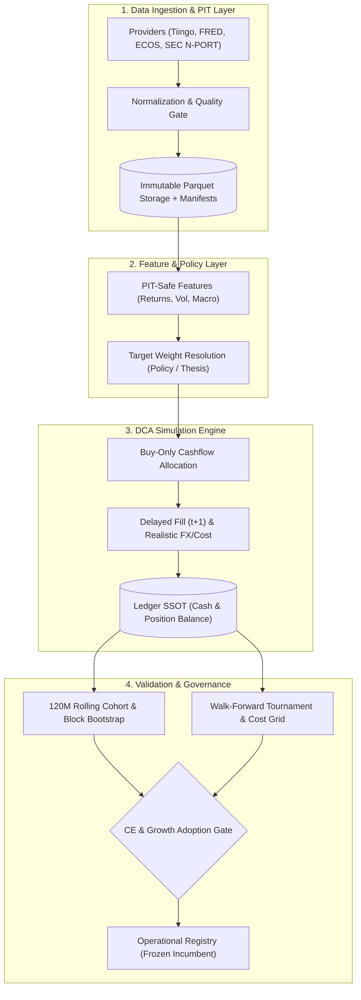

# ETF-Manager

> **Point-in-Time(PIT) 데이터 무결성**, **동일 외부 현금흐름(Identical Cashflows)** 제약 하에서 장기 적립식(DCA) 투자 시 실질 원화(Real KRW) 자산을 극대화하는 정책을 검증·확정하는 **퀀트 리서치 및 시뮬레이션 엔진**

`Point-in-Time Data` `DCA Simulation Engine` `Certainty-Equivalent Gate` `Walk-Forward Validation` `Circular Block Bootstrap`

---

## Key Highlights

| 구분 | 핵심 내용 | 검증 근거 / 지표 |
| :--- | :--- | :--- |
| **Data Integrity** | 공시 시점(`available_at`)과 관측 시점 분리, Look-ahead Bias 원천 차단 | PIT 엔진, 불변 Parquet 매니페스트, 4개 데이터 공급자 연동 |
| **Execution Model** | Look-ahead 없는 $t+1$ 익거래일 체결, 무매도(Buy-Only) 현금흐름 배분 | Invariant I2/I5 강제, 실질 원화 CPI 디플레이터 반영 |
| **Statistical Gate** | 위험회피계수($\gamma \in \{2, 5, 10\}$) 기반 Certainty-Equivalent (CE) 및 복잡도 페널티 검증 | CRRA 효용 함수 기반 채택/기각 판정, Compound Growth 게이트 |
| **Robustness** | 120개월 롤링 코호트, Paired Circular Block Bootstrap, 비용 시나리오 그리드 | Block size 12 부트스트랩 ($p_{05} > 1.0$), 4개 비용 스트레스 시나리오 |
| **Incumbent Policy** | 다층 교차 검증을 통과해 동결된 잠정 표준: **QQQ 90% / SOXX 10% Flat DCA** | 120M 코호트 중간값 비 $1.0336$, Bootstrap $p_{05}=1.0123$, 최악 코호트 비 $1.0224$ |
| **Engineering QA** | 단위·통합·속성 테스트 100% 통과, Strict 정적 타입 보증 | **633 passed tests**, Mypy Strict (127 files), Hypothesis 검증 |

---

## Architecture



---

## Problem

기존 개인 및 상용 백테스트 시스템은 3가지 구조적 왜곡을 내포합니다:
1. **Look-ahead Bias & 무마찰 가정:** 공시 시차를 무시하고 $t$ 시점 종가로 당일 즉시 무마찰 체결을 가정하여 비현실적인 초과수익을 산출합니다.
2. **현금흐름 왜곡 (Cashflow Distortion):** 동적 적립식 전략이 인샘플에서 납입 원금을 임의로 증가시켜, 순수 자산배분 알파가 아닌 단순 납입금 차이로 성과가 왜곡됩니다.
3. **단일 백테스트 과적합 & 꼬리 위험 간과:** 단일 기간 총수익률/샤프지수에 의존하여 체결 지연, 환율 스프레드, 인플레이션(실질 가치), 레짐 변화 시의 하방 위험을 통제하지 못합니다.

ETF-Manager는 이러한 문제를 18대 불변식(Invariants)과 엄격한 수학적 게이트웨이로 원천 차단(Fail-closed)합니다.

---

## What I Built / My Contribution

*본 프로젝트는 1인 리서치 및 엔지니어링으로 전체 파이프라인을 설계·구현했습니다.*

- **Strict Point-in-Time (PIT) 데이터 파이프라인 구축**
  - **문제:** 거시지표 수정치(Revision) 및 공시 시차로 인한 미래 정보 누수 발생.
  - **구현:** 관측일(`observation_date`)과 실제 가용일(`available_at`)을 분리하고 불변 SHA256 매니페스트로 Parquet 데이터를 관리하는 PIT 엔진 구현.
  - **효과:** 데이터 수정에 따른 Look-ahead Bias를 시스템 수준에서 원천 배제.
- **동일 현금흐름 제약 기반 Buy-Only 적립식 시뮬레이션 엔진 개발**
  - **문제:** 기존 자산 매도 리밸런싱은 세금·수수료 마찰을 유발하며, 가변 납입은 총 납입액 왜곡을 초래.
  - **구현:** 모든 비교군에 동일 외부 원화 납입금(Flat 월 100만 원)을 강제하고, 매도 없이 신규 유입금만 목표 비중에 우선 배분하는 `allocate_contribution` 알고리즘 개발.
  - **효과:** 과세 이연 및 마찰 비용 최소화 상태에서 전략 간 순수 자산배분 역량만 공정 비교.
- **Certainty-Equivalent (CE) 및 Compound Growth 통계 채택 게이트 설계**
  - **문제:** 단순 평균 수익률은 극단적 손실 위험(Tail Risk)을 반영하지 못하며, 복잡한 전략이 과적합되기 쉬움.
  - **구현:** CRRA 효용 함수 기반 확실성 등가 수익률($\mathrm{CE}_{\gamma}$, $\gamma \in \{2, 5, 10\}$)과 모듈 복잡도 페널티($\delta_0 \cdot m_k$)를 결합한 가설 채택/기각 게이트웨이 구현.
  - **효과:** 다중 위험회피 수준을 모두 만족하고 복잡도 대비 초과수익이 입증된 전략만 승격.
- **120개월 롤링 코호트 및 Paired Circular Block Bootstrap 검증 체계 구현**
  - **문제:** 시계열 데이터의 자기상관성(Autocorrelation)으로 인해 전통적 통계 검정이 과도한 신뢰도를 부여.
  - **구현:** 120개월 롤링 윈도우와 12개월 블록 단위 원형 블록 부트스트랩, 4대 비용 시나리오(Ideal, Low, Base, Stress) 스트레스 그리드 파이프라인 구축.
  - **효과:** 표본 의존성을 배제하고 비용 악화 환경에서도 강건한 통계적 유의성 확보 ($p_{05} > 1.0$).
- **5-Slot Thesis 리서치 프레임워크 & Prospective OOS 모니터링 구축**
  - **문제:** 단일 계량 지표에 의존한 테마 투자는 펀더멘털 악화나 과열 집중을 감지하지 못함.
  - **구현:** Structural(거시/CAPEX), Valuation(상대 밸류에이션 백분위), Crowding(SEC N-PORT 기반 HHI/Top5 집중도), Purity, Meaning 5개 슬롯 평가 엔진 및 2026-08-28 컷오프 기반 Append-only OOS 모니터링 구축.
  - **효과:** 가설의 구조적 타당성 실시간 추적 및 데이터 스누핑 방지.

---

## Results & Evaluation

### 최종 과거 캠페인 검증 결과 (`FINAL_HISTORICAL_CAMPAIGN_V1`)
- **평가 윈도우:** 2012-08-31 → 2026-08-28 (120개월 롤링 코호트, Step 12개월, 총 4개 코호트)
- **납입 조건:** Flat 월 100만 원 고정 납입 (동일 현금흐름 Invariant I5)
- **비용 조건:** 실질 원화 CPI 디플레이터 반영, 환전 스프레드 및 거래 수수료 차감, 익거래일($t+1$) 지연 체결
- **데이터 분할:** 120M Rolling In-Sample & Out-of-Fold Bootstrap 평가

| Strategy Arm | Cohorts | Median Ratio | P10 Ratio | Worst Ratio | Bootstrap $p_{05}$ | CE Ratio ($\gamma=10$) | 최종 판정 |
| :--- | :---: | :---: | :---: | :---: | :---: | :---: | :---: |
| **B0 (QQQ 100%, Benchmark)** | 4 | 1.0000 | 1.0000 | 1.0000 | 1.0000 | 1.0000 | 기준선 (Frozen) |
| **C1 (QQQ 95% / SOXX 5%)** | 4 | 1.0110 | 1.0069 | 1.0058 | 1.0047 | 1.0112 | 허들 미달 (마진 협소) |
| **C2 (QQQ 90% / SOXX 10%)** | **4** | **1.0336** | **1.0256** | **1.0224** | **1.0123** | **1.0335** | **운영 락 채택 (Incumbent)** |
| **C3 (QQQ 85% / SOXX 15%)** | 4 | 1.0556 | 1.0416 | 1.0368 | 1.0120 | 1.0546 | 집중 위험 배제 (보수적) |

> **선정 근거:** C2(QQQ 90% / SOXX 10%)는 QQQ 단독 대비 평가된 4개 코호트 전수에서 실질 초과수익을 기록(Worst Ratio = 1.0224)했으며, 블록 부트스트랩 하위 5%($p_{05}=1.0123$) 및 극단적 위험회피($\mathrm{CE}_{\gamma=10}=1.0335$) 기준에서도 기준선을 유의미하게 상회했습니다. C3 대비 단일 반도체 섹터 집중 위험을 통제한 보수적 최적 균형점으로 채택되었습니다.

---

## Key Engineering Decisions

### 1. 무매도 신규 유입금 배분 (Buy-Only Accumulation)
- **Decision:** 리밸런싱 시 기존 포지션 매도를 전면 금지하고, 신규 유입 현금만으로 목표 비중에 점진 수렴하는 알고리즘 채택.
- **Why:** 장기 DCA에서 빈번한 매도 리밸런싱은 거래 수수료, 슬리피지, 과세 실현을 유발하여 복리 효과를 저해함.
- **Alternative considered:** 정기 비중 리밸런싱(Periodic Sell Rebalance), 변동성 밴드 기반 임계치 리밸런싱.
- **Trade-off:** 급격한 시장 변동 시 목표 비중 수렴 속도가 느려질 수 있으나, 마찰 비용 및 세금 이연 측면에서 실질 최종 자산이 우수함.

### 2. 다중 위험회피도 기반 Certainty-Equivalent (CE) 게이트
- **Decision:** 단순 CAGR, 샤프지수 대신 위험회피계수($\gamma \in \{2, 5, 10\}$)를 적용한 CE 비율과 모듈 복잡도 페널티를 채택 기준으로 강제.
- **Why:** 평균 수익률이 높아도 좌측 꼬리 위험(Drawdown)이 깊은 전략과 과적합된 복잡한 전략을 체계적으로 기각하기 위함.
- **Alternative considered:** Sharpe Ratio 최적화, Sortino Ratio, 단일 효용 함수.
- **Trade-off:** 공격적인 타이밍 전략이나 고변동성 알파 후보가 보수적으로 탈락할 수 있으나, 시스템의 장기 안정성을 보장함.

### 3. Strict Point-in-Time (PIT) 분리 및 $t+1$ 비동기 체결
- **Decision:** 관측 시점(`observation_date`)과 데이터 공개 시점(`available_at`)을 분리하고, 신호 발생일 종가가 아닌 익거래일($t+1$) 체결 강제.
- **Why:** 거시지표 수정치 참조 및 당일 종가 동시 체결 가정으로 인한 백테스트 비현실성을 차단.
- **Alternative considered:** $t$ 시점 종가 즉시 체결, 단순 Forward-fill 데이터 파이프라인.
- **Trade-off:** 시뮬레이션 파이프라인 복잡도가 증가하고 캘린더 동기화 연산량이 늘어나지만, 현실 재현성이 극대화됨.

### 4. 불변 원장(Ledger) 중심 단방향 아키텍처
- **Decision:** 모든 포트폴리오 상태의 유일한 진실 공급원(SSOT)으로 원장(Ledger)을 정의하고, L1(Data) $\rightarrow$ L6(Execution) 단방향 의존성 적용.
- **Why:** 분석 모듈이나 전략 모듈이 포트폴리오 상태를 임의로 조작하거나 역방향 의존성을 갖는 것을 원천 방지.
- **Alternative considered:** 각 모듈별 상태 분산 관리, 양방향 이벤트 버스.
- **Trade-off:** 원장 이벤트 기록에 따른 메모리 오버헤드가 발생하나, 회계적 보존 법칙(Invariant I6)과 재현성을 보장함.

---

## Tech Stack

| Category | Technology | Role / Engineering Rationale |
| :--- | :--- | :--- |
| **Language & Tooling** | Python 3.11+, `uv` | 의존성 격리, 초고속 패키지 동기화 및 실행 재현성 보장 |
| **Data Engine** | Polars, PyArrow, Parquet | 고성능 벡터화 시계열 연산, 불변 컬럼형 저장소 및 스키마 보존 |
| **Contract & Typing** | Pydantic v2, Mypy (Strict) | 런타임 데이터 검증 및 127개 소스 파일 전수 Strict 타입 보증 |
| **Market Calendars** | Exchange-calendars | NYSE(XNYS), KRX 거래일 및 개폐장 시점 정밀 시뮬레이션 |
| **Testing & Quality** | Pytest, Hypothesis, Ruff | 속성 기반 테스트(Property-based testing), 고속 린팅 및 633개 테스트 자동화 |

---

## Reliability / Testing

- **테스트 스위트:** 총 **633개 단위 및 통합 테스트** 구현 및 100% 통과 (`pytest`).
- **정적 분석 및 린트:** `mypy --strict`로 전체 127개 소스 파일 무오류 통과, `ruff check` 보안/성능/스타일 규칙 전수 준수.
- **속성 기반 테스트 (PBT):** `hypothesis`를 활용한 현금 보존 법칙(Cash Conservation), 가중치 합계($1.0 \pm 10^{-6}$), 수치 수렴 검증.
- **격리 원칙 (Zero External `/tmp`):** 모든 테스트 아티팩트와 임시 파일은 외부 시스템 디렉토리를 오염시키지 않고 프로젝트 내부 `scratch/`에서 격리 관리.
- **18대 불변식 (Invariants):**
  - `I1`: `available_at <= t` 시점 분리 보장
  - `I2`: `execution_at > signal_at` 체결 지연 강제
  - `I5`: 모든 비교 전략에 동일 외부 현금흐름 강제
  - `I6`: 매 거래 단계 원장 현금 보존 법칙 준수

---

## Quick Start

### 1. 환경 설정 및 의존성 설치
```bash
# uv를 통한 의존성 동기화
uv sync --all-groups

# (선택) 데이터 인제스트 시 API 키 설정
export TIINGO_API_KEY="your_tiingo_api_key"
export FRED_API_KEY="your_fred_api_key"
export ECOS_API_KEY="your_ecos_api_key"
```

### 2. 운영 락 시뮬레이션 실행 (QQQ 90% / SOXX 10% Flat DCA)
```bash
uv run python -m src.cli run policy \
  --id qqq \
  --start 2016-07-01 --end 2026-06-30 \
  --contribution-krw 1000000
```

### 3. 검증 캠페인 및 테스트 실행
```bash
# 최종 과거 캠페인 검증 실행
uv run python -m src.cli run final-historical-campaign \
  --config configs/experiments/final_historical_campaign_v1.json \
  --seed 42

# 전체 테스트 및 정적 타입 검사
uv run pytest
uv run ruff check .
uv run mypy src
```

---

## Project Structure

```text
ETF-Manager/
├── src/
│   ├── data/            # L1: 데이터 공급자(Tiingo, FRED, ECOS, N-PORT) 및 PIT 파이프라인
│   ├── features/        # L2: PIT 안전 수익률, 변동성, 낙폭 및 거시 팩터 산출
│   ├── policy/          # L3: 포트폴리오 목표 비중 결정 및 테마(Thesis) 레지스트리
│   ├── sim/             # L4: Buy-Only 적립식 시뮬레이션, 지연 체결, 원장(Ledger SSOT)
│   ├── validation/      # L5: CE 게이트, 120M 코호트, 워크포워드, 블록 부트스트랩
│   ├── etf/             # L6: ETF 종목 매핑 및 히스테리시스 스코어링
│   ├── analytics/       # 5-Slot Thesis 분석(Structural, Valuation, Crowding 등)
│   ├── execution/       # 주문 생성 및 페이퍼 브로커
│   └── cli_commands/    # CLI 커맨드 핸들러
├── configs/
│   ├── experiments/     # 워크포워드 및 캠페인 실험 설정 JSON
│   ├── theses/          # 투자 가설 및 반증 조건(Falsifier) 정의
│   └── prospective/     # OOS 모니터링 동결 레지스트리
├── tests/               # 633개 단위/통합/속성 테스트
└── docs/                # 아키텍처 및 연구 결과 문서
```

---

## Limitations

1. **표본 크기 및 코호트 중첩 (Thin-Sample & Overlapping Cohorts):** 한국 CPI 데이터 가용성(2012-08-31~) 한계로 120개월 롤링 코호트가 총 4개로 제한되며, 코호트 구간 간 중첩으로 인해 완전 독립 표본이 아닙니다.
2. **과거 극단 국면(Dot-Com / GFC) 실제 ETF 시계열 부재:** 2000년대 닷컴 버블 및 2008년 금융위기 구간은 실제 ETF 상장 이전이므로 본 시뮬레이션의 실제 체결 데이터에 포함되지 않았습니다.
3. **세금 모델 간소화:** Buy-Only 적립 특성상 매도 전까지 과세가 이연되지만, 최종 청산/환급 시의 실질 세후 수익률 정산 모델은 포함되지 않았습니다.
4. **실주문 브로커 연동 제외:** 현재 버전은 페이퍼 브로커(PaperBroker) 기반 시뮬레이션으로 한정되며, 증권사 실계좌 주문 API 연동은 범위에서 제외되어 있습니다.

---

## Documentation

- [System Overview & 18 Invariants](docs/architecture/00_system_overview.md) — 6계층 구조 및 불변식 명세
- [Data Layer Contracts & PIT Integrity](docs/architecture/01_data_contracts.md) — 데이터 소스 및 품질 게이트
- [Policy Catalog & Validation Gates](docs/architecture/02_policy_and_validation.md) — 전략 카탈로그 및 CE 게이트 수학적 정의
- [Operator CLI Reference](docs/architecture/03_operator_cli.md) — 실행 커맨드 및 설정 스펙
- [Final Historical Campaign Report](docs/results/final-historical/FINAL_HISTORICAL_CAMPAIGN_V1_8201d9e.md) — 과거 데이터 최종 검증 리포트
- [Research Results Archive](docs/results/README.md) — 가설 검증 결과 아카이브

