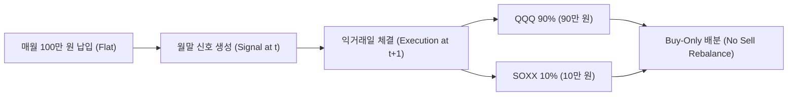
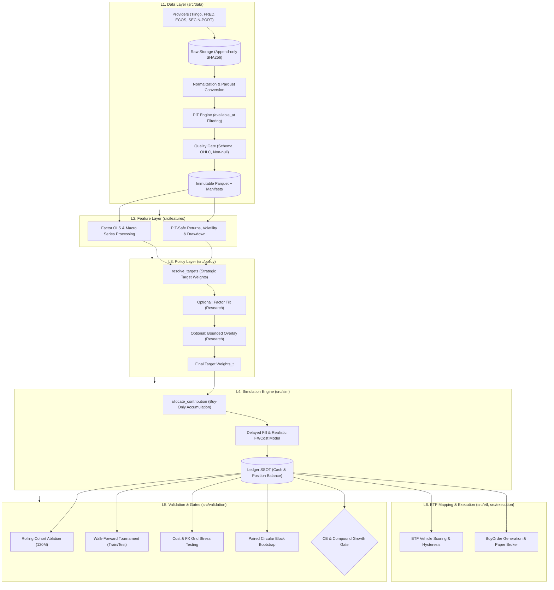

# 🏛️ ETF-Manager: Institutional Quant DCA Research & Execution Platform

> **Point-in-Time(PIT) 데이터 무결성**, **현실적 거래비용·환율 모델링**, **동일 외부 현금흐름(Identical External Cashflows)** 제약 하에서 장기 적립식 투자 시 실질 원화(Real KRW) 최종 자산을 극대화하는 정책을 검증·수렴하여 확정하는 **퀀트 리서치 및 시뮬레이션 엔진**입니다.

---

## 📌 1. Executive Summary & 핵심 문제 정의

대부분의 개인 및 금융 백테스트는 세 가지 치명적인 결함을 가지고 있습니다:
1. **Look-ahead Bias & Survivorship Bias:** 미래 데이터를 참조하거나 상장폐지/메타데이터 시점을 무시하여 비현실적인 수익률 산출.
2. **비현실적인 마찰 비용 누락:** 환전 스프레드(FX Spread), 거래 수수료, 슬리피지, 인플레이션(실질 가치)을 생략하여 과대평가.
3. **불공정한 현금흐름 비교 (Cashflow Distortion):** 전략마다 임의로 납입액/시점을 다르게 하여 자본 배분의 순수 알파가 아닌 단순 납입금 차이로 인한 왜곡 발생.

**ETF-Manager**는 이러한 오류를 수학적·소프트웨어적으로 원천 차단(Fail-closed)하고, 10년 이상의 장기 적립식(DCA) 환경에서 **"어떤 자산 배분 및 적립 정책이 실질 원화 부를 극대화하면서 꼬리 위험(Tail Risk)을 제어하는가?"**에 대해 재현 가능한 실증적 근거를 제공합니다.

---

## 🔒 2. 현재 운영 락 (Frozen Provisional Incumbent)

수많은 후보군(QQQ, VTI, 글로벌 분산, 다양한 위성 섹터, Dynamic Overlay, Adaptive 비중 조절 등)에 대한 다층 통계 검증을 거쳐 잠정 표준으로 동결(Freeze)된 **운영 락(Frozen Provisional Incumbent)** 사양입니다.



| 항목 | 운영 락 사양 | 결정 근거 및 성격 |
| :--- | :--- | :--- |
| **운용 자산 배분 (Mix)** | **QQQ 90% / SOXX 10%** | 반도체(AI Compute) 테마를 위성으로 결합하여 QQQ 단독 대비 실질 초과수익 확보 |
| **납입 방식 (Contribution)** | **Flat 월 100만 원 고정** | 가변 납입(Adaptive)의 현금흐름 왜곡을 배제하고 실운용 제약조건 준수 |
| **실행 메커니즘 (Execution)** | **월말 Signal $\rightarrow$ 익거래일 Buy-Only** | Look-ahead bias 없는 비동기 체결, 매도 없이 신규 유입금만으로 비중 추종 |
| **부가 모듈 (Modules)** | **전부 OFF (`modules = 1`)** | 불필요한 마켓 타이밍, 리밸런싱 밴드, 오버레이 제거로 복잡도 비용 최소화 |
| **전략 역할 (Role)** | `provisional_incumbent` | 다층 교차 검증을 통과해 동결된 잠정 표준 (불변 벤치마크: `QQQ 100%`) |

### 💡 운영 락 선정 4대 근거
1. **3중 검증 체계 교차 통과:** `Compound DCA`(120개월 전체 경로), `Final Historical Campaign`(4 cohort × 120M 롤링), `Thesis Incremental`(4 cohort 패널)에서 동일한 조건으로 채택 기준을 충족해 freeze된 Flat 조합.
2. **위성 비중 선택 (Hurdle vs Concentration):**
   - **5% 비중:** 경제적 유의성 허들(`median ≥ 1.01`) 대비 마진이 좁음.
   - **15% 비중:** 과거 시뮬레이션 지표는 우수하나, 단일 반도체 섹터에 대한 과도한 집중(Concentration) 위험을 방지하기 위해 배제.
   - **10% 비중:** QQQ 대비 유의미한 실질 초과수익을 확보하면서도 과도한 섹터 편중을 피하도록 보수적으로 선택한 운영 균형점.
3. **납입 규칙의 현실성 (Flat vs Adaptive):** Adaptive(v5)는 인샘플 수익률이 높았으나 평균 납입액 증가(+18%)로 인한 현금흐름 왜곡 발생 $\rightarrow$ 실운용 단순성을 위해 Flat 채택.
4. **자연 승격 방지 장치 (`operational_unlock=false`):** 단순 백테스트 1위라 할지라도 사전 등록된 게이트웨이를 공식 통과하지 않으면 운영 사양을 변경할 수 없도록 통제.

---

## 🏗️ 3. 시스템 아키텍처 (6-Layer Deterministic Pipeline)

의존성 역전 없이 하위 계층에서 상위 계층으로만 데이터가 흐르는 **6계층 단방향 파이프라인**을 구축했습니다. 원장(Ledger)이 모든 포트폴리오 상태의 유일한 진실 공급원(SSOT)입니다.



---

## 🔬 4. 핵심 메커니즘

### ① Strict Point-in-Time (PIT) 무결성 & 비동기 체결
* **가용 시점 분리:** 모든 시계열 데이터는 관측 시점(`observation_date`)과 실제 가용 시점(`available_at`)을 분리하여 관리합니다.
* **지연 체결 모델:** 시그널 생성 시점($t$)의 종가를 체결가로 사용하지 않고, 익거래일($t+1$)의 개장/체결 가격을 반영하여 Look-ahead bias를 구조적으로 차단합니다 ($execution\_at > signal\_at$).

### ② 동일 외부 현금흐름 제약 & Buy-Only 배분 알고리즘
* **Identical External Cashflows (Invariant I5):** 모든 비교 전략은 동일한 외부 원화 입금액(예: 매월 100만 원)을 가집니다.
* **No Sell Rebalancing:** 자산 비중 조절을 위해 기존 자산을 매도하지 않고, **신규 유입되는 현금만을 최적 배분**하여 목표 비중으로 점진 수렴시킴으로써 불필요한 과세 및 거래 수수료를 방지합니다.

### ③ Certainty-Equivalent (CE) & Compound Growth Gate
전략 채택 여부는 단순 총수익률이 아닌, 위험회피계수($\gamma \in \{2, 5, 10\}$)를 적용한 확실성 등가 수익률(CE)과 복잡도 페널티($\delta_0 \cdot m_k$)를 통해 판정합니다:

$$\mathrm{CE}_\gamma = \left(\frac{1}{N}\sum_{i=1}^{N}\left(W_i^{\text{real}}\right)^{1-\gamma}\right)^{\frac{1}{1-\gamma}}$$

$$\text{Adoption Gate:} \quad \forall \gamma \in \{2, 5, 10\}: \quad \frac{\mathrm{CE}_\gamma(k)}{\mathrm{CE}_\gamma(B)} > 1 + \delta_0 \cdot m_k$$

* **Compound Growth Objective:** 장기 적립식 DCA의 특성을 반영하여, 불필요한 MDD Veto 없이 실질 원화 부의 증분($Real\_Gain$)과 실질 $XIRR$을 극대화하는 목적함수를 지원합니다.

### ④ 5-Slot Thesis Research Framework
새로운 투자 가설(Thesis)이 제안될 때 단일 수치 백테스트에 의존하지 않고 5가지 다각적 증거 벡터를 독립 평가합니다:
1. **Structural:** 거시 지표(Macro Series) 및 CAPEX 펀더멘털 슬로우다운 검증.
2. **Valuation:** 벤치마크 대비 상대적 밸류에이션 백분위수 및 붕괴 리스크 검증.
3. **Crowding:** SEC N-PORT 기반 ETF 보유종목 집중도(HHI, Top 5 비중) 추적.
4. **Purity:** 테마 순도 및 비즈니스 노출도 정량 평가.
5. **Meaning & Decision:** 데이터 신뢰도와 표본 크기 기반 라이프사이클 전이 판정.

---

## 🛠️ 5. 기술 스택 & 엔지니어링 표준

| 영역 | 기술 스택 | 선정 이유 및 엔지니어링 특성 |
| :--- | :--- | :--- |
| **언어 & 런타임** | **Python 3.11+**, `uv` | 초고속 패키지 동기화, 의존성 격리, 재현성 보장 |
| **데이터 엔진** | **Polars**, **PyArrow**, Parquet | 벡터화 연산, 무손실 타입 보존, 초고속 대용량 시계열 I/O |
| **정적 검증** | **Pydantic v2**, **Mypy (Strict)** | 엄격한 계약(Contract) 기반 런타임/정적 타입 보증 |
| **거래일/캘린더** | **Exchange-calendars** | NYSE(XNYS), 한국거래소 거래일 및 개폐장 시점 완벽 모델링 |
| **품질 & 테스트** | **Pytest**, **Hypothesis**, **Ruff** | Property-based testing, 린트/보안 자동화, 600+ 단위/통합 테스트 |
| **임시 디렉토리 원칙** | **Zero External `/tmp`** | 모든 테스트/스크래치 아티팩트는 프로젝트 내부 격리 관리 |

---

## 🚀 6. Quickstart & 주요 실행 가이드

### 환경 세팅
```bash
# uv를 통한 초고속 의존성 동기화
uv sync --all-groups

# 데이터 벤더 API 키 설정 (데이터 인제스트 시 필요)
export TIINGO_API_KEY="your_tiingo_api_key"
export FRED_API_KEY="your_fred_api_key"
export ECOS_API_KEY="your_ecos_api_key"
```

### 1. 운영 락 시뮬레이션 실행 (QQQ 90% / SOXX 10% Flat DCA)
```bash
uv run python -m src.cli run policy \
  --id qqq \
  --start 2016-07-01 --end 2026-06-30 \
  --contribution-krw 1000000
```

### 2. 다층 검증 캠페인 실행
```bash
# 전략 선택 워크포워드 토너먼트 실행
uv run python -m src.cli run strategy-select \
  --config configs/experiments/wf_compound_dca_tournament.json

# 거래비용 및 환율 시나리오 그리드 스트레스 테스트
uv run python -m src.cli run walk-forward-costs \
  --config configs/experiments/wf_qqq95_soxx5_adaptive_v5.json

# 최종 과거 캠페인 프리즈 리포트 생성 (Frozen B0 + C1~C3)
uv run python -m src.cli run final-historical-campaign \
  --config configs/experiments/final_historical_campaign_v1.json \
  --seed 42
```

### 3. Thesis 리서치 및 Prospective 모니터링
```bash
# 특정 테마(AI Compute)의 전체 파이프라인 및 출구 평가
uv run python -m src.cli run thesis-pipeline --thesis-id ai_compute

# 2026-08-28 컷오프 이후 Out-of-Sample 관측치 점진적 기록
uv run python -m src.cli run prospective-monitor \
  --bundle configs/prospective/registry/prospective_2026_v1_frozen.json \
  --as-of 2026-09-30
```

---

## 🧪 7. 품질 검증 (Quality Assurance)

```bash
# 전체 테스트 실행 (단위, 통합, 인덱스 커버리지)
uv run pytest

# 엄격한 코드 린트 및 스타일 검사
uv run ruff check .

# Strict 정적 타입 검사
uv run mypy src
```

---

## 📚 8. 상세 문서 링크 (Documentation Index)

- [System Overview & Invariants](docs/architecture/00_system_overview.md) — 6계층 토폴로지 및 18대 불변식 명세
- [Data Layer Contracts & PIT](docs/architecture/01_data_contracts.md) — 데이터 소스, 가용성 규칙, 품질 게이트
- [Policy Catalog & Validation](docs/architecture/02_policy_and_validation.md) — 전략 카탈로그 및 CE 게이트 수학적 정의
- [Operator CLI Reference](docs/architecture/03_operator_cli.md) — 전체 명령어 및 JSON 스펙 가이드
- [Module Index](docs/architecture/04_module_index.md) — 서브시스템별 핵심 소스코드 맵
- [Research Results Archive](docs/results/README.md) — 연구 및 캠페인 결과 아카이브

---

## ⚠️ 9. 연구 한계 및 알려진 제약 (Known Limitations)

본 연구 플랫폼의 결과는 아래와 같은 데이터 및 모델링 제약 조건 하에서 산출되었으며, 운영 시 이를 인지하고 보수적으로 접근해야 합니다:

1. **표본 크기 및 코호트 중첩 (Thin-Sample & Overlapping Cohorts):**
   - CPI 가용성(2012-08-31~) 제약으로 120개월 롤링 코호트는 총 4개(`cohort_count=4 < 10 target`)로 제한되며, 각 코호트 구간이 서로 상당 부분 중첩되어 완전한 독립 표본이 아닙니다 (`independent_sample_warning=true`).
2. **과거 극단 국면(Dot-Com / GFC) 실제 ETF 시계열 부재:**
   - 2000년대 닷컴 버블 및 2008년 금융위기(GFC) 구간은 실제 ETF의 상장 시점 및 PIT 가용 데이터 부재로 인해 과거 실제 체결 기반 시뮬레이션에 포함되지 않았습니다 (`pre_history_mix_proxy: unavailable`).
3. **세금 모델 미반영 (Tax Not Modelled):**
   - Buy-Only DCA 적립식 특성상 매도 전까지 과세가 이연(`buy_only_accumulation_defers_realization_tax_until_sale`)되므로 전략 간 상대 순위 왜곡 가능성은 낮으나, 최종 청산/환급 시의 실질 세후 수익률 모델은 포함하지 않습니다.
4. **과거 레거시 실행 계보 (Lineage Hash Census):**
   - 39개의 실험 설정(Config Census)은 온전히 보존되어 있으나, 초기 레거시 실행들에 대한 고유 Config Hash 역추적(`unique_config_hashes=0`)은 생략되었습니다.


