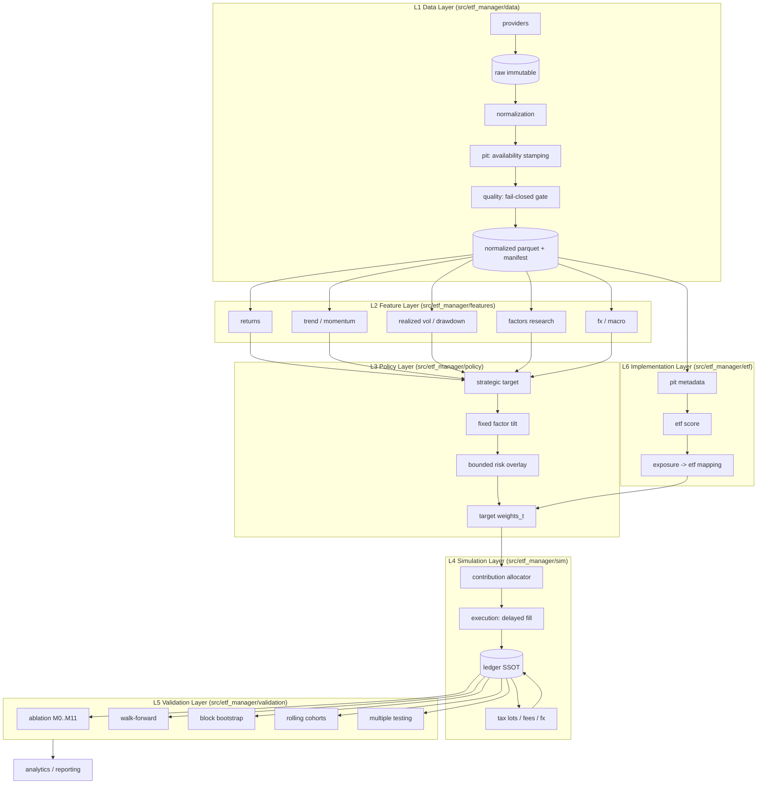

# System Overview — ETF Accumulation Research & Execution Platform

## 1. System Boundary

The system answers one question: **which long-horizon KRW accumulation policy maximizes real KRW
terminal wealth under point-in-time (PIT) data, realistic cost/FX/tax, and identical external
cashflows across candidates.**

In scope: research datasets, feature computation, allocation policy, cashflow-driven simulation,
statistical validation, ETF implementation mapping.
Out of scope (deferred to Live Execution Layer): broker connectivity, live order routing.

## 2. Layer Topology

Dependency rule: `L(n)` may import only from `L(m<n)` plus `core`. `L1` imports nothing from
`L2..L6`. The ledger (`L4`) is the sole source of portfolio state.

## 3. Objective Function

Contributions are identical across all candidates, so terminal wealth is directly comparable.
Let $W^{\text{real}}$ be terminal wealth deflated by Korean CPI, evaluated over the joint set of
rolling start cohorts $c$ and bootstrap paths $b$ ($N$ realizations total).

$$
\mathrm{CE}_\gamma \;=\; \left(\frac{1}{N}\sum_{i=1}^{N}\left(W_i^{\text{real}}\right)^{1-\gamma}\right)^{\frac{1}{1-\gamma}},
\qquad \gamma \in \{2, 5, 10\}
$$

Adoption gate for a candidate policy $k$ against baseline $B_0$:

$$
\forall \gamma:\quad \frac{\mathrm{CE}_\gamma(k)}{\mathrm{CE}_\gamma(B_0)} \;>\; 1 + \delta_0 \cdot m_k
$$

where $m_k$ is the count of added signal/sleeve modules and $\delta_0$ is the per-module complexity
margin (policy constant, config-supplied — not fitted). Cost, FX, and tax are not penalty terms:
they are realized inside `L4` and are already embedded in $W^{\text{real}}$. Turnover, MDD, and
drawdown duration are reported diagnostics and hard constraints, not weighted objective terms.

## 4. Non-Negotiable Invariants

| ID | Invariant | Enforcement Point |
| --- | --- | --- |
| I1 | Every value used at decision time $t$ satisfies `available_at <= t` | `data.pit.as_of`, `assert_no_lookahead` |
| I2 | Signal session $\ne$ fill session; `execution_at > signal_at` | `data.calendar.next_execution_session`, `sim.execution` |
| I3 | Revisable series resolve to the latest vintage with `release_date <= t` | `data.pit.as_of` |
| I4 | Missing data never silently imputed; no global forward-fill | `data.quality` fail-closed + `MissingPolicy` registry |
| I5 | External KRW cashflow schedule identical across all candidates | `sim.cashflow` shared fixture |
| I6 | Cash conservation: $\Delta\text{cash} = \text{contrib} - \text{buys} + \text{sells} + \text{div} - \text{fees} - \text{tax}$ | ledger invariant test |
| I7 | Weights: $\sum_i w_i + w_{\text{cash}} = 1 \pm 10^{-6}$ | `policy.targets` normalization test |
| I8 | Total return via adjusted price XOR raw price + dividend cashflow, never both | `data.schema` dataset flag |
| I9 | Research proxy returns are never spliced onto ETF return series | `validation` layer separation + labeled series |
| I10 | Current metadata is never applied to past dates | PIT metadata tables keyed by `available_at` |
| I11 | KRW tax basis is stamped at trade time and never recomputed with later FX | `sim.tax` lot records |
| I12 | Every result carries `experiment_id`, config hash, data manifest hash, git commit, seed | `validation.registry` |

## 5. Module Map

| Path | Responsibility | Key Contracts |
| --- | --- | --- |
| `data/schema.py` | Canonical dataset specs, dtypes, keys, availability rules, missing policy | `DatasetSpec`, `DATASET_SPECS` |
| `data/calendar.py` | Exchange sessions, close timestamps, fill-delay resolution | `TradingCalendar` |
| `data/pit.py` | Availability stamping, as-of/vintage resolution, look-ahead assertion | `stamp_availability`, `as_of` |
| `data/quality.py` | Declarative fail-closed validation gate | `QualityReport`, `enforce` |
| `data/storage.py` | Parquet write/read, manifest lineage, content hashing | `Manifest`, `write_dataset` |
| `data/providers/*` | Tiingo, FRED/ALFRED, Ken French, ECOS, SEC clients | `Provider` protocol |
| `features/*` | Pure PIT-safe transforms producing `(value, available_at)` pairs | vectorized, stateless |
| `policy/*` | Strategic weights, factor tilt, bounded overlay, currency policy | `TargetPolicy` protocol |
| `sim/*` | Event-driven engine, contribution allocator, ledger, fees, tax lots | `Ledger`, `TaxModel` |
| `validation/*` | Ablation, walk-forward, bootstrap, cohorts, multiple testing, registry | `Experiment` |
| `etf/*` | PIT ETF metadata, implementation score, exposure mapping, switching | `ETFScore` |

## 6. Engine Design Decision

A single simulation engine serves both research and validation, with two modes:

| Mode | Tax lots | Cost model | Batching | Use |
| --- | --- | --- | --- | --- |
| `fast` | disabled | linear bps | vectorized over parameter grid (config axis) | parameter surface, sensitivity |
| `full` | enabled | commission + spread + slippage + FX + TER + tax | single path | final validation, reporting |

Reconciliation constraint: with all costs, taxes and lot accounting zeroed, `fast` and `full` must
produce identical terminal wealth to $10^{-9}$ relative tolerance. This replaces a second
third-party research engine and removes cross-engine semantic drift.

## 7. Currency Model

`Trading currency` and `underlying economic currency exposure` are distinct columns on every
instrument record. Valuation path is fixed:

$$
V^{\text{KRW}}_t = \sum_i q_{i,t}\, p^{\text{USD}}_{i,t}\, e_t + \text{cash}^{\text{USD}}_t e_t + \text{cash}^{\text{KRW}}_t
$$

where $e_t$ is the PIT USD/KRW rate. Conversion events carry an explicit spread cost and are
recorded as ledger rows; no implicit conversion is permitted anywhere outside `sim.fx`.
