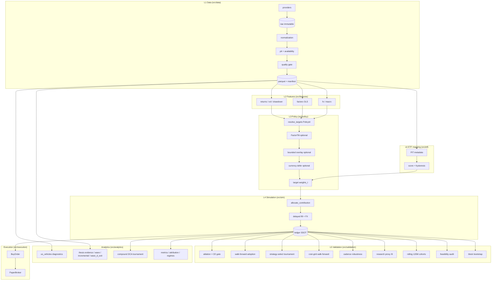

# System Overview — ETF Accumulation Research & Execution Platform

Agent task load recipes: [04_module_index.md](04_module_index.md).

## 1. System Boundary

The system answers two coupled questions:

1. **Policy (v1 operational):** which long-horizon KRW accumulation `PolicyId` maximizes real KRW
   terminal wealth under PIT data, realistic cost/FX/tax, and identical external cashflows.
2. **Thesis (v2 research):** which **economic thesis** is structurally plausible, investable via
   listed vehicles, and robust enough to challenge the QQQ incumbent — without collapsing evidence
   into a single score.

In scope: research datasets, thesis registry, sleeve/vehicle identity, feature computation,
allocation policy, cashflow-driven simulation, statistical validation, ETF implementation mapping,
reporting diagnostics.
Out of scope (deferred): live broker connectivity, sell-based rebalancing in production,
variable external cashflow without an explicit reserve ledger.

### Operational lock (2026-08-30)

| Field | Value |
| --- | --- |
| Policy | `QQQ` — Nasdaq-100 + SOXX satellite |
| Targets | QQQ 90% / SOXX 10% (`OPERATIONAL_TARGETS_OVERRIDE`) |
| Contribution | KAFI adaptive v5 (`OPERATIONAL_ADAPTIVE_CONTRIBUTION`) |
| Rebalancing | Buy-only via `allocate_contribution` |
| Active modules | Strategic targets + adaptive sizing (`modules = 2`) |

`S1_US` (VTI) remains the CE baseline in walk-forward and ablation configs. All other
`PolicyId` values and optional layers (tilt, overlay, currency, mapping) remain **research
challengers** until they pass the CE adoption gate under walk-forward or cohort ablation.

## 2. Layer Topology

Dependency rule: `L(n)` imports only from `L(m<n)` plus `core`. The ledger (`L4`) is the sole
source of portfolio state. Analytics and execution read the ledger; they never drive adoption gates.

## 3. Objective Function

Contributions are identical across all candidates (I5), so terminal wealth is directly comparable.
Let $W^{\text{real}}$ be terminal wealth deflated by Korean CPI.

$$
\mathrm{CE}_\gamma \;=\; \left(\frac{1}{N}\sum_{i=1}^{N}\left(W_i^{\text{real}}\right)^{1-\gamma}\right)^{\frac{1}{1-\gamma}},
\qquad \gamma \in \{2, 5, 10\}
$$

Adoption gate for candidate $k$ against baseline $B$:

$$
\forall \gamma:\quad \frac{\mathrm{CE}_\gamma(k)}{\mathrm{CE}_\gamma(B)} \;>\; 1 + \delta_0 \cdot m_k
$$

$m_k$ is the declared module count per experiment arm (never inferred). Cost, FX, and tax are
realized inside `L4`, not added as objective penalties. For long-horizon DCA accumulation, the
`compound_growth` objective evaluates real gain and XIRR without MDD veto.

## 4. Research vs Operations

| Mode | Entry | Adoption gate | Overlay in JSON experiments |
| --- | --- | --- | --- |
| **Operations** | `run policy --id qqq` | N/A (locked policy) | CLI flags only (`--overlay-max-shift`) |
| **Ablation** | `run ablation --config` | CE on cohort wealths | Disabled (`overlay=None` in `_arm_config`) |
| **Walk-forward** | `run walk-forward --config` | Train select → test CE/growth | Disabled (pending Wave G) |
| **Strategy selection** | `run strategy-select --config` | Multi-candidate WF tournament | Preregistered candidates |
| **Cadence robustness** | `run cadence-robustness --config` | Cost grid + worst cohort + bootstrap | Cadence candidate |
| **Diagnostics** | `run diagnose-us-vehicles` / `diagnose-qqq-*` | Never | Never |
| **Compound DCA** | `run diagnose-compound-dca` | Never | Never |
| **Thesis inspect/wave** | `run thesis` / `thesis-wave` / `thesis-report` | Never | Never |
| **Thesis incremental/exit** | `run thesis-incremental` / `thesis-pipeline` | Never | Never |
| **120M cohort report** | `run accumulation-cohort --config` | Never | Never |
| **Feasibility audit** | `run audit-feasibility --config` | Never | Never |

`run diagnose-*`, `run thesis*`, `run accumulation-cohort`, and `run audit-feasibility` are reporting-only;
they must not call `adoption_passes` or change `OPERATIONAL_POLICY_ID`.

## 5. Non-Negotiable Invariants

| ID | Invariant | Enforcement |
| --- | --- | --- |
| I1 | `available_at <= t` at decision time | `data.pit` |
| I2 | `execution_at > signal_at` | `data.calendar`, `sim` |
| I3 | Revisable series: latest vintage with `release_date <= t` | `data.pit.as_of` |
| I4 | No silent imputation; no global forward-fill | `data.quality` |
| I5 | Identical external KRW cashflows across candidates | `AllocationConfig` |
| I6 | Cash conservation on every ledger step | ledger tests |
| I7 | Weights sum to $1 \pm 10^{-6}$ | `policy.targets` |
| I8 | Adjusted price XOR raw + dividends, never both | `data.schema` |
| I9 | Research proxy ≠ ETF return series | `sim.research_proxy` |
| I10 | No current metadata applied to past dates | PIT metadata |
| I11 | Tax basis stamped at trade FX | `sim.tax` (full mode) |
| I12 | `experiment_id`, manifest hash, git commit on results | `validation.registry` |

## 6. Module Map

| Path | Responsibility |
| --- | --- |
| `data/*` | Providers, PIT catalog, quality, manifests, panel freshness, prune |
| `features/*` | PIT-safe returns, vol, drawdown, factor OLS, KAFI |
| `policy/targets.py` | `PolicyId`, `resolve_targets`, sleeve universe, `OPERATIONAL_POLICY_ID` |
| `policy/thesis.py` | `ThesisId`, `ThesisSpec`, registry, lifecycle |
| `policy/tilt.py` | Fixed factor tilt (research) |
| `policy/overlay.py` | Bounded trend/vol/drawdown/VIX overlay |
| `policy/currency.py` | Bounded FX defer |
| `sim/allocation.py` | Multi-sleeve buy-only engine |
| `sim/contribution.py` | Band + cost-aware contribution mixer, adaptive contribution |
| `sim/baseline.py` | Single-ticker fast DCA (B0/B1) |
| `sim/research_proxy.py` | French daily proxy path (I9) |
| `validation/ablation.py` | Cohort CE gate |
| `validation/walk_forward.py` | Walk-forward multi-fold runner |
| `validation/strategy_selection.py` | Multi-candidate walk-forward tournament selection |
| `validation/campaign.py` | Walk-forward + cost grid + proxy orchestration |
| `validation/cost_grid.py` | Cost scenario grid evaluation |
| `validation/cadence_robustness.py` | Cadence robustness gate |
| `validation/accumulation_cohort.py` | 120M rolling accumulation cohort & bootstrap |
| `validation/feasibility_audit.py` | Static DCA feasibility & window audit |
| `validation/gate.py` | CE adoption gate & compound/contribution growth gates |
| `validation/experiment.py` | `ExperimentSpec` JSON, preregistration |
| `analytics/us_vehicles.py` | VTI/IVV/QQQ diagnostics (no adoption) |
| `analytics/compound_dca.py` | Compound DCA tournament |
| `analytics/thesis/*` | Modular thesis evidence (structural, valuation, crowding, purity, meaning, wave, incremental, report, wave_d_exit) |
| `analytics/regimes.py`, `blends.py`, `cadence.py`, `reserve_usage.py`, `adaptive_hp_screen.py` | QQQ diagnostic modules |
| `etf/mapping.py` | Implementation mapping + hysteresis |
| `etf/sleeves.py` | `SleeveId`, `VehicleId`, `resolve_vehicle`, `RESEARCH_SATELLITE_VEHICLES` |
| `execution/*` | Buy-only orders, PaperBroker |
| `cli.py` / `cli_commands/*` | Thin CLI facade and command handlers |

## 7. Engine Modes

| Mode | Tax lots | Costs | Use |
| --- | --- | --- | --- |
| `fast` | off | linear bps | ablation, walk-forward, policy CLI |
| `full` | on | commission + spread + FX + TER + tax | future final reporting |

Current validation paths use the fast allocation engine with costs from `ExperimentSpec`
(`commission_bps`, `fx_spread_bps`) or CLI defaults.

## 8. Currency Model

$$
V^{\text{KRW}}_t = \sum_i q_{i,t}\, p^{\text{USD}}_{i,t}\, e_t + \text{cash}^{\text{USD}}_t e_t + \text{cash}^{\text{KRW}}_t
$$

Trading currency and economic exposure are distinct per instrument. FX conversion records spread
explicitly; no implicit conversion outside the simulation layer.
