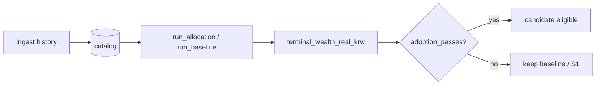

# Policy Catalog & Validation Pipeline

## 1. Design Principle

```
Thesis → Sleeve → Vehicle → PolicyId (operational alias) → optional layers → simulation → CE gate
```

Thesis is the research unit. `SleeveId` names economic exposure, `VehicleId` names the listed
implementation via `resolve_vehicle`, and `PolicyId` remains the operational alias whose
`resolve_targets` maps it to sleeve weights at `signal_at` using only PIT data. ETF tickers
are implementation vehicles, not the strategy.

## 2. PolicyId Catalog

| PolicyId | Sleeves | Status | Notes |
| --- | --- | --- | --- |
| `s0_global` | VT 100% | Baseline | Global equity DCA reference |
| `s1_us` | VTI 100% | CE baseline | US total market; prior operational lock |
| **`qqq`** | **QQQ 100%** | **Operational lock** | Nasdaq-100; WF + cost grid + ablation adopted 2026-08-24 |
| `s2_regional` | VTI 50 / VEA 30 / VWO 20 | Rejected (M1) | Regional diversification |
| `s3_global_bond` | VT 70 / BND 30 | Rejected (M1) | Equity + bonds |
| `s4_defensive` | VT 60 / IEF 20 / TLT 20 | Rejected (M1) | Defensive mix |
| `s5_invvol` | VTI/VEA/VWO inverse-vol | Research | Dynamic regional weights |
| `s6_us_core_value` | VTI 80 / VTV 20 | **Rejected (M2)** | US + value tilt |
| `s7_us_large_cap` | IVV 100% | **Rejected (Wave D)** | S&P 500 large-cap only |
| `r1_us_mkt_ff` | (none — proxy) | Research I9 | French daily US market; no ETF targets |

### UsEquityUniverse (non-policy buckets)

| Bucket | Vehicle | PolicyId |
| --- | --- | --- |
| `us_total_market` | VTI | `s1_us` |
| `us_large_cap` | IVV | `s7_us_large_cap` |
| `us_nasdaq_100` | QQQ | `qqq` |

`all_policy_tickers()` returns the sorted union of every `PolicyId` sleeve. `history_price_tickers()`
also includes diagnostic-only tickers for operator ingest where not already a policy sleeve.

### Thesis registry (Wave 0)

| Field | Rule |
| --- | --- |
| Identity | `ThesisId` → `SleeveId` → `VehicleId` via `resolve_vehicle` |
| Config | `configs/theses/*.json` — falsifiers required, `extra=forbid` |
| File status | `discovered`, `research`, `rejected`, `dormant` only |
| Lifecycle | Runtime transitions via `transition_thesis`; no `ADOPTED` member |
| Inspect | `run thesis` lists/loads registry; **never** an adoption gate |
| Horizon | primary evaluation uses `target_years` only when ≥1 cohort at target (step 12m); otherwise primary absent |
| Surface | preregistered `horizon_surface` for `{60,84,96,120}` ∩ `[min,target]` with `cohort_count` via `rolling_cohorts` |
| Meaning | frozen `ThesisMeaningSnapshot`: `thesis_status`/`vehicle_status`/`portfolio_status`/`historical_quality`/`history_available`/`evidence_sufficient`/`thin_sample_warning` |
| Quality | `PROSPECTIVE_ONLY`→`PARTIAL_HISTORY`→`TARGET_THIN` (`TARGET_ROBUST` only with path bootstrap) |
| Vehicle | `ACTIVE_PROXY` if median≥1.0; `REJECTED_PROXY` if median<1.0 and (cohort_ce<0.98 or median<0.98) |

Seed theses: `ai_compute` (SOXX proxy), `ai_power_bottleneck` (GRID), `physical_automation`
(BOTZ). Full v2 evolution roadmap: `docs/plans/v2_thesis_evolution.md`.

### Operational incumbent (frozen)

`PolicyId.QQQ` remains operational until a candidate passes the **36M CE** adoption gate
(`CE_ratio > 1 + 0.02 × modules` at every γ). Post-hoc hurdle lowering is prohibited.
120M cohort median ratios are **reporting only** and do not override the CE gate.

### Satellite research discipline

Single-satellite arms use `targets_override` on `PolicyId.QQQ`. Rule:

```text
single satellite → CE gate pass → eligible for combination wave
single satellite → CE gate fail → exclude from combination (no weight retuning)
```

`FUTURE_INDUSTRY_STATIC_MIX_V1` is closed: GRID/IWF mixes failed CE; Wave 3 matrix 0/17 pass
(details: `docs/results/20260828_wave3_satellite_matrix.md`).

## 3. Optional Layers (research only in JSON experiments)

Applied in `run_allocation` order after strategic targets:

| Layer | Module flag | CLI (manual run) | In ablation/WF JSON |
| --- | --- | --- | --- |
| Factor tilt | `tilt` | `--tilt-factor`, `--tilt-intensity` | `None` (disabled) |
| Bounded overlay | `overlay` | `--overlay-max-shift`, `--vix-threshold` | `None` (Wave G: wire in) |
| FX defer | `currency` | `--fx-max-defer`, `--fx-expensive-percentile` | `None` |
| ETF mapping | `mapping` | `--map-etf`, `--map-min-improvement` | `None` |

Manual `run policy` can stack layers for exploration. **Adoption decisions** must use
`ExperimentSpec` JSON so `modules` and `delta0` are explicit.

## 4. Validation Pipeline



### 4.1 Ablation (`run ablation --config`)

- Shared window, contribution, costs across arms
- `horizon_months > 0`: rolling cohort terminal wealths → pooled CE
- `horizon_months = 0`: single-path wealth vector
- One JSON: baseline + N candidates

### 4.2 Walk-forward (`run walk-forward --config`)

- Requires `train_months`, `test_months`, exactly one candidate
- Per fold: train CE gate → choose policy → realize test wealth
- `process_adopted_vs_baseline`: chosen test CE vs baseline test CE across folds

### 4.3 Cost grid (`run walk-forward-costs --config`)

- Repeats walk-forward for `ideal`, `low`, `base`, `stress` cost scenarios
- `COST_SCENARIOS` in `validation/campaign.py`

### 4.4 Research proxy (`run walk-forward-proxy --config`)

- ETF baseline vs `r1_us_mkt_ff` French daily path (I9 separation)
- Proxy runner never mixes with ETF price series

### 4.5 Diagnostics (`run diagnose-us-vehicles`)

- `profile_us_vehicles`: trailing factor loadings (VTI, IVV, QQQ)
- `compare_vehicle_dca`: identical-cashflow single-sleeve DCA via `run_baseline`
- **No adoption gate** — reporting only

### 4.6 Accumulation cohort (`run accumulation-cohort --config`)

- Primary horizon is `target_months` only; fallback uses longest feasible surface month when primary absent
- Overlapping cohorts are **dependent** — report median/worst/p10 and optional block bootstrap; `thin_sample_warning` when cohort_count<10
- **Reporting only** — does not replace the 36M CE adoption gate; `horizon_surface` always emitted in thesis reports

### 4.7 Static DCA feasibility (`run audit-feasibility --config`)

- Audits max feasible window, dependency profile, and 120M cohort count for an experiment JSON
- `ingest static-dca` extends CPI/prices/FX for long-horizon satellite panels

## 5. Completed Experiment Matrix

| Config | Baseline | Candidate | Gate | Result (2026-08-23) |
| --- | --- | --- | --- | --- |
| `m0_m1.json` | S0 | S1–S4 | ablation | S1 adopted over S0/S2–S4 |
| `wf_s0_s1.json` | S0 | S1 | walk-forward | S1 process adopted |
| `wf_s1_s7.json` | S1 | S7 | walk-forward | **S1 kept** (3 folds, no train adopt) |
| `m1_m2.json` | S1 | S6 | ablation 36m | **S1 kept** (CE ratio ~0.99) |
| `m1_d_universe.json` | S1 | S7 | ablation 36m | (operator; same hypothesis as WF) |
| `wf_s0_r1.json` | S0 | R1 | walk-forward proxy | I9 isolation |

Empirical window note: catalog PIT constraints require operator dates roughly
`2012-06-01` – `2024-10-31` (CPI release lag; last execution session price coverage).

## 6. CE Gate Reference

```python
# validation/gate.py — all γ must pass
CE_ratio(γ) = CE_γ(candidate) / CE_γ(baseline)
adopted ⟺ ∀γ: CE_ratio(γ) > 1 + delta0 * modules
```

Default `delta0 = 0.02`. A one-module challenger needs **> 2%** CE improvement at every γ.

## 7. Research Roadmap (code changes)

| Wave | Focus | Status |
| --- | --- | --- |
| **1** | 120M rolling accumulation cohort + bootstrap | **Done** (`validation/accumulation_cohort.py`) |
| **2** | Historical coverage + static-DCA feasibility audit | **Done** (`feasibility_audit`, `ingest static-dca`) |
| **3** | Independent satellite matrix (XLI/SOXX/IBB/ITA/GRID/BOTZ) | **Done** — 0/17 CE pass; QQQ unchanged |
| **0 (v2)** | Thesis / sleeve / vehicle identity kernel | **Done** (`policy/thesis.py`, `etf/sleeves.py`) |
| **1 (v2)** | `thesis_id` on `ExperimentSpec` + preregistration | **Done** (`validation/experiment.py`, `validation/registry.py`) |
| **F–I (legacy)** | S1 cost grid, overlay, reserve, live broker | See rows F–I in prior waves; overlay wiring pending |

### v2 Wave 1 experiment preregistration

| Field | Type | Default | Notes |
| --- | --- | --- | --- |
| `thesis_id` | `ThesisId \| null` | `null` | must exist in `configs/theses` when set |
| `preregistration.weights_locked` | `bool` | `false` | declared weights frozen |
| `preregistration.universe_locked` | `bool` | `false` | tickers limited to QQQ + thesis proxies |
| `preregistration.baseline_frozen` | `bool` | `true` | baseline hash via `freeze_baseline_config_hash` |
| `baseline` / `candidates[].targets` | `map[ticker,float]` | `null` | validated against allowed universe when locked |

Strategic sleeve or satellite changes require a **registered thesis** (or explicit `PolicyId`
hypothesis) and a fresh ablation; closed waves (M1/M2/D, static mix v1, Wave 3 matrix) do not
justify weight retuning without new structural evidence.
