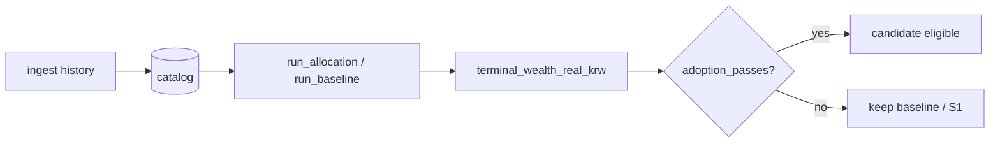

# Policy Catalog & Validation Pipeline

## 1. Design Principle

```
Economic exposure → PolicyId → ETF sleeves → optional layers → simulation → CE gate
```

ETF tickers are implementation vehicles, not the strategy. `PolicyId` names an economic hypothesis;
`resolve_targets` maps it to sleeve weights at `signal_at` using only PIT data.

## 2. PolicyId Catalog

| PolicyId | Sleeves | Status | Notes |
| --- | --- | --- | --- |
| `s0_global` | VT 100% | Baseline | Global equity DCA reference |
| **`s1_us`** | **VTI 100%** | **Operational lock** | US total market |
| `s2_regional` | VTI 50 / VEA 30 / VWO 20 | Rejected (M1) | Regional diversification |
| `s3_global_bond` | VT 70 / BND 30 | Rejected (M1) | Equity + bonds |
| `s4_defensive` | VT 60 / IEF 20 / TLT 20 | Rejected (M1) | Defensive mix |
| `s5_invvol` | VTI/VEA/VWO inverse-vol | Research | Dynamic regional weights |
| `s6_us_core_value` | VTI 80 / VTV 20 | **Rejected (M2)** | US + value tilt |
| `s7_us_large_cap` | IVV 100% | **Rejected (Wave D)** | S&P 500 large-cap only |
| `r1_us_mkt_ff` | (none — proxy) | Research I9 | French daily US market; no ETF targets |

### UsEquityUniverse (non-policy buckets)

| Bucket | Vehicle | PolicyId |
| --- | --- | --- |
| `us_total_market` | VTI | `s1_us` |
| `us_large_cap` | IVV | `s7_us_large_cap` |
| `us_nasdaq_100` | QQQ | **None** — diagnostic ingest only |

`all_policy_tickers()` returns the sorted union of every `PolicyId` sleeve. `history_price_tickers()`
adds `QQQ` for operator ingest; QQQ never enters `resolve_targets` or adoption experiments as a policy.

## 3. Optional Layers (research only in JSON experiments)

Applied in `run_allocation` order after strategic targets:

| Layer | Module flag | CLI (manual run) | In ablation/WF JSON |
| --- | --- | --- | --- |
| Factor tilt | `tilt` | `--tilt-factor`, `--tilt-intensity` | `None` (disabled) |
| Bounded overlay | `overlay` | `--overlay-max-shift`, `--vix-threshold` | `None` (Wave G: wire in) |
| FX defer | `currency` | `--fx-max-defer`, `--fx-expensive-percentile` | `None` |
| ETF mapping | `mapping` | `--map-etf`, `--map-min-improvement` | `None` |

Manual `run policy` can stack layers for exploration. **Adoption decisions** must use
`ExperimentSpec` JSON so `modules` and `delta0` are explicit.

## 4. Validation Pipeline



### 4.1 Ablation (`run ablation --config`)

- Shared window, contribution, costs across arms
- `horizon_months > 0`: rolling cohort terminal wealths → pooled CE
- `horizon_months = 0`: single-path wealth vector
- One JSON: baseline + N candidates

### 4.2 Walk-forward (`run walk-forward --config`)

- Requires `train_months`, `test_months`, exactly one candidate
- Per fold: train CE gate → choose policy → realize test wealth
- `process_adopted_vs_baseline`: chosen test CE vs baseline test CE across folds

### 4.3 Cost grid (`run walk-forward-costs --config`)

- Repeats walk-forward for `ideal`, `low`, `base`, `stress` cost scenarios
- `COST_SCENARIOS` in `validation/campaign.py`

### 4.4 Research proxy (`run walk-forward-proxy --config`)

- ETF baseline vs `r1_us_mkt_ff` French daily path (I9 separation)
- Proxy runner never mixes with ETF price series

### 4.5 Diagnostics (`run diagnose-us-vehicles`)

- `profile_us_vehicles`: trailing factor loadings (VTI, IVV, QQQ)
- `compare_vehicle_dca`: identical-cashflow single-sleeve DCA via `run_baseline`
- **No adoption gate** — reporting only

## 5. Completed Experiment Matrix

| Config | Baseline | Candidate | Gate | Result (2026-08-23) |
| --- | --- | --- | --- | --- |
| `m0_m1.json` | S0 | S1–S4 | ablation | S1 adopted over S0/S2–S4 |
| `wf_s0_s1.json` | S0 | S1 | walk-forward | S1 process adopted |
| `wf_s1_s7.json` | S1 | S7 | walk-forward | **S1 kept** (3 folds, no train adopt) |
| `m1_m2.json` | S1 | S6 | ablation 36m | **S1 kept** (CE ratio ~0.99) |
| `m1_d_universe.json` | S1 | S7 | ablation 36m | (operator; same hypothesis as WF) |
| `wf_s0_r1.json` | S0 | R1 | walk-forward proxy | I9 isolation |

Empirical window note: catalog PIT constraints require operator dates roughly
`2012-06-01` – `2024-10-31` (CPI release lag; last execution session price coverage).

## 6. CE Gate Reference

```python
# validation/gate.py — all γ must pass
CE_ratio(γ) = CE_γ(candidate) / CE_γ(baseline)
adopted ⟺ ∀γ: CE_ratio(γ) > 1 + delta0 * modules
```

Default `delta0 = 0.02`. A one-module challenger needs **> 2%** CE improvement at every γ.

## 7. Research Roadmap (code changes)

| Wave | Hypothesis | Implementation status |
| --- | --- | --- |
| **F** | S1 survives cost-grid walk-forward | CLI ready (`wf_s0_s1` + `walk-forward-costs`) |
| **G** | S1 + bounded overlay beats S1 on OOS CE | Needs `ExperimentSpec.overlay` + `_arm_config` wiring |
| **H** | Variable contribution from explicit reserve | Not started; new ledger + I5-safe gate |
| **I** | Live broker | Paper path exists; routing deferred |

Improvement priority for compounding under this codebase:

1. Confirm S1 under costs (F)
2. Risk buffering without sells (G)
3. Contribution schedule only with conserved cashflow (H)

Strategic sleeve changes (new `PolicyId`, multi-ETF splits) require a **new economic hypothesis**
and a fresh ablation; M1/M2/D results do not justify reopening that axis without new evidence.
