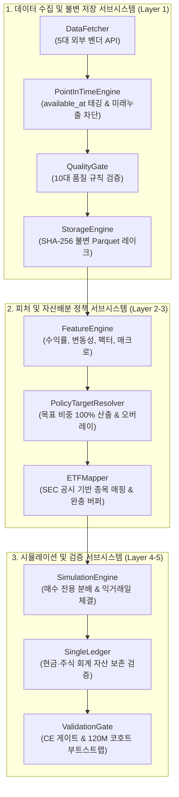

# 컴포넌트 아키텍처 및 계층별 명세 (Component Architecture)

본 문서는 ETF-Manager 플랫폼을 구성하는 핵심 컴포넌트별 단일 책임(Single Responsibility), 입출력 규격, 그리고 시스템 불변식(Invariants)을 3대 핵심 서브시스템 단위로 정의합니다.

---

## 1. 컴포넌트 토폴로지 및 계층 상호작용

---

## 2. 데이터 수집 및 불변 저장 서브시스템 (Layer 1)

| 컴포넌트 | 핵심 책임 | 핵심 인터페이스 (Input / Output) | 장애 방어 및 불변식 (Fail-Closed) |
| :--- | :--- | :--- | :--- |
| **`DataFetcher`** | • 5대 외부 금융 API(Tiingo, FRED, ECOS, French, SEC) 호출 • 지수 백오프 및 호출량(Rate Limit) 제어 | **In**: 수집 대상 기간, 티커, 인증키 **Out**: 원본 파일 (`data/raw/<provider>/...`) | • **Rate Limit 준수**: 429 감지 시 지수 백오프 • **원본 불변성**: 가공되지 않은 raw 응답을 영구 보존 |
| **`PointInTimeEngine`** | • 공식 발표 시점(`available_at`) 계산 및 태깅 • 의사결정 시점 $t$ 기준 안전 시계열 슬라이싱 | **In**: 정규화 DataFrame, 의사결정 시각 $t$ **Out**: 공시 시점 부여된 안전 슬라이스 | • **`assert_no_lookahead`**: 프레임 내 미래 시점 데이터 발견 시 즉시 `LookAheadError` 중단 |
| **`QualityGate`** | • 10가지 품질 규칙(스키마, 결측, 날짜 역전, 가격 모순) 검증 | **In**: 정규화 DataFrame, 데이터셋 스펙 **Out**: 검증 리포트 (`QualityReport`) | • **입력 무수정 원칙**: 비정상 데이터 임의 수정 금지, `DataQualityError` 발생 후 차단 |
| **`StorageEngine`** | • 불변 Parquet 저장 및 SHA-256 매니페스트 발급 • 데이터 로드 시 해시값 재검산 | **In**: 품질 검증 통과 DataFrame **Out**: Parquet 파일 및 매니페스트 JSON | • **1바이트 변조 차단**: 매니페스트 해시 불일치 시 `UntrustedDatasetError` 발생 |

---

## 3. 피처 및 자산배분 정책 서브시스템 (Layer 2-3)

| 컴포넌트 | 핵심 책임 | 핵심 인터페이스 (Input / Output) | 장애 방어 및 불변식 (Fail-Closed) |
| :--- | :--- | :--- | :--- |
| **`FeatureEngine`** | • 과거 데이터만을 이용한 롤링 수익률, 변동성, MDD, 팩터 민감도(Beta) 산출 | **In**: PIT 보장 주가/환율/매크로 DataFrame **Out**: 날짜·종목별 피처 DataFrame | • **과거 데이터 한정**: $t$ 이전 관측 데이터만 슬라이싱하여 피처 연산 오염 원천 배제 |
| **`PolicyTargetResolver`** | • 전략 ID에 따른 각 자산군 목표 비중(합계 1.0) 산출 • 하락장 방어 오버레이 및 환전 지연 적용 | **In**: 전략 식별자, 의사결정 시각, 피처 **Out**: 종목별 목표 가중치 (`{티커: 비중}`) | • **가중치 보존법칙**: $\sum w_i = 1.0$ 강제 • **복잡도 상한**: 전략 모듈 개수당 2% 추가 초과수익 허들 |
| **`ETFMapper`** | • 추상 자산군을 상장 ETF(QQQ, SOXX 등)로 연결 • 운용보수, 거래대금, 추적오차 평가 | **In**: 목표 자산군 비중, SEC ETF 메타데이터 **Out**: 실제 상장 ETF 티커 매핑 비중 | • **잦은 교체 방지 완충(Hysteresis)**: 사소한 점수 차이로 인한 잦은 종목 교체 및 세금 낭비 방지 |

---

## 4. 시뮬레이션 및 검증 서브시스템 (Layer 4-5)

| 컴포넌트 | 핵심 책임 | 핵심 인터페이스 (Input / Output) | 장애 방어 및 불변식 (Fail-Closed) |
| :--- | :--- | :--- | :--- |
| **`SimulationEngine`** | • 매월 100만 원 신규 적립금을 부족 종목에 우선 배분 • 익거래일($t+1$) 종가, 환율, 수수료 적용 정수 체결 | **In**: 설정(`AllocationConfig`), 과거 패널 **Out**: 매월 스냅샷 및 실질 원화 자산($W^{\text{real}}$) | • **매수 전용(Buy-Only)**: 보유 주식 매도 0건 보장 (양도소득세 22% 과세 회피) • **동일 외부 납입금 ($I_5$)**: 매월 고정 100만 원 강제 |
| **`SingleLedger`** | • 원화/달러 현금 및 주식 잔고 단일 회계 원장 관리 • 스텝별 자산 보존 법칙 검증 | **In**: 매매 체결 내역, 입금액, 비용 **Out**: 감사 추적 가능한 회계 원장 | • **자산 보존법칙**: 총자산 = 주식 평가액 + 원화 현금 + 달러 현금 일치 강제 |
| **`ValidationGate`** | • 위험회피 확실성 등가 수익률(CE) 평가 • 120M 롤링 코호트 및 12M 블록 부트스트랩 | **In**: 후보 전략 vs 기준선 전략 결과 **Out**: 최종 승격 여부 (Boolean), 통계량 | • **CE 게이트 ($\gamma \in \{2,5,10\}$)**: 폭락 위험 감점 + 복잡도 페널티 통과 시에만 표준 승격 • **연구 수렴 규율**: 탈락 시 기준선 자동 복귀 |
