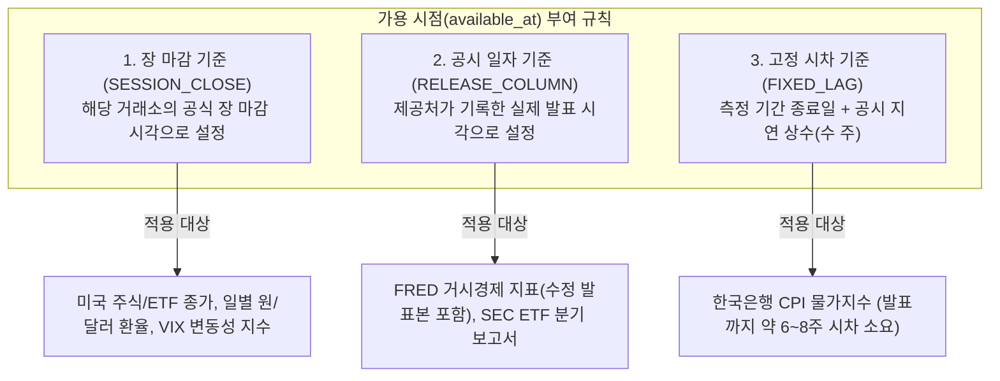
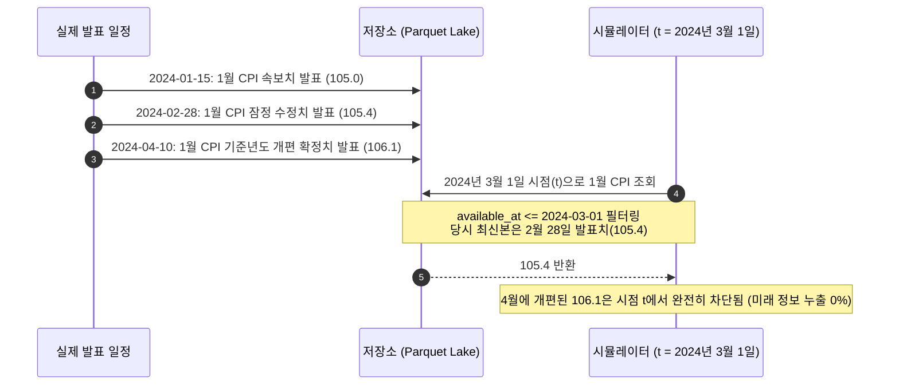

# 데이터 흐름 및 시점 정합성 명세 (Data Flow)

## 1. 10단계 엔드투엔드 파이프라인

ETF-Manager의 데이터 파이프라인은 미래 정보 누출을 방지하고, 데이터의 출처와 무결성을 추적할 수 있도록 설계되었습니다. 데이터가 유입되어 최종 결과가 도출되기까지의 10단계 흐름은 다음과 같습니다.

| 단계 | 입력 (Input) | 주요 처리 내용 (Processing) | 출력 (Output) | 담당 모듈 |
| :--- | :--- | :--- | :--- | :--- |
| **1. 원본 수집** | 외부 HTTP API<br/>(Tiingo, FRED, ECOS, French, SEC) | 지수 백오프 기반 재시도, 원본 응답 추출, 내용 기반 바이트 캐싱 | 원본 데이터 파일<br/>(`data/raw/<provider>/<dataset>/<sha256>`) | `src/data/fetch.py`<br/>`src/data/providers/*` |
| **2. 정규화 및 공시 시점 태깅** | 원본 데이터 바이트, 거래일 캘린더, 데이터셋 규격 | 컬럼명 표준화, UTC 타임스탬프 변환, 공시 시점(`available_at`) 계산 | 메모리 상의 Polars 정규화 DataFrame | `src/data/pipeline.py`<br/>`src/data/pit.py` |
| **3. 품질 검증 (Quality Gate)** | 정규화 DataFrame, 데이터셋 규격 | 스키마 일치, 중복 키 검사, 필수값 결측 검사, OHLC 가격 논리 검사 | `QualityReport`<br/>(오류 발견 시 `DataQualityError` 발생 후 중단) | `src/data/quality.py` |
| **4. 불변 저장 및 매니페스트 발급** | 검증 통과 DataFrame, 품질 리포트 | 컬럼 및 행 정렬 후 SHA-256 해시 생성, Parquet 저장, 출처 메타데이터 JSON 생성 | `data/normalized/.../<sha256>.parquet`<br/>`data/manifests/.../<sha256>.json` | `src/data/storage.py` |
| **5. 과거 시점 조회 (`as_of`)** | 정규화 Parquet 파일, 의사결정 시점 $t$ | $t$ 시점 이전에 공개된 행만 필터링(`available_at <= t`), 사후 수정 지표는 당시 최신 발표본 선택 | 의사결정 시점 $t$ 기준 안전한 DataFrame | `src/data/pit.py`<br/>`src/data/query.py` |
| **6. 팩터 및 지표 계산** | 과거 시점 안전 DataFrame | 수익률, 실현 변동성, 최대 낙폭(MDD), 팩터 민감도, 종합 매크로 지표(KAFI) 계산 | 종목 및 날짜별 피처 벡터 | `src/features/*` |
| **7. 목표 비중 산출** | 피처 벡터, 전략 식별자(`PolicyId`) | 자산배분 규칙 적용, 보조 오버레이 적용, 총합이 100%가 되는 목표 심플렉스 가중치 도출 | 종목별 목표 비중 `{티커: 가중치}` | `src/policy/targets.py`<br/>`src/policy/*` |
| **8. 매수 전용 적립금 배분** | 목표 비중, 현재 원화 평가액, 월 납입금 (100만 원) | 기존 주식 매도 없이, 목표 대비 부족한 금액과 거래 비용을 감안하여 신규 적립금 분배 | 종목별 매수 예산 비율 `{티커: 비율}` | `src/sim/contribution.py` |
| **9. 익거래일 지연 체결** | 매수 예산 비율, $t+1$ 거래일 종가, 환율 및 수수료 | 정수 단위 매수 주수 계산, 거래 수수료 및 환전 스프레드 차감, 잔여 현금 이월 | 체결 주수, 수수료, 변경된 현금 잔고 | `src/sim/allocation.py`<br/>`src/sim/lots.py` |
| **10. 단일 회계 원장 기록** | 체결 내역, 잔고 데이터, 예비금 | 회계 원장에 거래 이벤트 기록, 매 거래 후 자산 보존 법칙 검증 ($\Delta 자산 = 입금 + 손익 - 비용$) | 누적 회계 원장 스냅샷 (`AllocationSnapshot`) | `src/sim/allocation.py` |

---

## 2. 공시 시점(available_at) 계산 규칙

금융 시계열 백테스트에서 가장 흔한 실수는 **"2023년 1월 31일의 경제지표"를 "2023년 1월 31일 장중에 알고 있었다"고 착각하는 것**입니다.

실제 현실에서는:
* 주가는 당일 장이 마감된 후에야 확정됩니다.
* 거시경제 지표는 해당 월이 끝나고 수 주~수개월 뒤에 정부 기관이 발표합니다.

ETF-Manager는 모든 데이터셋에 3가지 명시적 규칙 중 하나를 강제합니다:



1. **장 마감 기준 (`SESSION_CLOSE`):**
   * 당일 장이 완전히 종료된 시점(`calendar.close_ts(date)`)을 `available_at`으로 기록합니다.
   * 당일 종가를 바탕으로 계산한 신호는 당일 장중에 체결할 수 없으며, 반드시 다음 거래일에 체결됩니다.
2. **공시 일자 기준 (`RELEASE_COLUMN`):**
   * 데이터 제공처(FRED 등)가 원본에 기록한 공식 발표 일시를 `available_at`으로 기록합니다.
   * 동일한 기준 월에 대해 1차 속보치, 2차 수정치, 확정치가 여러 번 발표되더라도 각각의 공시 일시가 보존됩니다.
3. **고정 시차 기준 (`FIXED_LAG`):**
   * 공시 시각이 컬럼으로 제공되지 않는 데이터의 경우, 측정 월 종료 후 최소 6~8주의 고정 시차를 둔 시점을 `available_at`으로 간주합니다.

---

## 3. 과거 시점 조회(`as_of`)와 지표 수정치(Vintage) 처리

투자 의사결정 시점 $t$(예: 매월 말 신호 생성 시각)에 시스템이 조회할 수 있는 데이터는 **오직 $available\_at \le t$인 행뿐**입니다.

특히 경제지표처럼 훗날 수치가 수정되는 데이터는 다음과 같이 처리됩니다:



만약 시뮬레이션 코드 어디선가 실수로 의사결정 시점 $t$보다 미래의 데이터($available\_at > t$)를 읽어오면, `assert_no_lookahead` 함수가 즉시 `LookAheadError`를 발생시키고 실행을 중단합니다.

---

## 4. 금융 데이터 엔지니어링 핵심 원칙

### 1. 복수 거래소 캘린더 동기화
* 미국 주식(QQQ, SOXX 등)은 뉴욕증권거래소(`XNYS`) 일정을 따르고, 환율과 한국 물가지수는 한국은행 일정을 따릅니다.
* 두 시장의 공휴일이 서로 다르므로, 미국 시장 휴장일에는 주문이 나가지 않도록 캘린더 엔진(`src/data/calendar.py`)을 통해 시뮬레이션 일정을 정밀하게 동기화합니다.

### 2. 타임스탬프 표준화 (UTC)
* 모든 시간 데이터는 시간대 혼선을 원천 방지하기 위해 마이크로초 단위의 UTC 타임스탬프(`pl.Datetime("us", "UTC")`)로 통일하여 다룹니다. 시간대 정보가 없는 naive 시간 데이터는 품질 검사에서 즉시 반려됩니다.

### 3. 수정주가와 배당금의 중복 계산 방지 (Invariant $I_8$)
* 백테스트 엔진에서 흔히 발생하는 오류 중 하나는, 이미 배당금이 주가에 반영된 '수정주가(Adjusted Close)'를 쓰면서 동시에 현금 배당금까지 이중으로 계상하는 것입니다.
* 본 시스템은 **"수정주가를 쓸 것인가, 아니면 원본 주가 + 배당금 현금흐름 원장을 쓸 것인가"** 중 단 하나만 택하도록 강제하여 수익률이 부풀려지는 현상을 방지합니다.

### 4. 결측치 임의 보간 금지 (Invariant $I_4$)
* 데이터 중간에 빈 날짜가 생겼을 때, 대부분의 튜토리얼 코드는 `fillna(method='ffill')` 등으로 앞선 가격을 끌어와 채워 넣습니다.
* 하지만 이는 거래 정지나 데이터 유실 문제를 감추고 가짜 거래 가능성을 만들어내는 위험한 방식입니다. 본 시스템은 주가 및 환율 데이터에 결측이 발견되면 임의로 채우지 않고 즉시 에러를 발생시키며 중단합니다(`FAIL` 정책).

---

## 5. 저장소 구조와 SHA-256 해시 검증

모든 데이터는 위변조를 감지할 수 있도록 SHA-256 해시 매니페스트와 함께 컬럼형 파일(Parquet)로 저장됩니다.

```text
data/
├── raw/                 # 수집된 원본 응답 파일 (해시 기반 보관)
├── normalized/          # 스키마 정규화된 불변 Parquet 파일
└── manifests/           # 데이터 출처, 행 수, 해시값을 담은 검증용 JSON
```

데이터를 읽어 들일 때마다 파일 내용의 해시값을 다시 계산하여 매니페스트와 대조합니다. 단 1바이트라도 변조되었거나 불완전하게 다운로드된 파일은 `UntrustedDatasetError`를 발생시키고 읽기를 거부합니다.
