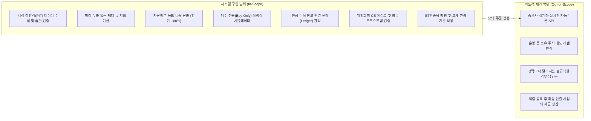
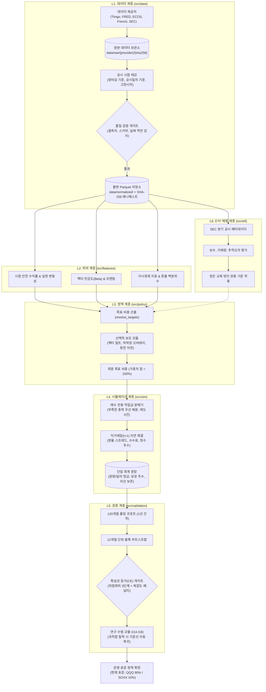

# 아키텍처 개요 (System Overview)

## 1. 프로젝트 목적과 배경

**ETF-Manager**는 10~20년의 장기 자산 형성을 목표로 하는 개인 투자자를 위한 **적립식(DCA) 퀀트 시뮬레이션 및 자산배분 정책 검증 엔진**입니다.

일반적인 주식 백테스트 프로그램은 다음과 같은 비현실적인 가정을 흔히 사용합니다:
1. **미래 정보 미리보기 (Look-ahead Bias):** 과거 특정 시점에는 아직 발표되지 않았거나 훗날 수정된 거시 지표(CPI, GDP 등)를 미리 알고 투자했다고 가정하여 수익률을 부풀립니다.
2. **무마찰 당일 체결 가정:** 한국 투자자가 밤에 미국 ETF 종가를 확인하고 그 종가로 즉시 샀다고 가정하거나, 환전 수수료와 거래 비용을 0원으로 처리합니다.
3. **외부 납입금 왜곡:** 주가가 하락했을 때 임의로 외부에서 돈을 더 많이 넣고는, 투자 전략이 좋아서 최종 자산이 늘어난 것처럼 왜곡합니다.
4. **잦은 매도 리밸런싱:** 비중을 맞추기 위해 주식을 자주 팔아치워 실제로 발생하는 양도소득세(22%)와 거래 수수료를 간과합니다.

ETF-Manager는 이러한 비현실적 왜곡을 배제하고, **"실제 시장에서 그대로 실행했을 때 실질 원화(한국 CPI 물가 반영) 구매력을 가장 크게 늘려주는 자산배분 정책은 무엇인가?"**를 엄격하게 검증합니다.

---

## 2. 시스템 범위 (Scope)

### 구현 범위 (In-Scope)
* **5대 데이터 소스 연동:** Tiingo(미국 주가), FRED(미국 금리/환율/매크로), 한국은행 ECOS(원/달러 환율, 한국 CPI), Kenneth French(팩터 연구 데이터), SEC EDGAR(ETF 분기별 보유종목 공시).
* **시점 정합성(Point-in-Time, PIT) 보장:** 모든 데이터에 공시 시점(`available_at`)을 기록하여 미래 정보 누출을 차단.
* **불변 데이터 레이크:** SHA-256 해시 매니페스트로 데이터 변조를 감지하는 Parquet 저장소.
* **매수 전용(Buy-Only) 적립식 배분:** 보유 주식을 절대 팔지 않고 매월 들어오는 100만 원의 적립금만 부족한 종목에 채워 넣는 `allocate_contribution` 알고리즘.
* **현실적인 주문 체결 모델:** 뉴욕 거래소(NYSE)와 한국 캘린더 동기화, 익거래일($t+1$) 종가 체결, 환전 스프레드 및 거래 수수료 차감, 정수 주수 체결.
* **단일 원장(Ledger SSOT):** 매 스텝마다 '현금 + 주식 평가액 = 이전 자산 + 입금 - 비용'이 성립하는지 회계적으로 검증.
* **통계적 검증 게이트:** 투자자의 위험 기피 성향을 반영한 확실성 등가 수익률($\mathrm{CE}_\gamma, \gamma \in \{2, 5, 10\}$)과 전략 복잡도 페널티, 120개월 롤링 코호트, 12개월 단위 원형 블록 부트스트랩(1,000회).

### 제외 범위 (Out-of-Scope)
* **증권사 실계좌 주문 연동:** 본 시스템은 전략의 타당성을 입증하는 리서치 및 시뮬레이션 엔진으로, 페이퍼 브로커(`PaperBroker`)까지만 구현되어 있습니다.
* **보유 주식 매도:** 적립 기간 동안 양도소득세 과세를 피하기 위해 매도는 일절 수행하지 않습니다.
* **전략별 차등 납입금:** 전략 간 공정한 비교를 위해 모든 전략은 매달 동일한 100만 원(Invariant $I_5$)만을 투자합니다.

---

## 3. 전체 시스템 계층 구조

시스템은 6개의 독립된 계층($L_1 \sim L_6$)으로 구성되며, 단방향 의존성 규칙(상위 계층은 하위 계층만 참조 가능)을 엄격히 준수합니다.

---

## 4. 핵심 컴포넌트 역할 요약

| 계층 | 주요 패키지 경로 | 핵심 책임 | 비고 |
| :--- | :--- | :--- | :--- |
| **L1. 데이터** | `src/data/` | 외부 API 수집, 공시 시점(`available_at`) 태깅, 데이터 품질 검사, Parquet 저장 및 SHA-256 해시 검증 | 결측치 임의 보간 금지 |
| **L2. 피처** | `src/features/` | 공시 시점 이전 데이터만 사용하여 수익률, 변동성, 최대 낙폭(MDD), 팩터 지표 계산 | 미래 데이터 누출 차단 |
| **L3. 정책** | `src/policy/` | 전략 ID(`PolicyId`)에 따른 종목별 목표 투자 비중(합계 1.0) 결정 및 위험 통제 규칙 적용 | 비중 심플렉스 보장 |
| **L4. 시뮬레이션** | `src/sim/` | 매달 들어오는 100만 원을 매도 없이 배분, 익거래일($t+1$) 종가 체결, 환율 및 수수료 반영, 원장 기록 | 매 스텝 현금 보존 검증 |
| **L5. 검증** | `src/validation/` | 위험회피 성향을 반영한 확실성 등가 수익률(CE) 평가, 롤링 코호트, 블록 부트스트랩, 비용 스트레스 테스트 | 과적합 전략 탈락 |
| **L6. ETF 매핑** | `src/etf/` | 자산군 슬리브를 실제 상장된 최적 ETF로 매핑하고, 잦은 교체로 인한 수수료를 막는 완충 기준 적용 | 실투자 집행 가능성 확보 |
| **분석** | `src/analytics/` | 5개 관점(구조적 타당성, 밸류에이션, 수급 쏠림, 테마 순도, 경제적 의미)의 투자 가설 증거 평가 | 읽기 전용 진단 모듈 |
| **실행** | `src/execution/` | 목표 비중에 따른 매수 주문서(`BuyOrder`) 생성 및 모의 브로커(`PaperBroker`) 체결 시뮬레이션 | 실계좌 연동 제외 |

---

## 5. 실행 흐름 (End-to-End Flow)

1. **데이터 수집 (`ingest history`):** Tiingo, FRED, ECOS 등에서 원본 데이터를 다운로드하여 저장합니다.
2. **시점 정합성 태깅:** 각 데이터가 시장에 실제로 알려진 시점(`available_at`)을 붙이고, 오류 발견 시 시뮬레이션을 즉시 중단합니다.
3. **지표 계산:** 의사결정 시점 $t$ 기준으로 이미 공개된 데이터만을 사용해 이동평균, 변동성, 낙폭 등을 계산합니다.
4. **목표 비중 산출:** 활성화된 정책(예: QQQ 90% / SOXX 10%)에 따라 포트폴리오 목표 비중을 결정합니다.
5. **적립금 배분 (`allocate_contribution`):** 이번 달 납입된 100만 원을, 기존 주식은 한 주도 팔지 않고 목표 비중보다 부족한 종목에만 배분합니다.
6. **익거래일 체결 ($t+1$):** 다음 거래일의 종가와 환율, 거래 수수료를 적용하여 실제로 살 수 있는 정수 주수를 체결합니다.
7. **회계 원장 갱신:** 잔여 현금과 주식 수를 단일 원장(`Ledger`)에 기록하고, 1원의 오차도 없는지 검증합니다.
8. **다층 검증 (`run final-historical-campaign`):** 120개월 롤링 코호트와 12개월 블록 부트스트랩을 돌려 확실성 등가 수익률(CE)이 기준선을 유의미하게 넘어서는지 판정합니다.

---

## 6. 시스템 핵심 불변식 (Invariants)

시뮬레이션 전 과정에서 절대로 깨지지 않도록 코드로 강제된 주요 규칙입니다:

* **I1 (미래 정보 참조 금지):** 투자 의사결정 시점 $t$ 이전에 시장에 공개된 데이터(`available_at <= t`)만 조회할 수 있습니다.
* **I2 (체결 시점 지연):** 신호가 발생한 날($t$) 종가로 즉시 체결될 수 없으며, 반드시 다음 거래일($t+1$)에 체결됩니다.
* **I3 (지표 수정치 반영):** 사후 수정되는 거시 지표는 시점 $t$ 당시에 발표되어 있던 최신 발표본(vintage)만을 사용합니다.
* **I4 (결측치 임의 보간 금지):** 데이터가 비어있다고 해서 직전 가격으로 앞당겨 채우는(forward-fill) 행위를 금지하며, 결측 발생 시 에러를 냅니다.
* **I5 (동일 외부 납입금 강제):** 모든 비교 전략은 매달 동일한 100만 원만을 납입해야 하며, 전략 임의로 납입금을 늘릴 수 없습니다.
* **I6 (현금 보존 법칙):** 모든 거래 후 '총자산 = 주식 평가액 + 달러 현금 + 원화 현금'의 회계적 보존이 성립해야 합니다.
* **I7 (가중치 합계 100%):** 모든 자산의 목표 비중 합은 항상 $1.0 \pm 10^{-6}$ 범위 내에 있어야 합니다.
* **I14 (과적합 탈락 시 자동 복귀):** 복잡한 전략이 훈련 구간에서 검증을 통과하지 못하면, 테스트 구간에서는 자동으로 단순 기준선(QQQ 100%)으로 강제 전환됩니다.
* **I17 (과거 데이터 경계선):** 2026-08-28 이전의 데이터는 이미 확인된 과거(Seen History)이므로, 전향적 미래 데이터(Out-of-Sample)로 주장할 수 없습니다.

---

> 상세 참고 문서:
> - [데이터 흐름 및 계약 명세](data-flow.md)
> - [컴포넌트 상세 명세](components.md)
> - [핵심 설계 결정 및 트레이드오프 (ADR)](design-decisions.md)
> - [에이전트 모듈 인덱스](04_module_index.md)
