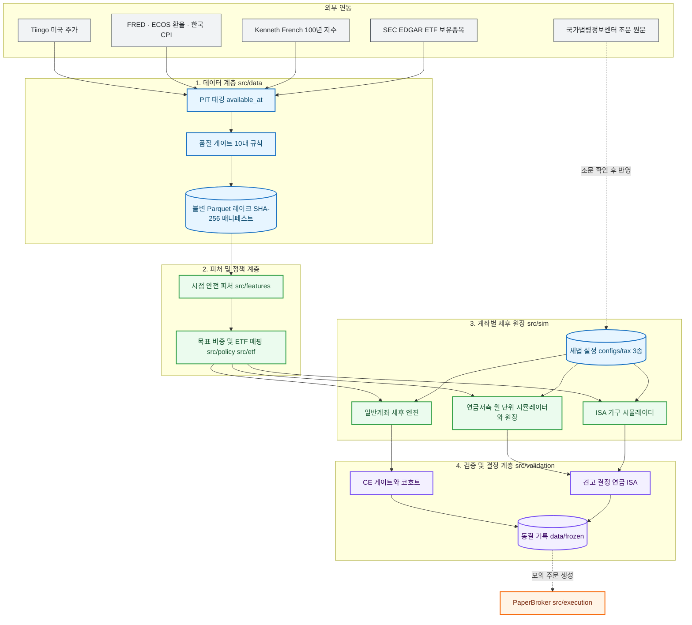

# System Architecture & Design Specification

> **일반계좌 · 연금저축펀드 · ISA 중개형 세 계좌의 ETF 자산배분 정책을 시점 정합성(PIT) 데이터와 법령 기반 세후 원장으로 검증·확정하는 퀀트 리서치 시스템의 핵심 아키텍처 정본**

---

## 1. System Goals & Boundaries

같은 ETF도 담는 계좌에 따라 세금·납입 한도·인출 제약이 달라 최적 선택이 달라질 수 있습니다. 본 시스템은 계좌마다 **독립된 결정 파이프라인**을 두고, 모두 같은 원칙(사전 등록 → 다중 구간 검증 → 최악 구간 기준 채택 → 결정 동결)으로 정책을 확정합니다.

```text
Primary Objective: 동일한 외부 납입금 아래에서 세후 실질 원화(한국 CPI 반영) 최종 자산을
                   최악 구간에서도 유지하며 극대화하는 정책을 확정한다
```

| 구분 | 포함 범위 (In-Scope) | 배제 범위 (Out-of-Scope) |
| :--- | :--- | :--- |
| **대상 계좌** | 일반계좌(월 100만 원), 연금저축펀드(연 600만 원), ISA 중개형(연 600만·1,200만·2,000만 원 비교) | IRP, 퇴직연금, ISA 농어민형, 생산적금융 ISA(국회 계류 법안) |
| **대상 자산** | 해외 지수 추종 ETF(QQQ·SOXX·SPY·SCHD 등)와 국내 상장 대응 ETF | 개별 종목, 파생, 레버리지·인버스 ETF, 국내주식형 ETF(ISA 시험에서 기각) |
| **체결 모델** | 신호일 $t$ 이후 익거래일($t+1$) 종가 체결, 환전 스프레드·수수료·정수 주수 | 당일 종가 동시체결(미래 참조 편향) |
| **매매 규칙** | 매수 전용 적립, 세금 최적화 목적의 연말 이익실현(TGH)만 매도 허용 | 위험 회피·비중 조정·종목 교체 목적의 매도 |
| **납입 규칙** | 모든 비교 전략에 동일한 외부 납입금 강제(Invariant $I_5$) | 전략별로 달라지는 불규칙한 추가 납입 |
| **세금** | 해외 ETF 양도세·배당 원천징수, 연금 세액공제·수령세, ISA 해지세·연금 이전 공제 | 종합소득세 전체 신고, 지방세 외 부가 세목 |
| **주문 연동** | 모의 브로커(`PaperBroker`)까지 | 증권사 실계좌 자동주문 API |

---

## 2. Component Topology & External Interfaces



| 서브시스템 | 핵심 컴포넌트 | 책임 | 강제 불변식 (Fail-Closed) |
| :--- | :--- | :--- | :--- |
| **Data** | `src/data/` (`fetch`, `pit`, `quality`, `storage`) | 5개 벤더 수집, 공시 시점 태깅, 품질 검사, 불변 저장 | 결측 보간 금지, 해시 불일치 시 `UntrustedDatasetError` |
| **Features** | `src/features/` | 공시 시점 이전 데이터만으로 수익률·변동성·낙폭·팩터 계산 | 미래 행 유입 시 `LookAheadError` |
| **Policy / ETF** | `src/policy/`, `src/etf/` | 목표 비중(합 1.0), ETF 매핑, 잦은 교체 방지 완충 | 비중 합 $1.0 \pm 10^{-6}$ |
| **Sim (일반)** | `src/sim/allocation.py`, `after_tax_engine.py` | 매수 전용 배분, $t+1$ 체결, 22% 양도세·연 250만 원 공제, FIFO 취득가 | 매 스텝 현금 보존 |
| **Sim (연금)** | `src/sim/pension_monthly.py`, `pension_engine.py`, `pension_tax.py` | 월 단위 코호트 시뮬레이션, 세액공제·수령세 원장 | 세액공제는 실제 납부세액 한도 안에서만 인정 |
| **Sim (ISA)** | `src/sim/isa_tax.py`, `isa_household.py` | 해지세, 납입 한도 이월, 연금 이전 공제, 6개 운용 방식 가구 원장 | 모든 방식의 외부 현금 총액 동일 |
| **Validation** | `src/validation/` | CE 게이트, 롤링 코호트, 블록 부트스트랩, 견고 결정, 동결·재검토 | 통과 못하면 기준선 유지 |
| **Analytics** | `src/analytics/` | 5개 관점 투자 가설 증거 평가(읽기 전용 진단) | 결정 경로에 미개입 |
| **Execution** | `src/execution/` | 매수 주문서, 모의 체결 | 실계좌 연동 없음 |

---

## 3. Research Lifecycle & Decision State Machine

24/7 서비스가 아니라 **재현 가능한 배치 결정**입니다. 모든 결정 실행은 `SHA-256(설정 바이트 + git 커밋 + 소비한 매니페스트 + 시드)`로 run id를 만들어 같은 입력이 같은 결과를 냅니다.


### 결정 상태 전이 불변식
1. **후보 자격:** 후보의 견고 점수는 모든 증거 구간·기간 칸의 최저값이며, 기준 조합 대비 $1 - 0.005 = 0.995$ 이상인 칸만 가진 후보만 채택 자격을 갖습니다(지배 가드).
2. **동률 처리:** 점수가 동등 대역(0.005) 안이면 연금은 하락 위험이 작은 조합, ISA는 등록 순서상 단순한 운용 방식을 택합니다.
3. **판정:** 연금은 `ADOPT_CANDIDATE`, `KEEP_BENCHMARK`, `KEEP_INCUMBENT`, `KNIFE_EDGE`(이웃 조합이 기준 이하), `BOOTSTRAP_WEAK`(승률 0.6 미만), `NO_DECISION`. ISA는 `ADOPT_ARM`, `KEEP_BASELINE`, `BOOTSTRAP_WEAK`, `EXIT_SENSITIVE`.
4. **세금 교차 검증:** 세금 없는 월 단위 연금 결정의 순위가 세금·환율 전체 원장 캠페인의 순위와 다르면 `NO_DECISION`으로 멈춥니다.
5. **동결:** `ADOPT`·`KEEP` 판정만 `data/frozen/`에 불변 기록으로 동결하고, 같은 파일을 덮어쓰지 않습니다. 재검토 상태는 `HOLD`, `REVIEW_DUE`, `INSUFFICIENT_DATA`입니다.
6. **다중검정 공개:** 모든 결정은 관련 시험 횟수(`trial_count`)와 사후 선택 공개문을 결과에 기록합니다.

---

## 4. Data Models & Financial Integrity Barriers

```text
data/                 # git 무시, 재생성 불가 영역만 Drive 미러
├── raw/              # [Bronze] Drive에만 상주, 로컬은 검증 후 제거
├── normalized/       # [Silver] 스키마 정규화 불변 Parquet (<sha256>.parquet)
├── manifests/        # 출처, 행 수, 해시 매니페스트 JSON
├── frozen/           # 동결된 결정 기록 (pension, isa, prospective)
├── prospective_registry/  # 전향 관측 로그, 재생성 불가
└── runs/             # [Runs] 실행 결과, 로컬 전용(백업 제외), 재실행으로 재생성
configs/decision/     # 최종 결정 설정 3종 (general, pension, isa)
configs/research/     # 남은 명령 입력 설정 + 시험 이력 색인 INDEX.json
configs/tax/          # 법령 근거 세금 설정 (해외 ETF, 연금저축, ISA)
```

### 공시 시점(`available_at`) 규칙
| 규칙 | 의미 | 적용 대상 |
| :--- | :--- | :--- |
| `SESSION_CLOSE` | 거래소 장 마감 시각에 가용 | 미국 ETF 종가, 원/달러 환율, VIX |
| `RELEASE_COLUMN` | 제공처가 기록한 실제 발표 시각 | FRED 지표(수정 발표본 포함), SEC ETF 분기 보고서 |
| `FIXED_LAG` | 기간 종료 후 6~8주 고정 시차 | 한국은행 CPI |

의사결정 시점 $t$에는 `available_at <= t`인 행만 조회하고, 사후 수정 지표는 당시 최신 발표본(vintage)만 씁니다.

### 신뢰 계층별 계약
* **Bronze (원본 캐시):** 유실돼도 Silver 읽기는 성공하고 경고(`silver_without_bronze`)만 남깁니다. `maintain data --apply`가 검증된 재수집으로 복구하며, 재수집 바이트가 매니페스트와 다르면 `SourceMismatchError`로 중단합니다.
* **Silver (매니페스트 + Parquet):** 모든 읽기에서 매니페스트 바인딩, 스키마, 행 수, 정준 해시를 검증하고 하나라도 어긋나면 `UntrustedDatasetError`로 읽기를 거부합니다. 손상 시 과거 파티션으로 축소 대체하지 않습니다.
* **Gold (고정된 PIT 뷰):** 한 실행은 `CatalogSnapshot`으로 매니페스트 신원을 한 번 고정하고 그 안에서만 조회합니다.
* **Results (생성물):** 결과에 소비한 매니페스트 해시(`manifest_hashes`)를 기록해 어떤 데이터 위에서 계산됐는지 사후 추적합니다. 기록 해시는 `docs/results/*.md`에 명시되며, 기록 파일 자체는 쓰기 한 번(write-once)으로 Drive에 미러링됩니다.

### 도메인 무결성 배리어
1. **결측 보간 금지(I4):** 주가·환율 결측은 직전값으로 채우지 않고 오류로 중단합니다.
2. **수정주가·배당 이중 계상 금지(I8):** 수정주가 또는 원본 가격 + 배당 원장 중 하나만 씁니다.
3. **시간 표준화:** 모든 타임스탬프는 UTC 마이크로초이며 시간대 없는 값은 품질 검사에서 반려됩니다. 미국(`XNYS`)과 한국 캘린더를 분리해 동기화합니다.
4. **환율 공백 처리:** 연금 원장은 ECOS 환율을 기본으로, FRED는 내부 공백만 메우며 대체 비율 상한을 설정으로 강제합니다.
5. **현금 보존(I6):** `총자산 = 주식 평가액 + 달러 현금 + 원화 현금`이 모든 거래 후 성립해야 합니다.

---

## 5. Account Tax & Cash Models

| 항목 | 일반계좌 | 연금저축펀드 | ISA 중개형 |
| :--- | :--- | :--- | :--- |
| **설정 파일** | `kr_overseas_equity.json` | `kr_pension_2026.json` | `kr_isa_2026.json` |
| **납입** | 월 100만 원 | 연 600만 원 (납입 한도 1,800만 원) | 연 2천만·총 1억, 미사용 한도 이월(최대 4년분) |
| **과세** | 양도차익 22%, 연 250만 원 공제, 손실 이월 없음, 배당 15% 원천 | 납입 시 세액공제 15%/12% + 지방세 10%, 수령 시 연령대별 3~5%, 연 1,500만 원 초과 15% | 해지 시 순이익 중 비과세 한도(일반형 200만·서민형 400만) 초과분만 9% + 지방세 |
| **제약** | 없음 | 55세 이후·가입 5년 후 수령, 연 수령 한도 | 의무 3년, 만기 후 60일 안 연금 이전 시 이전액 10%(최대 300만 원) 추가 공제 |
| **엔진** | 일 단위 원장(FIFO 취득가) | 월 단위 코호트(결정), 일 단위 원장(캠페인) | 월 단위 가구 원장 |

* **세금 설정 원칙:** 법령 조문 원문(조세특례제한법 제91조의18, 시행령 제93조의4, 소득세법 제59조의3)으로 확인한 값만 설정 파일에 넣고, 로더는 키 집합이 정확히 일치하지 않으면 실행을 막습니다. 법이 바뀌면 코드 수정 없이 새 설정과 새 결정 실행으로 대응합니다.
* **ISA 가구 원장:** 연금 연 600만 원과 ISA 예산을 합한 외부 현금이 모든 운용 방식에서 동일하며, ISA에 넣지 못한 금액은 일반계좌로 갑니다. 연도 초 이벤트 순서는 만기 해지 → 연금 납입 → ISA 납입 → 비중 재조정으로 고정하고, 공제 환급은 다음 해 2월에 일반계좌로 입금하며 평가일까지 못 받은 금액은 미수금으로 계상합니다.
* **ISA 운용 방식 6종:** 계속 보유(`hold`), 3년마다 해지 후 공제 최대 금액만 연금 이전, 3·5년마다 해지 후 전액 연금 이전, 3년마다 해지 후 일반계좌 이동, ISA 미사용.
* **소득 경로:** 소득·세액 한도를 추정하지 않고 사전에 선언한 4개 시나리오(학생 2년 후 서민형 유지, 일반형 공제율 16.5%, 공제율 13.2%, 공제받을 세금 없음)를 모두 통과해야 합니다.

---

## 6. Strict Layer Contracts & Static Verification Rules

```text
Layer 6: CLI 진입점            (`src/cli.py`, `src/cli_commands/`)
   ↓
Layer 5: 검증 및 결정           (`src/validation/`)
   ↓
Layer 4: 계좌별 시뮬레이션·세금 (`src/sim/`)
   ↓
Layer 3: 정책 및 ETF 매핑       (`src/policy/`, `src/etf/`)
   ↓
Layer 2: 시점 안전 피처         (`src/features/`)
   ↓
Layer 1: 데이터 수집·저장       (`src/data/`)
────────────────────────────────────────────────────
읽기 전용 옆 계층: 진단 (`src/analytics/`), 모의 집행 (`src/execution/`)
```

* **의도한 의존 방향:** 위 계층이 아래 계층만 참조합니다. 임포트를 스캔해 확인한 예외는 `src/data/thesis_fundamentals.py`가 `src.policy.thesis.ThesisId`를 참조하는 1건, `src/etf`와 `src/policy`가 `PolicyError`·`SleeveId` 정의를 서로 참조하는 1쌍, 진단 계층(`src/analytics`)이 `src/sim`·`src/validation`을 읽는 경우이며, 이 방향은 자동 테스트로 강제되지 않습니다.
* **타입 안전성:** `pyproject.toml`의 `mypy --strict`로 `src` 전체 173개 파일 오류 0건, `ruff` 전수 준수.
* **문서 정합성:** `tests/unit/docs/test_architecture_docs.py`가 이 문서와 결정 문서의 경로·명령어가 실제 트리에 존재하는지, 각 문서가 300줄 이하인지 검사합니다.
* **테스트 정책:** 순수 합성 데이터로 보존 법칙(현금, 비중 합, 외부 현금 총액)과 경계(0, NaN, 빈 유니버스, 휴장, 중복 시각)를 검증하며, 수익성 자체는 테스트하지 않습니다.

### 시스템 불변식 요약
| ID | 불변식 | 강제 장치 |
| :--- | :--- | :--- |
| **I1** | 의사결정 시점 이전 공개 데이터만 사용 | `available_at <= t` 필터, `assert_no_lookahead` |
| **I2** | 신호일 종가 체결 금지, $t+1$ 체결 | `src/sim/allocation.py` |
| **I3** | 지표는 당시 최신 발표본만 사용 | vintage 조회 |
| **I4·I8** | 결측 보간 금지, 배당 이중 계상 금지 | 품질 게이트 |
| **I5** | 모든 비교 전략에 동일한 외부 납입금 | `AllocationConfig`, ISA 현금 총액 항등식 |
| **I6·I7** | 현금 보존, 목표 비중 합 1.0 | 원장 검증, 심플렉스 검사 |
| **I12** | 결과는 커밋·데이터 해시와 1:1 결속 | 매니페스트 해시 기록 |
| **I14·I17** | 과적합 탈락 시 기준선 복귀, 관측 이후만 전향 검증 | 연구 수렴 규율, 전향 레지스트리 |

---

## 7. Limitations

1. **표본 크기:** 한국 CPI 가용 기간(2012-08~)이 실질 원화 코호트를 제한하며, 120개월 코호트 4개는 서로 겹칩니다.
2. **극단 국면의 실제 ETF 부재:** 닷컴 버블·2008 금융위기 구간은 실제 ETF 상장 이전이라 100년 지수 프록시로만 검증합니다(실제 ETF 구간은 참고용).
3. **근사 모델:** 연금·ISA 결정은 월 단위, 환율 중립 근사이며 법정 금액은 물가에 연동하지 않은 명목값입니다.
4. **독립성 한계:** 세 결정은 같은 과거 데이터를 공유하므로 독립된 발견이 아닙니다.
5. **미모델링:** ISA 3년 미만 중도해지, 2027년 세제개편 정부안(국회 계류), 실계좌 주문 연동.
