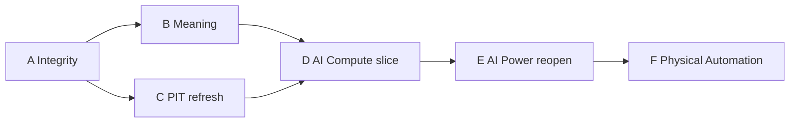

# ETF-Manager v2: Next Plan

Post–thesis-wave roadmap. Normative contracts live in `docs/architecture/`. This file is the ordered **why and when**; it is not an adoption gate.

Input: `docs/results/20260829_v2_thesis_wave_detail.md` and the 2026-08-29 review (`docs/feedback.md`). Judgment that diverges from that review is in §3.

---

## 1. One-sentence shift

| | Question the system answers |
| --- | --- |
| **v1 (operational)** | Which `PolicyId` / ETF mix beat QQQ on past accumulation under PIT data and the 36M CE gate? |
| **v2 kernel (built)** | Which **thesis JSON** maps to a sleeve/vehicle, with a five-slot evidence blob and a single decision enum? |
| **v2 target (this plan)** | Which **economic thesis** is structurally true, investable via a clean listed vehicle, not already overpriced, and robust enough on **incremental** QQQ replacement to challenge the incumbent over 10+ years? |

v2 is not “find the best backtest ETF.” The 2026-08-29 wave showed the kernel can **wrap** ETF-proxy history in v2 shape. It cannot yet **verify** a thesis.

**Next milestone:** complete one vertical slice (`ai_compute`) through the full chain below. Breadth (new industries, new tickers) is closed until that slice is the reference implementation.

```text
Thesis → Fundamental series → Structural change (fundamentals, not prices)
      → Exposure / purity → Vehicle → Valuation / crowding
      → Historical accumulation → Path robustness
      → Incremental portfolio vs QQQ → Decision vector
```

---

## 2. Current state (2026-08-29)

Operational lock is unchanged: `PolicyId.QQQ` 100%, buy-only, 36M CE adoption gate. Thesis-wave / report / decision **never** call `adoption_passes`.

### 2.1 What the kernel actually is

| Layer | Status | Honest reading |
| --- | --- | --- |
| Thesis registry, sleeve/vehicle IDs, `run thesis` | Done | Identity kernel |
| Experiment `thesis_id` + preregistration flags | Done | Experiments can speak thesis |
| N-PORT overlap slot | Done, **audit required** | `overlap_a_only_wt` ≈ 195 for SOXX is not a valid portfolio weight |
| 120M / adaptive-horizon accumulation | Done | Vehicle history vs QQQ, overlapping cohorts |
| Regime windows in the `structural` slot | Done, **misnamed** | Market-regime performance, not structural evidence |
| Adaptive horizon (`span ≥ min_years` ⇒ not prospective) | Done, **over-steers** | Longest horizon with n≥1 became the decision input (BOTZ 96M n=1) |
| `ThesisDecision` enum | Done, **too coarse** | One of reject / watch / prospective / continue_research |
| Singleton-window CE γ=2 on thesis-wave | Done, **γ is a no-op** | `certainty_equivalent((W,), γ=2)` = W; ratio is a single terminal-wealth ratio |
| Valuation / crowding / fundamental PIT / change-point | **Not implemented** | Slots print `unknown` |
| Paired path bootstrap / buy-only attribution / incremental 5–15% | **Not implemented** | Next research question is unanswered |
| Catalog as-of vs report date | **Stale** | Report 2026-08-29; panel as-of **2025-04-30** (~16 months) |

The 2026-08-29 wave is therefore: **ETF proxy historical performance, packaged as v2.** That is useful. It is not a thesis verdict.

### 2.2 Board after the wave

The experiment that ran was `SOXX/GRID/BOTZ 100%` vs `QQQ 100%`. That answers “was the proxy vehicle historically stronger than QQQ?”, not “does a QQQ sleeve replacement help?”.

| Thesis | Thesis | Vehicle | Portfolio vs QQQ | Next |
| --- | --- | --- | --- | --- |
| **AI Compute** | Unresolved, strongest research lead | SOXX = **active proxy** (strong 120M surface; n=8 overlapping) | **Unverified** | Finish the v2 slice; do not adopt |
| **AI Power Bottleneck** | Unresolved — do **not** close | GRID = **rejected proxy** | None | Rebuild exposure; no more GRID vs QQQ backtests |
| **Physical Automation** | Unresolved — do **not** close | BOTZ = **rejected proxy** (short history, strongly negative surface) | None | Split industrial vs humanoid; last |
| QQQ | — | Incumbent | — | **Operational 100%** |

SOXX 120M (step 12M): median ratio 1.278, p10 1.099, worst 1.088, win rate 100%, n=8. Adjacent cohorts share 108/120 = 90% of months. Treat this as **consistent observed history**, not eight independent 10-year experiments.

GRID 120M: median 0.788, worst 0.625, win rate 0%. Vehicle evidence is strongly negative. Thesis evidence is still missing.

BOTZ: 8.62y span, 96M n=1 ratio 0.613. History exists; evidence for a 10y objective does not. Low QQQ overlap (reported 2%) plus weak accumulation implies **not a hidden QQQ clone** — still a failed proxy.

### 2.3 Confirmed code facts (integrity, not policy)

1. **SOXX decision enum is `continue_research`.** Watch requires `median ≥ 1` **and** `ce < 1.02`. CE ratio 1.20 does not take the watch branch. The contradiction is in **report prose** (`docs/results/20260829_v2_thesis_wave_detail.md` §5.1 / §6.2: “hurdle not met”, “below adoption”), not in `synthesize_thesis_decision` for this case.
2. **Thesis-wave CE is a singleton wealth ratio.** `_ce_ratio_gamma_2` passes a 1-tuple into `certainty_equivalent`. Comparing that number to the **operational** 36M cohort CE hurdle (`1 + 0.02 × modules`) mixes two instruments.
3. **Holdings PIT likely aggregates multiple `report_date`s.** `overlap.py` keeps max `filing_date` per `(etf_ticker, report_date, holding_id)`, then sums `weight_pct`. Two ~100% snapshots explain `a_only_weight_pct ≈ 195`. Until this is fixed, do not treat “SOXX/QQQ overlap = 11.5%” as a fact.

---

## 3. Judgment vs the review memo

The review’s diagnosis is accepted: **depth over breadth; AI Compute first; do not adopt SOXX; do not kill Power/Automation theses because GRID/BOTZ failed.** The following are deliberate changes to the memo’s 10-step serial list.

| Review memo | This plan | Why |
| --- | --- | --- |
| 10 serial steps (integrity → … → Physical last) | Six waves A–F; C parallel with B; D has two tracks | Serializing refresh behind schema, and valuation behind every historical test, delays the actual incremental-portfolio question |
| Refresh “market + FX/CPI + holdings + fundamentals + valuation” as one P0 | **Wave C = existing series only** | Fundamentals/valuation have no `Dataset` yet; inventing a refresh of missing data is not a wave |
| AI Compute fundamentals **then** robustness **then** 5/10/15 | **Track H and Track F in parallel** after A+C; 5/10/15 after Track H robustness | Incremental QQQ replacement is the research question; it does not require CAPEX ingest. **Adoption** still requires both tracks |
| Keep using CE vs 0.98 / 1.02 as thesis gates, plus boundary tests | **Demote singleton CE from thesis gates in Wave A** | γ=2 on one wealth is the wealth ratio. Operational 36M CE is unchanged |
| Build a 10-dimension decision object in one redesign | Wave B splits **statuses that already have meaning**; remaining slots stay explicit `UNKNOWN` | No empty valuation/crowding machinery before data (same rule as the old plan) |
| `n ≥ 10` → quality warning | Same, and **do not wait for n=10 overlapping 120M cohorts** | 10y × 1y step needs a long calendar; even n=10 is 90% overlapping |
| Longest feasible horizon as eval | Target 120M primary when it exists; **preregistered multi-horizon surface** secondary; never n=1-at-max-h as the sole reject | BOTZ 96M n=1 was the over-correction after removing the 120M hard-code |
| SOXX 100 vs QQQ 100 as current result | Keep as **vehicle diagnostic** only | Next **portfolio** experiment is preregistered 5/10/15, not 17–30% |

Deferred or rejected (unchanged from the old plan, still correct):

- Big-bang `src/etf_manager/` rename, YAML thesis configs, 2010 backcast of 2026 research indexes, Hansen SPA, collapsing evidence to one score, changing QQQ ops because a research report looks strong.

**Principle:** add capability when **data + contract** exist. Fix lying reports before generating more of them.

---

## 4. Accepted v2 direction (still binding)

- **Research unit = thesis**, not ticker / `PolicyId`.
- **Sleeve ≠ vehicle** — economic exposure vs listed implementation.
- **Falsifiers required** on every thesis.
- **Evidence is a vector** — no magic composite score. A final `CONTINUE_RESEARCH` is a summary, not a score.
- **QQQ stays operational incumbent** until a **separate** adoption wave. Research cannot write `operational_challenger` from JSON.
- **Preregistration** — weights and universe locked before seeing results; failed runs stay in the registry.
- **Strangler** — new files beside `src/`; no layout theater.
- **Analytics never call `adoption_passes`.**

---

## 5. Completed kernel (do not re-implement)

Old plan Waves 0–7 are **first-pass complete**. Do not reopen identity, `run thesis`, experiment `thesis_id`, N-PORT ingest, or E2E `run thesis-wave` as if they were missing.

| Old wave | Delivered |
| --- | --- |
| 0 Identity | `ThesisId` / `SleeveId` / `VehicleId`, `configs/theses/*.json`, `run thesis` |
| 1 Experiments | `thesis_id`, preregistration flags, registry |
| 2 Holdings | N-PORT `ETF_HOLDINGS`, overlap slot (semantics broken — Wave A) |
| 3 Evidence vector | Five slots; valuation/crowding/true structural still empty |
| 4 Long horizon | 120M reporter; `long_horizon_passes` still `n≥10` gate (Wave B demotes) |
| 5 Prospective | `span < min_years`; mixed up with evidence sufficiency (Wave B splits) |
| 6 Regime | Price-window proxy stuffed into `structural` (Wave B renames) |
| 7 E2E | `run thesis-wave` 2025-04-30 |

---

## 6. Work order

Execute A before D. **C is a research-run gate**, not a schema-code gate: ingest may start during B. E and F do not start in code until D has a non-lying evidence vector and at least one complete track.



```text
D = Track H (historical / incremental)  ∥  Track F (fundamental / valuation)
Operational Challenger only if both tracks complete AND incremental 5/10/15 survives
```

### Wave A — Integrity (P0)

Stop the evidence system from contradicting its own numbers. No new theses, no new tickers, no operational change.

| Deliverable | Rule |
| --- | --- |
| Report / rationale vs booleans | `ce ≥ 1.02` cannot emit “CE hurdle fail” / “below adoption”. Rationale strings are generated from the same predicates as the enum |
| Boundary tests | 0.98 / 1.00 / 1.02 on whatever CE **distribution** remains in the thesis path; plus median 1.0 |
| Singleton CE | Document as wealth ratio. **Remove it from thesis reject/watch gates.** If thesis CE stays, it is CE of the **cohort wealth vector**, not a 1-tuple |
| Operational CE | Unchanged: ablation / walk-forward 36M `adoption_passes` |
| Holdings PIT | One as-of snapshot per vehicle: latest `report_date` with `available_at ≤ t`. `Σ weight_pct = 100 ± ε` or fail-closed. `a_only_weight_pct ∈ [0, 100]` |
| Overlap citation | Until the audit passes, reports must not claim a precise SOXX/QQQ overlap percentage as fact |

**Exit:** unit tests for the invariants; overlap fixture with two report dates does not double-count; regenerated wave markdown cannot say SOXX CE 1.20 failed a 1.02 hurdle.

**Next spec:** integrity of `thesis_decision` / `thesis_report` / `overlap` / CE wiring.

---

### Wave B — Meaning (schema, not more ETF runs)

Separate questions the single enum currently smashes together.

| Dimension | Meaning | AI Compute now (expected) |
| --- | --- | --- |
| `thesis_status` | Is the economic phenomenon real? | `UNRESOLVED` |
| `vehicle_status` | Does this ETF carry the thesis? | SOXX `ACTIVE_PROXY`; GRID/BOTZ `REJECTED_PROXY` |
| `portfolio_status` | Does a QQQ sleeve replacement help? | `UNVERIFIED` |
| `historical_quality` | How much 10y-objective evidence exists? | `TARGET_THIN` (120M exists, overlapping n=8) |
| `history_available` | Is there enough calendar to evaluate at all? | yes for all three current proxies |
| `evidence_sufficient` | Enough for the **target** horizon? | SOXX/GRID yes-thin; BOTZ no |

`historical_quality` values:

| Status | Meaning |
| --- | --- |
| `TARGET_ROBUST` | Target 120M with disclosed dependence still acceptable under Wave D bootstrap rules |
| `TARGET_THIN` | 120M possible; sample or overlap too weak to treat as confirmation |
| `PARTIAL_HISTORY` | ≥ min horizon, < target (BOTZ today) |
| `PROSPECTIVE_ONLY` | < min horizon — freeze and paper-forward, do not reject for “no 120M” |

**Horizon:** keep **120M as primary** when at least one cohort exists. Always emit a **preregistered secondary surface** `{60, 84, 96, 120}` months (integer years already in `[min, target]`). Do not promote “max h with n≥1” to the decision. BOTZ: `PARTIAL_HISTORY` + strongly negative surface → `REJECTED_PROXY`; thesis stays `UNRESOLVED`.

**Rename:** current `structural` slot → `market_regime_performance`. True `structural` remains `UNKNOWN / NOT_IMPLEMENTED` until Track F change-points on **fundamental** series (not returns). Price-up → “thesis confirmed” is forbidden.

**Long-horizon flag:** `n ≥ 10` becomes a **quality warning**, not a pass/fail that blocks `continue_research`. Report `raw_cohort_count`, temporal overlap ratio, calendar span, path-bootstrap probability, worst/p05 together.

**Decision object:** vector of the dimensions above; a single `ThesisDecision` is derived last. Do not fill valuation/crowding/structural with placeholder formulas.

**Exit:** GRID reject is a **vehicle** reject; AI Power thesis is not `rejected`. BOTZ same. Reports cannot label regime windows as structural evidence.

---

### Wave C — PIT refresh (existing series)

Bring **already contracted** series to the latest PIT as-of. Do not pretend to refresh datasets that do not exist.

| In scope | Out of scope (Track F) |
| --- | --- |
| ETF/equity prices, USD/KRW, KRW CPI | Hyperscaler CAPEX, semiconductor revenue, valuation multiples |
| N-PORT holdings (post Wave A snapshot rule) | Crowding / revisions products |

**As-of policy:** thesis-wave `as_of` is the catalog’s last admissible timestamp, and the lag to calendar-today is printed. A report dated D with panel as-of D−16 months is a **quality failure**.

**Exit:** operator ingest + quality gate; a thesis-wave as-of in 2026-H2 (or documented provider hard stop, not a silent 2025-04 panel).

C may run in parallel with B. **D research conclusions require A and C.** B’s schema can land on the old panel.

---

### Wave D — AI Compute reference slice

One thesis, end-to-end. No fifth industry. SOXX remains the **active historical proxy**, not an adopted sleeve.

#### Track H — Historical completeness (after A+C)

Answers: *If we replace 5/10/15% of QQQ with SOXX under buy-only, does 10y real accumulation improve, and is that improvement allocation skill or buy-only drift?*

| Item | Rule |
| --- | --- |
| **Not** the next decision experiment | SOXX 100 vs QQQ 100 (vehicle diagnostic only) |
| **Preregistered arms** | `QQQ95/SOXX5`, `QQQ90/SOXX10`, `QQQ85/SOXX15` vs `QQQ100` |
| **Forbidden after seeing results** | 17 / 20 / 25 / 30% or any widened grid |
| Path robustness | Paired **monthly path** block bootstrap (not resampling overlapping terminal ratios); walk-forward; cost/FX stress; regime windows as `market_regime` |
| Buy-only attribution | Realized SOXX weight path vs target; contribution vs price-drift; incremental wealth vs QQQ. Required before any “15% worked” claim |
| Metrics (all arms) | 120M real wealth, cohort CE γ∈{2,5,10}, XIRR, p10/worst, path-bootstrap tail, realized weight, MDD/recovery, incremental attribution |

Track H may conclude `portfolio_status = HISTORICALLY_PROMISING` or `HISTORICALLY_WEAK`. That is **not** operational adoption.

#### Track F — Fundamental completeness (after A+B; new datasets)

Answers: *Is the AI compute economic phenomenon happening, is SOXX a clean vehicle, and is the market already priced for it?*

| Item | Rule |
| --- | --- |
| Purity / look-through | Post–Wave A holdings; QQQ overlap as **incremental** exposure, not a vanity % |
| Thesis exposure | Semiconductor / foundry / equipment revenue mapping — companies first, ticker second |
| Structural | Change-point on PIT fundamental series (CAPEX, related industry series). **Not** price windows |
| Valuation / crowding | Independent slots; `UNKNOWN` until a contracted dataset exists |
| Falsifiers | Monitor `capex_structural_slowdown` (and peers) as data, not as a string on the report |

**Do not start Track F ingest until `Dataset` + `available_at` + quality policy exist** (`01_data_contracts.md`).

#### Wave D exit

| Label | Condition |
| --- | --- |
| Slice usable as reference | Track H **or** Track F produces honest, schema-correct artifacts other theses can copy |
| `Operational Challenger` | **Both** tracks complete, incremental 5/10/15 still alive under robustness + attribution, valuation/crowding not `UNKNOWN`, separate adoption wave still required for QQQ lock |
| Not this wave | New ETFs, AI Power code, BOTZ revival, raising SOXX weight after looking at 15% |

---

### Wave E — AI Power reopen (after D reference exists)

GRID is archived `REJECTED_PROXY`. **Do not re-run GRID 100 vs QQQ 100.**

Order: causal chain → fundamental series → beneficiaries → holdings → revenue exposure → ETF purity → **then** a new vehicle (GRID / PAVE / XLI / research basket). The same architecture as Wave D, not a new satellite matrix.

Thesis stays `UNRESOLVED` until that chain can falsify it. Dormant is allowed **after** structural/fundamental evidence exists and fails — not after a dirty ETF backtest.

---

### Wave F — Physical Automation (last)

BOTZ archived `REJECTED_PROXY`. Split **Industrial Automation** vs **Humanoid Optionality**. Define company/revenue exposure before picking a ticker. Prospective frozen paper only if history is truly `PROSPECTIVE_ONLY`, not because a 96M n=1 print was ugly.

---

## 7. Invariants (all waves)

| Rule | Enforcement |
| --- | --- |
| I1–I12 | Unchanged |
| QQQ operational lock | Until an **explicit adoption wave** (not thesis-wave, not JSON status) |
| 36M CE gate | Default **PolicyId** adoption; thesis-wave does not call it |
| Thesis registry ≠ adoption | Config cannot set operational challenger |
| Analytics / thesis inspect | Never call `adoption_passes` |
| No 2010 backcast of 2026 indexes | I9 / I10 |
| Evidence vector | Never merged into one score |
| `from src.*` layout | No `etf_manager/` rename |
| Vehicle reject ≠ thesis reject | GRID/BOTZ fail as proxies; theses stay open until fundamentals speak |
| No post-hoc weight grid | 5/10/15 locked before Track H runs |
| Structural ≠ price regime | Rename in B; fill only from fundamental change-points |

---

## 8. Closed for now

- New industry theses or a broader ETF screen.
- Treating SOXX 100% vs QQQ 100% as the portfolio question.
- Adopting any SOXX allocation.
- Closing AI Power or Physical Automation **theses** because GRID/BOTZ lost.
- Calling current regime windows structural confirmation.
- Treating overlapping cohort `n` as independent sample size.
- Researcher-chosen weights 17%+ after seeing SOXX 100% results.
- Repeating GRID or BOTZ as backtest vehicles.

---

## 9. Relation to `docs/architecture/`

| Document | Role |
| --- | --- |
| `docs/architecture/*` | **Current** contracts (layers, I1–I12, 36M CE, Wave 0 identity) |
| This file | **Evolution** order after the kernel |

When A/B land, update **`00_system_overview.md`** (evidence/decision nodes) and **`02_policy_and_validation.md`** (horizon, prospective, roadmap table) surgically. English, ≤300 lines per file. Do not paste this plan into architecture docs.

`02_policy_and_validation.md` §7 still lists kernel waves as done; append A–F there only after the corresponding spec is implemented.

---

## 10. Immediate next step

```text
Wave A: thesis report/decision cannot contradict metrics;
        singleton CE is not a thesis gate;
        holdings overlap is one PIT snapshot with weights ≈ 100%.
```

Spec the integrity contract (decision predicates, CE wiring, overlap snapshot), then `/implement` that spec. Do not start Track H 5/10/15 or new industry work until A (and C before any new **conclusion**) is done.
